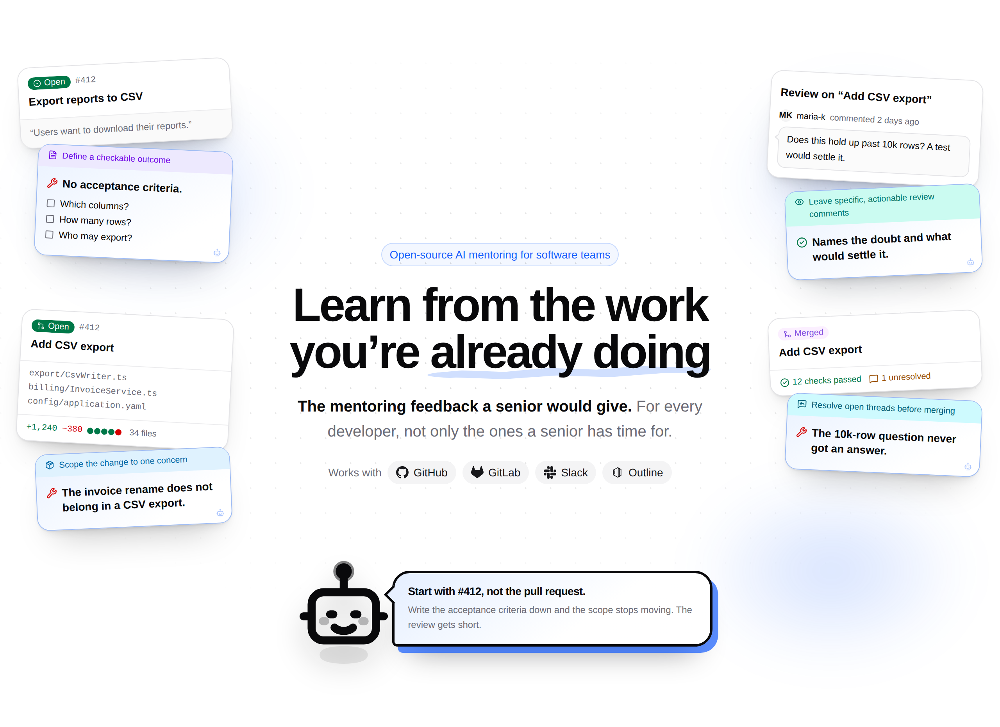

<div align="center">
  <h1>
    <picture>
      <source media="(prefers-color-scheme: dark)" srcset="./docs/static/img/brand/hephaestus-lockup-dark.png">
      <source media="(prefers-color-scheme: light)" srcset="./docs/static/img/brand/hephaestus-lockup-light.png">
      
    </picture>
  </h1>
  <p><strong>Learn from the work you already do</strong></p>

  <p>
    <a href="https://hephaestus.build"></a>
    <a href="https://docs.hephaestus.build/"></a>
    <a href="https://github.com/hephaestus-build/Hephaestus/releases/latest"></a>
    <a href="https://github.com/hephaestus-build/Hephaestus/actions/workflows/cicd.yml"></a>
    <a href="https://github.com/hephaestus-build/Hephaestus/blob/main/LICENSE"></a>
  </p>
</div>

Hephaestus is an open-source AI mentor for software teams.
It checks developers' existing work against the engineering practices that their project values.
This work includes issues, pull requests, reviews, and their related discussions.
Hephaestus explains what went well, what could be better, and a way to improve it.

Every piece of feedback names its practice and points back to the reviewed work.
Developers can ask why, disagree, or discuss the next step.

A mentor gives feedback on how you work.
Examples include a coach on a university capstone or an experienced maintainer on an open-source project.
There is never enough of that attention for everyone.
Hephaestus does the routine part so that everyone gets some.
People keep responsibility for the harder judgment and the relationships.

<div align="center">
  <picture>
    <source media="(prefers-color-scheme: dark)" srcset="./docs/images/readme/landing-hero-dark.png">
    <source media="(prefers-color-scheme: light)" srcset="./docs/images/readme/landing-hero-light.png">
    
  </picture>
  <p><sub>An illustration of the feedback Hephaestus writes. See the <a href="https://docs.hephaestus.build/user/ai-code-review">user guide</a> for the real interface.</sub></p>
</div>

> [!IMPORTANT]
> **Hephaestus is pre-1.0.** Releases are continuous.
> Only the [latest release](https://github.com/hephaestus-build/Hephaestus/releases/latest) has support.
> There are no maintenance branches or backports.
> Until 1.0, a *minor* release can change configuration or the API in ways that need you to act.
> Read the release notes before every upgrade.
>
> Version 1.0 makes upgrades, configuration, Compose, and the REST API predictable:
> [compatibility policy](https://docs.hephaestus.build/admin/compatibility-policy) ·
> [1.0 milestone](https://github.com/hephaestus-build/Hephaestus/issues/1378).

## What Hephaestus does

- **Reviews contributions against engineering practices.** A curated set of practices ships with it.
  These practices cover:
  - How developers scope and describe work.
  - How developers write issues.
  - How developers give and answer reviews.
  - Testing and failure handling.
  - Security and maintainability.
  - Recorded decisions and version control.
  - Planning and communication in the open.

  A workspace adopts the groups it values.
  It can rewrite any practice inside them.
- **Gets the feedback to the developer.** Feedback can appear on the work itself.
  It can also appear on the developer's own
  [Practice profile](https://docs.hephaestus.build/user/practice-profile) or in their next conversation with Heph.
  Feedback on the work waits for a workspace admin's approval by default.
  Every piece names its practice and points at its evidence.
- **Answers follow-up questions.** Developers can ask why a suggestion matters or supply context that Hephaestus did not have.
  In chat, Hephaestus goes by Heph.
  Chat is available in the web app and, if Slack is connected, in a direct message.
- **Explains itself where the work is.** A Chrome extension shows what Hephaestus recorded about the reviewed work and why.
  It shows this on the pull request, merge request, or issue that you view.
- **Uses the project context you connect.** This includes GitHub repositories and projects from one configured GitLab instance.
  It also includes selected Outline collections and Slack channel messages that members permit it to use.
- **Respects your AI choice.** Each member chooses **In-house**, **Cloud**, or **No AI** across their
  workspaces.
  That choice limits practice reviews and Heph.
  It does not stop source sync.
- **Opens on your Practice profile.** This private page is the workspace home when it reviews
  practices. Other workspaces open on Activity.
- **Puts admins in control.** They configure repositories, practices, members, integrations, the AI
  model through any OpenAI-compatible endpoint, and a monthly spending cap.
- **Shows what happened, without ranking anyone.** Activity shows work that needs you, such as review requests and returned pull requests.
  It summarizes your pull requests, reviews, comments, and issues over a time range.
  It keeps a timeline of the work.
  Workspace activity does the same for everyone or one team.
  It lists members by name and never ranks them.

## How feedback works

1. A workspace connects its GitHub or GitLab repositories and adopts the practices it cares about.
2. Hephaestus gathers a contribution together with the work around it: the issue, the change, the
   review thread, the conversation.
3. It records what it observed against those practices.
   It writes feedback from those observations.
4. Feedback on the work waits for a workspace admin's approval by default.
   Private feedback has separate delivery checks.
   It can appear on the developer's Practice profile or in conversation with Heph.
5. They act on it, push back with a reason, or let it pass. Their next contribution is read the same
   way.

The feedback is advisory: it does not approve a change for merge or grade anyone.

## Get started

- **Try the hosted app:** open the [TUM deployment](https://hephaestus.build).
- **Learn how it works:** read the [user guide](https://docs.hephaestus.build/user/overview).
- **Run your own deployment.** Start with one 64-bit Linux host: 4 vCPUs / 16 GB RAM / 40 GB SSD.

  ```bash
  VERSION=0.83.1   # the release you are installing, without the leading "v"
  sudo git clone --depth 1 --branch "v$VERSION" https://github.com/hephaestus-build/Hephaestus.git /opt/hephaestus
  sudo chown -R "$USER" /opt/hephaestus
  cd /opt/hephaestus/docker/self-host
  cp .env.example .env
  ```

  The stack refuses to start until `.env` is complete.
  Before the first `docker compose up -d`, finish the
  [installation guide](https://docs.hephaestus.build/admin/install).
  It covers the sign-in OAuth app, TLS, and the first admin account.

  Before you upgrade, read the release notes and the [migration guide](./MIGRATION.md).
  Then test the upgrade in staging.

- **Contribute:** start with the
  [local development guide](https://docs.hephaestus.build/contributor/local-development).
  The
  web app's components are browsable in
  [Storybook](https://main--66a8981a27ced8fef3190d41.chromatic.com/).

## Get help

- Ask questions and share ideas in [GitHub Discussions](https://github.com/hephaestus-build/Hephaestus/discussions).
- Report reproducible bugs in [GitHub Issues](https://github.com/hephaestus-build/Hephaestus/issues).
- Report security vulnerabilities privately as described in [SECURITY.md](./SECURITY.md).

## Contributing

Contributions are welcome.
[CONTRIBUTING.md](./CONTRIBUTING.md) explains project setup, change proposals, quality checks, pull requests, and what to expect from triage.
The [Code of Conduct](./CODE_OF_CONDUCT.md) governs participation in the project.

## Project origins

Hephaestus is an [MIT-licensed](./LICENSE) open-source project developed by
[Applied Education Technologies](https://aet.cit.tum.de/) at the
[Technical University of Munich](https://www.tum.de/en/).
Its name comes from the Greek god of the forge.
In Plato's myth, someone stole the god's craft from his workshop and gave it to people.
This let them make things for themselves.

<p align="center">
  <strong>Developed by</strong><br><br>
  <a href="https://aet.cit.tum.de/">
    <picture>
      <source media="(prefers-color-scheme: dark)" srcset="./docs/static/img/readme-brand/aet-mark-dark.svg">
      
    </picture>
  </a>
  <a href="https://www.tum.de/en/">
    <picture>
      <source media="(prefers-color-scheme: dark)" srcset="./docs/static/img/readme-brand/tum-logo-dark.svg">
      
    </picture>
  </a>
  <br>
  <sub><a href="https://aet.cit.tum.de/">Research Group for Applied Education Technologies</a> · <a href="https://www.tum.de/en/">Technical University of Munich</a></sub>
</p>
