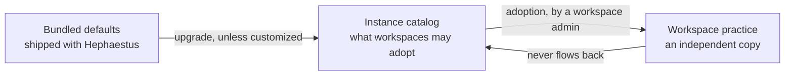

A practice is a defined way of working that Hephaestus uses to review work.
Its location determines its owner and what a change affects.

1. Before you create or adapt an entry, use [Writing effective practices](./writing-practices) to define its evidence boundary.
2. Before you create or adapt an entry, test its judgments against realistic cases.

| Scope              | Owner               | Changing it affects                                                           |
| ------------------ | ------------------- | ----------------------------------------------------------------------------- |
| Bundled defaults   | Hephaestus releases | Every instance that has not customized the entry                              |
| Instance catalog   | Instance admin      | What workspaces may adopt next, and what updates existing adopters can review |
| Workspace practice | Workspace admin     | Reviews in that one workspace                                                 |

The arrow points only right.
A release can update an instance entry that nobody customized.
An instance change alters what the catalog includes.
But **nothing rewrites a workspace practice**.
Thus, adoption lets a workspace rely on its practices staying unchanged.

## Adopt a practice into a workspace

Available practices appear beside your existing practices, organized into groups.
The preview starts with the purpose and **What good looks like**.
Where the definition has these sections, the preview also shows:

- **Review scope and evidence**.
- **How it decides**.
- **How feedback is delivered**.
- **Static analysis**.

1. In **Administration → Practice setup**, select **Show catalog**.
2. Select a practice to read it before you decide.

:::note Adding never starts sending feedback
A practice that Hephaestus can review starts at **Review before sending**.
A practice it cannot review stays **Off** until you connect the required sources.
A change to **Send automatically** is a separate, later decision on the **Review settings** screen.
:::

Adoption gives you a copy.
Edits, moves, renames, and deletions of that copy do not affect the catalog.
The catalog does not change it without your approval.

:::caution CAUTION: One exception: a practice Hephaestus has withdrawn
A release can establish that no collected evidence answers a practice's question.
It then ships that practice as needing human review.
At startup, the server switches every linked workspace copy **Off**, regardless of edits.
It records the change in the configuration audit log.

If the server cannot switch a copy off, its health reports the catalog repair out of service.
A restart must complete the repair.
The copy shows the shipped reason.
You cannot raise its autonomy.

Where the instance catalog asks for a review, it shows the practice as needing human review.
Adoption adds it **Off**.
Definitions, revisions, and earlier observations stay unchanged.
Results from before the upgrade remain.
A review already in progress records nothing new for this practice.

A copy can lack a catalog link if it predates origin records and had edits before Hephaestus could add that record.
Hephaestus cannot distinguish it from a workspace-written practice with the same name.
Thus, it treats the copy as workspace-owned.
It does not switch the copy off, and the copy keeps its settings.

1. If your workspace has such a copy, switch it **Off** yourself.

"Confirm the outcome before closing the issue" is the one such practice.
A review sees an issue only after closure, never as it was at closure.
:::

### Review a later update

Each adopted practice has its own proposal when the instance catalog changes.
The comparison shows the adopted version, your current version, and the proposed version, one changed field at a time.
A **Conflict** means both sides changed that field.
A **Local edit** means only your workspace changed it.
That field stays unchanged.

1. Open **Administration → Practice setup → Review updates**.
2. For every field that the catalog changed, select **Current** or **Proposed**.
3. Accept the update.

Your choice creates a new practice revision only for this workspace.
Earlier observations keep the revision that judged them.
A change to review rules starts a new recurrence chain.
Guidance-only changes do not.

You can decline a proposed version.
This does not change the practice or create a revision.
Hephaestus does not propose that same version again.
You can review a later, different version.

An older release might not have stored the original adopted content.
In this case, **Comparison base** identifies the base that Hephaestus used:

- A matching bundled version.
- A recorded practice version matched by its saved source fingerprint.
- Your current definition.

A recorded version might not show the original guidance or delivery.
With either of the latter two bases, Hephaestus makes no field choices for you.

1. Select **Current** or **Proposed** for each changed field.
2. Review that comparison with extra care.

The comparison cannot recover content that was never stored.

### Adopt a whole group

A group's action adopts every practice in that group that the workspace does not have.
Hephaestus first shows the full plan:

- What it will add.
- What is already present.
- What it cannot add.

It applies all of the plan or none of it.
If the catalog or workspace changed while you read the plan, Hephaestus refuses it.
You then review the current plan.

### Remove a group

Removal of a group asks what to do with its practices:

- **Keep practices unassigned** — they stay in the workspace without a group.
- **Delete group and practices** — this also deletes their observations. You cannot undo it.

If you kept the practices, the catalog offers **Restore group**.
This puts the matching unassigned copies back without changes to your edits.

### Adopt something again

After you delete an adopted practice, the catalog immediately includes it again.
Adoption uses the practice's slug in your workspace as its key.
Thus, you cannot have two copies of the same practice.

## Read the badges

A badge compares your copy with the entry it came from.
All badges are informational.
**A copy never changes on its own**, whether you edited it or not.

**In a workspace**, badges compare your copy with the catalog:

| Badge                              | Meaning                                                          | What to do                                            |
| ---------------------------------- | ---------------------------------------------------------------- | ----------------------------------------------------- |
| **Same as the catalog**            | Your copy matches the catalog                                    | Nothing                                               |
| **Edited here**                    | Your definition differs from the adopted version and the catalog | Check **Review updates** for a later catalog proposal |
| **Catalog changed, yours did not** | Your copy equals its adopted base, but the catalog changed       | Open **Practice updates** to accept or decline fields |
| **Update declined**                | You declined this exact catalog version                          | Nothing. A different version can be proposed later    |
| **No longer in the catalog**       | The source was excluded or removed                               | Nothing. Your copy continues to work                  |

**On the instance**, badges compare the catalog with bundled defaults:

| Badge                                | Meaning                                                            |
| ------------------------------------ | ------------------------------------------------------------------ |
| **Customized on this instance**      | You edited the entry. The bundled definition has not changed       |
| **Hephaestus update available**      | You edited the entry, and a release changed the bundled definition |
| **No Hephaestus default**            | You created the entry here                                         |
| **Removed from Hephaestus defaults** | A release removed the entry. Your customization still applies      |

An update never silently replaces a customization.
The comparison includes guidance and declared feedback-delivery behavior, not only review criteria.

1. Open the entry to compare its bundled base, your current definition, and the new bundled version.
2. Select fields to accept, or decline this version.

If you accept only some fields, the others stay as you wrote them.
**Restore Hephaestus default** still discards the entire customization.
It is not the update review action.

## How reliable a practice is

Nobody has measured how often any practice is correct.
Each practice has its author's description of what it checks.
That description has not been tested against real work.
The practice states this under **How reliable this is**.
Thus, a practice starts with approval for each piece of feedback.

1. Keep that setting until you have observed the practice on your own work.

## Curate the instance catalog

**Instance administration → Practice catalog** determines what workspaces can adopt.

1. To change an entry's definition for this instance, select **Edit practice** or **Edit group**.
2. To stop workspaces from adopting an entry, select **Exclude from workspaces**.
   Workspaces that adopted it keep their copies and see no change.
3. To discard a customization and return to the bundled definition, select **Restore Hephaestus default**.
4. To discard custom positions, select **Use Hephaestus order**.

Exclusion of a group also removes its practices from the catalog that workspaces can adopt.

## Where practices come from on a new instance

At startup, each workspace with no recorded catalog installation receives the whole catalog once.
On a fresh instance, workspaces provisioned at startup already have those practices.
Adoption adds practices you did not adopt before or restores ones you deleted.

## See also

- [Practice Review](practice-review.mdx) — switch reviews on, set autonomy and scope, find out why a
  workspace went quiet.
- [Practice Review Operations](practice-review-operations.mdx) — what it costs and what to watch.
- [Practice catalog curation](https://docs.hephaestus.build/contributor/practice-catalogue)
  — for contributors changing the bundled defaults.

## Restore an instance default

In the instance catalog, **Restore Hephaestus default** replaces a customized entry with the bundled definition.
Where a newer bundled version is available, **Apply Hephaestus update** applies that version.
Workspace copies still require their own update decision.
A change to an instance entry does not rewrite them.

1. Read the comparison before you confirm.
