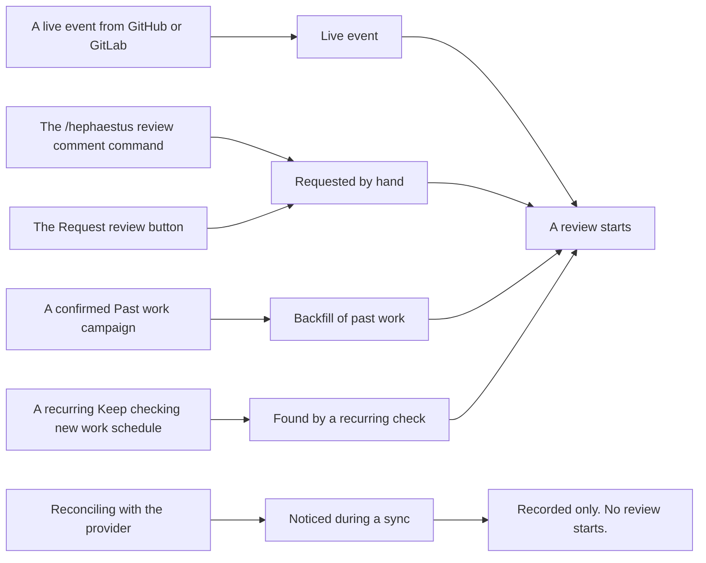

Practice review checks connected workspace work against its installed practices.
This work includes pull requests, merge requests, issues, documents, and settled Slack threads.
It first records grounded observations.
It composes feedback only for pull or merge requests and issues.
Document and settled-thread reviews record their results and stop there.

Feedback reaches the work, the developer's private practice pages, or a later mentor conversation.
This page explains setup, cost controls, and diagnosis of quiet workspaces.
Many review gates refuse work without a user-facing error.
Thus, a workspace can become quiet.
Every refusal has a record.

1. First, inspect **Practices → Practice reviews → Work**, which lists every piece of work that Hephaestus recorded.

## First successful review

Use this path before changes to coverage, campaigns, or per-practice overrides.

1. Connect GitHub or GitLab.
2. Confirm that a recent pull or merge request appears under **Practices → Practice reviews → Work**.
3. If it does not, repair ingestion first.
   Practice-review settings cannot make missing work appear.
4. Under **AI models**, assign a ready model to practice reviews.
5. Open **Practices → Review settings → When and where**.
6. Turn on **Start practice reviews**.
7. Under **How reviews start**, enable **Start from work activity**, **Start requested reviews**, or both.
   The screen says *"Nothing can start a review"* if both are off.
8. Open **Practices → Review settings → How much**.
9. Keep **Workspace default** at **Review before sending**, its default.
10. Return to **When and where**.
11. Keep coverage at **All monitored repositories** and **All eligible linked members**.
12. Leave **Send feedback** on.
13. Open a small pull or merge request whose author is an eligible linked member.
14. Open that work under **Practices → Practice reviews → Work**.

The work distinguishes ingestion, admission, observation, composition, withholding, and delivery.
A provider comment is not the success test.
After this path works, you can narrow coverage, add practice overrides, or configure past-work reviews.
The rest of this page gives reference information and diagnosis for those decisions.

### Follow one review end to end

Suppose a developer opens **Update dependencies** with no explanation in its description.
The review follows this sequence:

1. The provider event creates an occurrence.
   It appears under **What we noticed** on **Practices → Practice reviews → Work**.
2. Coverage admits the repository, base branch, and author before the review proceeds.
3. The review gate selects practices whose occasions match the pull request.
4. Capture satisfies each selected practice's evidence requirements before that practice runs.
5. A practice about why a change is needed can observe the absence of an explanation in the searched description.
   That bounded observation remains even if nobody receives feedback.
6. Composition considers the observation with recent observations and feedback.
   It can propose a public summary, private process feedback, mentor context, or no feedback.
7. Server-side policy admits or refuses each proposal.
   Feedback awaiting a decision appears first under **Needs you** on **Practices → Practice reviews**.
8. A workspace admin reads the exact in-context feedback and its observations.
9. That person approves and sends the feedback, or rejects it.

A provider comment exists only after approval and a successful release-time policy check.
The smallest useful diagnostic sequence is occurrence → readiness → observation → composition → delivery.

1. Stop at the first missing stage instead of random changes to downstream settings.

### Use the right screen

| Question                                                          | Open                                                        |
| ----------------------------------------------------------------- | ----------------------------------------------------------- |
| Did this piece of work enter the system, and why was it quiet?    | **Practices → Practice reviews → Work**, then open the work |
| What needs me, and are the reviews working?                       | **Practices → Practice reviews** (the overview)             |
| Did a job run, fail, or produce observations and feedback?        | **Practices → Practice reviews → Reviews**, then open a row |
| Is in-context feedback waiting for approval?                      | **Practices → Practice reviews**, under **Needs you**       |
| How does one practice behave: its outcomes and incorrect marks?   | **Practices → Practice reviews**, then open the practice    |
| Which work may start reviews, and may feedback be sent?           | **Practices → Review settings → When and where**            |
| How far do reviews go without a person?                           | **Practices → Review settings → How much**                  |
| What does one practice review and which evidence does it require? | **Practices → Practice setup**                              |
| Who counts as a covered person?                                   | **Members**                                                 |
| Is the review model ready?                                        | **AI models**                                               |
| Did a budget stop new work?                                       | **AI usage**                                                |

### Read the Practice reviews overview

**Practices → Practice reviews** opens an overview.
Its time range is the last 7 days, 30 days, 90 days, or 12 months.
The range controls everything except feedback awaiting approval.
That feedback remains regardless of its composition date.

The number beside **Practice reviews** in the sidebar counts feedback awaiting approval.
You can see it anywhere in the workspace.
If the **Practices** sidebar section is folded, the number appears on **Practices**.
If the sidebar shows only icons, the **Practices** tooltip gives the number.

**Needs you** lists feedback awaiting approval, oldest first.
**Review N pieces of feedback** opens the oldest in a queue.
The panel shows your position, such as **2 of 7**.
The adjacent arrows move backward or forward through the queue.
Approval or rejection moves to the next piece or returns to a piece you skipped.
The panel closes when nothing else awaits a decision.

Feedback opened from the **Feedback** list, a review, or an observation opens alone, without the queue.
Below the queue, one line counts these problems in the selected range:

- Reviews that failed or timed out.
- Reviews whose results could not be processed or delivered.
- Feedback that failed to deliver.

A review with failed automatic delivery counts in both of the latter two groups.
Each count opens exactly the corresponding list.
If nothing needs you, one line states this.

**What the reviews did** has a tile for **Reviews**, **Observations**, and **Feedback**.
Each shows its total, change from the preceding period of equal length, volume through the range, and subdivisions.
Queued or active reviews count separately because they have no result yet.
Observations marked incorrect appear separately from the outcomes they overlap.

Feedback groups are awaiting approval, prepared, delivered, unconfirmed, withheld, and failed to deliver.
Delivered includes feedback that reached the developer only in part.
Unconfirmed is conversation feedback with no record that it appeared.
It is neither delivered nor withheld, and it is never prepared again.
Withheld includes feedback rejected by a reviewer or replaced by newer feedback.
Each count opens exactly the rows it counts.

**Practices** lists practices with an observation, or feedback about one, in the range, busiest first.
Each row counts observations, negative outcomes, and observations marked incorrect.
It shows how much feedback that cites the practice was delivered.
Only observations an admin judged incorrect have that mark.
An unmarked observation is not confirmed correct.

A final line counts enabled, reviewable practices that recorded nothing in the range.

1. Open a practice to see its autonomy, counts, and most recent observations, or to edit it.

The overview's lists are **Reviews**, **Observations**, and **Feedback**.
Each has its own date filter.
A tab opens without a date filter.
An overview count opens the corresponding list filtered to that range.
**Reviews** filters by status and **Result processing**.
**Observations** filters by **Origin**, among other filters.

**Feedback** filters by **Practice**, meaning the practices covered by its observations.
It can list the oldest first.
A review, observation, piece of feedback, reviewed work, or practice opens as a panel over the current page.
Links inside a panel open the next record over it.
The path at the top returns to earlier records.
The page address identifies open panels, so you can share it.

### Correct an observation that was wrong

1. Open the observation under **Practices → Practice reviews → Observations**.
2. Select **Mark as incorrect** at the bottom of the panel.
3. Supply a reason that the developer will read.

The review record stays unchanged.
The observation no longer contributes to the developer's standing, Practice profile, or Heph's context.
Feedback about it that has reached nobody is withheld.
If Hephaestus is delivering feedback that cites it at that moment, it asks you to retry and changes nothing.

Comments already on the pull request or merge request do not change immediately.
The page shows their resulting state, and each state has a record.
The table contains the exact UI text:

| State                  | Sentence shown while the correction is in force                                                                                                                                                                                                                                                                      |
| ---------------------- | -------------------------------------------------------------------------------------------------------------------------------------------------------------------------------------------------------------------------------------------------------------------------------------------------------------------- |
| Pending                | `Hephaestus is still correcting the comments it posted about this observation, or it is still checking whether a comment it tried to post arrived.`                                                                                                                                                                  |
| Nothing posted         | `No comment about it was found on the work.`                                                                                                                                                                                                                                                                         |
| Updated                | `Every summary comment Hephaestus posted about it now opens with a correction notice, or has since been deleted.`                                                                                                                                                                                                    |
| Inline comments remain | `Inline comments Hephaestus posted about it are still on the work unchanged, because they cannot be edited from here. Any summary comment now carries a correction notice. Remove or answer the inline comments on the pull request or merge request.`                                                               |
| Unresolved             | `Hephaestus cannot correct every comment about it. A summary comment could not be edited, the provider did not say which comment it accepted, or a posted comment is unconfirmed. Check the pull request or merge request and correct it there. Hephaestus keeps checking and updates this if it finds the comment.` |

**Restore observation** reverses the correction with a second reason.
It removes any notice the correction added and resends nothing.
Every correction stays listed on the page.

### Withdraw feedback whose words were wrong

Observations can be correct while their feedback is incorrect.
Only a developer's Practice profile card that awaits display or has appeared can be withdrawn.
You cannot recall feedback posted on the work or raised in a conversation here.

1. Open the feedback under **Practices → Practice reviews → Feedback**.
2. Select **Withdraw feedback** at the bottom of the panel.
3. Supply a reason.

Withdrawal has these effects:

- The feedback's text, delivery, and observations stay unchanged.
- A card that the developer had not seen never appears.
- A previously seen card temporarily shows a withdrawal notice without your reason.
- Later reviews and Heph receive the record that the card existed, without its text.
- Context already given to a review or used in a conversation is not recalled.
- A card on display at the withdrawal moment might already have reached the developer.

**Restore feedback** reverses withdrawal with a second reason.
The card returns through its ordinary checks.
Nothing is sent again.
Every withdrawal and restoration stays listed.
A new withdrawal after restoration adds a new entry.

### Act on a dispute

Developers dispute feedback from their own reviews, linked by every comment on the work.
They can also rate a Practice profile card **Not accurate**.
The dispute appears on each observation that the feedback used, with the developer's explanation.
It adds a **Disputed** mark in the **Observations** list and the **Developer response** filter.
The explanation appears at the top of the observation and feedback panels.
It is the developer's explanation addressed to you.

Practice profile and conversation feedback text remain hidden from you.

1. Decide what the dispute concerns.
2. If the observation was incorrect, use **Mark as incorrect**.
3. If the observations were correct but the Practice profile card was incorrect, use **Withdraw feedback**.
4. If neither applies, leave the dispute unchanged.

The dispute stays on the observation until the developer withdraws it.
While it stands, later reviews of the same work do not raise the same point about the same place again.
The withheld feedback lists that reason.
A different point, or the same point on other work, is not withheld.

Nothing already posted on the work or said in conversation is recalled.
A summary comment gets a correction notice where the provider permits an edit.
Inline comments and conversation replies stay unchanged.

### Approve or reject feedback

Feedback on the work awaits approval by default.

1. Open it under **Needs you**.
2. Check the exact proposed summary and inline comments against their observations.
3. Select **Approve and close** to approve that package and close the panel.

Approval still passes current delivery checks.
It does not approve a pull request for merge.
**Reject feedback** requires one reason:

- **Incorrect**.
- **Missing important context**.
- **Not useful to the recipient**.
- **Already covered elsewhere**.
- **Wrong place for this feedback**.
- **Something else**.

1. Add the requested explanation.

The decision records your identity and reason.
Rejection does not mark observations incorrect.
Use **Mark as incorrect** for that.

## What starts a review

Five entry paths start reviews.
Provider reconciliation also records an occurrence, but stops before a review starts.

The labels on the right match **What we noticed** on **Practices → Practice reviews → Work**.
Two distinctions matter:

- **The comment command and button have indistinguishable records.**
  Both record `Requested by hand`.
  The data does not identify which one was used.
- **Provider reconciliation records an occurrence but starts no review.**
  For pull requests and issues, a sync establishes that something happened, not when.
  A later review would spend money on a stale event.
  Settled Slack threads are the exception.
  Their thread sweep records the occurrence and starts the review.

All five entry paths spend from the workspace's AI budget.

| Entry path                                                 | Who may use it                                                                 | Rate limit                                                 |
| ---------------------------------------------------------- | ------------------------------------------------------------------------------ | ---------------------------------------------------------- |
| Live event                                                 | Nobody. It is automatic, per the practices' occasions                          | Per-workspace cooldown between reviews of the same work    |
| `/hephaestus review` in a **GitLab merge request** comment | The work's author or assignees, or a workspace admin                           | Per-person hourly allowance and the same per-work cooldown |
| **Request review** in the app                              | The same people. Only authorized readers see it, and the server refuses others | Per-person hourly allowance and the same per-work cooldown |
| **Past work** campaign                                     | A workspace admin, only after confirmation of a priced estimate                | The campaign's own scope                                   |
| **Keep checking new work** schedule                        | A workspace admin                                                              | One campaign at a time per workspace                       |

Two switches control the whole table.
**Start from work activity** controls the first row.
**Start requested reviews** controls the other four.
If it is off, the button, comment command, campaigns, and schedules all stop.

Every entry path passes coverage checks.
A manual request does not broaden coverage.
A request about an uncovered author is refused, as a live event would be.
The button appears only on pull requests and issues in these places:

- A developer's **Activity**, beside their own open pull requests and assigned issues.
- Their **Reviews of your work**, beside work with recorded review results.
- For workspace admins, any pull or merge request or issue under **Practices → Practice reviews → Work**.

Documents and Slack threads use their source's occasion, without a manual review target.
There is no comment command on GitHub pull requests.

## Deployment

The workspace setup above is not sufficient on its own.
The deployment must enable the agent runtime on both the submitting server and claiming worker.
It must enable repository checkout wherever evidence capture runs.
Until then, every workspace on the instance stays quiet, regardless of configuration.

No instance population flag configures workspace coverage.
Instance silent mode is the separate emergency brake for external delivery.
[Practice review operations](./practice-review-operations.mdx) covers variables, Compose forwarding, storage, queue metrics, retention, and fixed limits.

Review conditions belong to each practice, not workspace coverage.

1. In the practice editor, select permitted states, such as pull/merge-request draft status or document archive status.

Selection of every value leaves that condition unrestricted.

## Autonomy, coverage, and delivery

Three independent controls answer different questions.
Confusion between them is the most common misconfiguration.

- **Who authorizes release** uses **Off**, **Review before sending**, or **Send automatically**.
  **Off** stops the review.
  **Review before sending** continues measurement.
  It queues each new in-context piece of feedback for a workspace admin to approve or reject.
  The developer's practice pages and mentor still receive feedback on request.
  Only the developer reads those channels.
  **Send automatically** permits new feedback on the work without that decision, subject to the same delivery policy.
  A setting change never releases an existing proposal.
- **Coverage**, under **What gets reviewed**, selects all or selected monitored repositories and people for repository work.
  An empty repository selection covers no repository work.
  Slack conversations and Outline documents have no repository.
  They follow the people selection and their own collection permissions.
  An empty people selection covers nobody across every work kind.
  People coverage uses linked human workspace membership.
  See [Who counts as a person](#who-counts-as-a-person).
- **Send feedback**, under **Sending feedback**, controls whether feedback can leave Hephaestus.
  It stops comments on connected work and feedback in the mentor.
  It does not stop measurement, discard configuration, or remove the developer's own feedback pages.
  Those pages are not external delivery.
  Pause is the immediate workspace brake.
  Feedback approved but unsent at pause is permanently withheld, as automatic feedback is.
  Resume cannot release that old work.
  Undecided proposals stay in the approval queue.
  After resume, a workspace admin can still inspect and decide each proposal under current policy.

1. To stop all new practice reviews, turn **Start practice reviews** off.

Changes to coverage, **Post feedback after merge**, or workspace default autonomy invalidate admitted, unsent automatic feedback.
This applies to narrower and broader settings.
That feedback never re-enters delivery.
A later review creates new feedback.
Undecided proposals remain explicit workflow items and pass current policy checks on later approval.

A cooldown change does not advance the revision.
Delivery checks group and practice overrides separately.
Those overrides never promote an existing proposal to automatic delivery.

### Who counts as a person

People coverage contains linked human workspace members.
The **People** count on the review screen shows how many are in scope.
Only the member's account on the connected GitHub or GitLab instance counts.
The GitHub profile of a GitLab workspace creator establishes membership, not a reviewed person there.
A covered person must appear as eligible on **Members**.

1. Manage a missing person in the connected organization, group, or team roster.
2. Let membership sync add them.

Sign-in to Hephaestus alone does not create workspace membership.
GitLab workspace members include everyone with group access shown in GitLab's group member list with **Include inherited** on:

- Direct group members.
- Parent-group members, including students in a course's parent group for a workspace on its subgroup.
- Members of an invited group, limited to the invitation's role.
- Subgroup members, such as tutors listed only in a team subgroup.
- Project members with Developer or Reporter roles in the group or its subgroups, including a student on one project only.

If GitLab lists someone repeatedly, their highest role applies.
Maintainer and Owner roles make workspace admins.
Someone listed only by a subgroup or project is a member.
An email invitation counts after acceptance.
The workspace owner retains the workspace regardless of the roster.

A person leaves when GitLab stops listing them.
Removal is immediate if GitLab reports loss of access to the group and every subgroup.
Otherwise, removal occurs at the next membership sync (`MONITORING_SYNC_CRON`) with a complete GitLab listing.
An incomplete listing changes nobody.
Removal of direct membership does not remove a person with access through a parent or invited group.

The person a practice evaluates must be covered.
Usually this is the pull-request or issue author.
Reviewer practices use the reviewer.
Outside contributors, unlinked reviewers, unidentified people, and bots remain outside coverage.
Hephaestus prepares no feedback about them.

1. Before a diagnosis of broken reviews, read the **People** count.

If it is below your contributor count, the difference is nonmembers.

### You set this once, not a hundred times

The workspace's **Autonomy** answer applies to every group and practice until an override.
A group can override the workspace.
A practice can override its group:

> practice → its group → the workspace

An undecided value shows as **inherited**, with its source level.
You can reset an override to inheritance at any time.
Workspaces can have dozens of practices across a dozen groups.
A setting that needs individual row changes is unlikely to be applied.

1. Start with one workspace answer.
2. Override the few groups where that answer is inappropriate.

Coverage does not use inheritance.
It is set once for the whole workspace on **When and where**.
Above its list, **Review settings → How much** counts practices at each setting for the workspace and each group.
That line is the fastest way to check an old override.
**Set by hand** filters the list to overrides.

1. Before a change, read that count line.

The [practice review glossary](/contributor/practice-review-glossary) defines exact refusal semantics and delivery-gate order for all three controls.

## What costs money

A review can make many model calls.
These controls limit admission and spend:

- **The monthly AI budget** has two separate caps, which are never added together.
  The *instance* budget caps shared-model spend for models you registered.
  The *workspace's own* budget caps its connected-provider spend.
  Each pauses only the work it funds.
  Exactly `0` stops that budget's spend mid-month.
  An empty field removes the cap.
- **The cooldown** is the minimum gap between reviews of the same work for the same occasion.
  New commits become eligible for one review at the latest commit after ten quiet minutes.
  They also become eligible sixty minutes after the first pending push.
  The cooldown can delay that review further.
  This groups changes and is not an hourly rate cap.
  Queue and concurrency limits also affect review start time.
- **The per-person hourly allowance** limits hand-requested reviews.
- **Coverage and autonomy** determine eligible work.

A budget pause is a **hold**, not cancellation.
Queued jobs resume automatically after a cap increase or a new month.
A job still over cap seven days after queue entry is canceled instead of held forever.

**Practice reviews go silent when a budget is exhausted, and the mentor does not.**
A queued review is refused before execution and posts nothing.
No end user sees an error.
A mentor request to an exhausted budget receives a reply that names the cap and who can raise it.
Operators hear about mentor failures but must actively inspect review failures.

[Integrations & Reference Deployment](./production-setup#instance-wide-llm-settings) explains full budget mechanics, including an unverifiable month.

## Reviewing past work

A campaign is a bounded decision.
A recurring check is ongoing authorization.
**Past work** is under **Administration → Practices → Review settings → Past work**.
The recurring check is on **When and where**, beside other review triggers.

**A campaign — *Past work*.** A campaign is bounded, priced, named, and ends.
No review starts until confirmation.

1. Choose a kind of work and a lookback window.
2. Select **Estimate this backfill**.
3. Review the work count and estimated cost.
4. Confirm the campaign.

:::caution CAUTION: A recurring check authorizes spending *and* speaking
A schedule starts every campaign **directly in a running state** under its creator's authority.
Each run has a cost estimate, but nobody approves it.
There is no sweep-specific cap.
Only the workspace AI budget, schedule scope, or a disabled schedule stops it.
Before confirmation, the screen states:

> Every check can start reviews, so this authorizes the AI spend for all of them, not just the first.

**A swept review is a normal review.**
It records live observations, composes feedback, and delivers provider comments, practice-page cards, and mentor context.
It behaves as an event-triggered review would.
The sweep finds current work that had no notification.
A schedule is an ongoing decision about spend and feedback, not a one-time action.

1. To stop it, select **Pause** or **Remove** on the schedule, or cancel its campaign.

Windows intentionally overlap so previously missed work gets another opportunity.
Previously reviewed work does not incur a second review charge.
:::

**A schedule — *Keep checking new work*.** The schedule reviews work that raised no notification and would otherwise silently remain unreviewed.

1. Choose a kind of work.
2. Choose a cadence.
3. Choose how far back each check reaches.

**A campaign, by contrast, is measured and never delivered.**
Backfilled runs never enter composition.
The in-app channel also refuses a pattern supported only by backfilled observations.
Results appear in read models and under **Practices → Practice reviews**.
They never become comments, practice-page cards, or mentor briefs.

This behavior cannot be changed by a setting.
A campaign changes what you can read about past work.
It does not contact the people whose work it measured.
A campaign does not move a practice's trend.
It does not resolve feedback on the Practice profile.
If only a campaign judged a practice, that practice shows a standing from the campaign alone.

## When a workspace goes quiet

Step 0 usually ends diagnosis.
Steps 1–7 are workspace-specific.
Steps 8–10 apply to the instance.
If several workspaces became quiet simultaneously, start with steps 8–10.

**0. Open the work.**

1. Open **Practices → Practice reviews → Work**.
2. Read what was recorded.

The list includes all recorded work, reviewed or not.
Names follow the provider, such as *Pull request #1423* on GitHub or *Merge request !1423* on GitLab.
Each row counts the recorded moments that started a review.
The work view includes:

- Observations and feedback.
- **What we noticed**: records, discovery method, review start, and any reason for no start.
- **Every practice**: each practice's result and a sentence that states what would change it.

A quiet workspace with rows differs from a quiet workspace with none.
The sentences give the same reasons as the checks below.
They identify the relevant next step.

1. If the work reports an unset model, disabled practices, or an exhausted budget, repair that configuration.
2. If it reports no records, check the integration's sync.

The latter problem is upstream of practice review.
If the work is not visible on the provider, a sync marked it as gone.
This is not misconfiguration.
Reviews remain held until a sync finds the work again.
They run automatically after its return, or are dropped if it stays absent for a week.

1. **Check the review model binding and enabled state.**
   Open Administration → **AI models**, the **Practice reviews** card.
2. **Check whether the bound model remains usable.**
   The model and connection must be enabled, and the protocol must be supported.
   A shared model for selected workspaces also requires this workspace's grant.
   Grant revocation or connection disablement stops every bound workspace, although the binding still appears correct.
3. **Check for an exhausted budget.**
   Administration → **AI usage** identifies the budget and who can raise it.
   `agent.queue.held` counts capped jobs.
   `agent.queue.depth` counts only jobs a worker can claim now.
   Use held jobs for alerts, not depth.
4. **Check whether practice review or the workspace is off.**
   **Start practice reviews** is under Administration → Practices → **Review settings → When and where**, not Workspace settings.
   An API-suspended workspace runs nothing, regardless of AI configuration.
   Workspace settings has no pause control.
   A developer's **No AI** stops reviews about them (`MEMBER_AI_DECLINED`).
   A choice with no matching model stops admission without a looser choice.
   Check the member's AI choice separately from coverage and model availability.
5. **Check whether anything can start a review.**
   On the same screen, inspect **How reviews start**.
   If **Start from work activity** and **Start requested reviews** are both off, the enabled workspace receives no reviews.
   The screen says *"Nothing can start a review"*.
6. **Check work coverage.**
   On the same screen, inspect **What gets reviewed**.
   Both counts must be nonzero, and the author must be a covered person.
   **What we noticed** distinguishes an unknown author from excluded work:

   - *“The author is unknown or not yet a member of this workspace”*.
     The repository and base branch are covered.
     The author is not a member on the connected instance, or has no known account.
     Check **Members**, and for GitLab the group's list with inherited members shown.
     Work waits for membership sync to admit the author.
     It then runs without another request if admission occurs within `SIGNAL_LEDGER_PENDING_LAPSE_AFTER` (default seven days).
   - *“The author, repository, or base branch is outside this workspace’s review scope”*.
     The repository or base branch is unselected, or the people selection excludes the member.
     This decision is final for the work.
     Broader coverage affects later work.

   Bot authors have a separate refusal.
   Bot work is not reviewed as a member's work.
   Generated paths remain in captured evidence, marked as generated, and are not judged as hand-written work.
   See [Generated paths](#generated-paths).

7. **Check whether delivery is paused.**
   On the same screen, inspect **Sending feedback**.
   Reviews and in-app feedback continue, but comments and feedback in Heph do not leave Hephaestus.
   Resume does not release automatic feedback withheld by the pause.
8. **Check `AGENT_ENABLED=true` on every role that needs it.**
   It defaults to `false` and separately gates submission, execution, and orphan recovery, independently of the worker role.
   If enabled only on the worker, no submission occurs.
   If enabled only on the server, jobs queue without claims.
   Confirm presence, not value.
   If the flag never reached a pod, its metrics omit `agent.queue.depth`, `agent.queue.oldest_age_seconds`, and `agent.queue.running`.
   These metrics are **absent**, not zero.
9. **Check whether workers claim jobs.**
   Watch `agent.queue.oldest_age_seconds`.
   It should rise and fall.
   A continual increase means the server submits jobs but no worker claims them.
10. **Check instance-wide silent mode.**
    Open Instance admin → **Instance settings**.
    While it is on, it blocks external comments, conversation feedback, and email for every workspace.
    Reviews continue, and in-app feedback still reaches developers' Practice profiles.
    Every instance-admin page shows a banner.

The **Reviews** tab under Administration → **Practices → Practice reviews** lists per-workspace review status.

1. Open a review to see its model and error message.

This is the fastest distinction between no submission and failed submission.

## Generated paths

Generated paths are separate for each monitored GitHub or GitLab repository.
The setting is independent of repository and branch coverage.
A coverage change does not clear generated paths.
Slack conversations and Outline documents have no repository paths, so the setting does not apply.

1. In **Review settings**, set generated paths for the repository.
2. Enter one pattern per line.
3. To stop the classification, clear the list.
4. Save the change.

Patterns use case-sensitive, repository-root Ant-style globs:

- `*` matches within one path segment.
- `?` matches one character.
- `**` matches zero or more directories.

`webapp/src/api/**` marks all files below the committed API client.
`**/*.generated.ts` matches that suffix at any depth.
A bare filename matches only at the repository root.
Each repository accepts at most 100 patterns, each with at most 512 characters.
The matcher has no negation, leading `/`, parent traversal, or URI variable.
It does not automatically import `.gitattributes` or other tools' settings.

1. Use `/` separators.

**Generated content is kept, not removed.**
The review receives matched changed paths as trusted workspace policy.
It must not judge them as hand-written work or count them toward hand-written review size.
The `excludes-generated-and-build-artifacts` practice does not treat intentionally committed output on those paths as unwanted artifacts.
It can still assess artifacts outside them.

If a practice requires hand-written changes and none remain, the result is **Not applicable**, not a strength or problem.
Other evidence, including the title, body, commits, and review comments, remains available.
A broad pattern can hide useful practice feedback.

1. Mark only paths that your repository intentionally generates.
2. Under **Practice reviews**, open a review to see its generated-path patterns and matched changed paths.

Both names of a renamed file have separate checks.
Review admission fixes the patterns.
Evidence capture records matched paths.
Later setting changes do not rewrite old records.
A review with no captured classification does not claim that no paths matched.

The matcher follows [Spring's AntPathMatcher semantics](https://docs.spring.io/spring-framework/docs/current/javadoc-api/org/springframework/util/AntPathMatcher.html), not `.gitignore` or `.gitattributes` syntax.
GitHub also supports [marking generated files for diff presentation](https://docs.github.com/en/repositories/working-with-files/managing-files/customizing-how-changed-files-appear-on-github).
Hephaestus uses the workspace admin's explicit per-repository setting.
