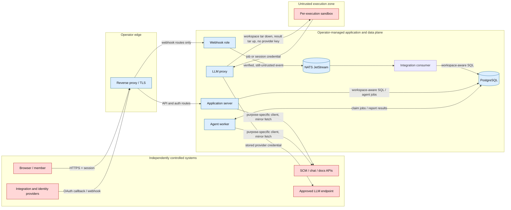

# Security threat model

This model applies to the supported self-hosted Compose topology in this documentation revision.
It covers the four application trust boundaries below.
These separate control planes are outside its scope:

- Browser and identity-provider internals.
- Host and database administration.
- Backup custody.
- The CI/release supply chain.
- Edge DDoS protection.

The [Security Policy](https://github.com/hephaestus-build/Hephaestus/blob/main/SECURITY.md), [Production Setup](./production-setup), [Backup & Restore](./backup-restore), and [Release Image Lock](./release-image-lock) own those control planes.

## Security objectives and protected assets

Hephaestus must meet these security objectives:

1. Prevent one workspace from reading or changing another workspace's data.
2. Keep reusable integration, session, encryption, and model-provider credentials out of untrusted content and sandbox environments.
3. Contain execution influenced by repositories and models without trusting their instructions or output.
4. Authenticate public ingress.
5. Bound public ingress.
6. Restrict outbound destinations and side effects.

| Asset                       | Examples                                                                           |
| --------------------------- | ---------------------------------------------------------------------------------- |
| Reusable credentials        | Provider keys, OAuth secrets, integration tokens, webhook secrets, encryption keys |
| Workspace-confidential data | Repository content, issues, messages, documents, feedback, membership              |
| Untrusted content           | Webhook bodies, diffs, files, comments, chat, documents, model output              |
| Operational data            | Job and delivery identifiers, metrics, sanitized error categories                  |

## System and data flow

Arrows show permitted logical flows, not network-level reachability.
Only `application-worker` holds the Docker socket and joins each internal sandbox network.
That container carries the worker role.
The application server runs without the worker role and joins none of those networks.

Without internet access, a sandbox's network has only the worker's sandbox gateway as a listener.
The worker's application and management listeners bind to other addresses.
No other service or external route attaches to that network.
A sandbox with internet access uses an ordinary bridge (SB-3).
The [sandbox isolation probe](https://github.com/hephaestus-build/Hephaestus/blob/main/scripts/sandbox-isolation-probe.ts) checks this on the supported install in CI and before each release.

Sandbox inputs arrive and results leave through the worker's sandbox gateway, which also hosts the LLM proxy.
No worker disk paths mount into a sandbox.
Runtime-role separation reduces reachable surface but is not authorization.
See [Runtime Roles](./runtime-roles).

## Attacker assumptions

An attacker can be any of these actors:

- An unauthenticated internet client that calls all routes exposed by the reverse proxy.
- A legitimate member who attempts horizontal or vertical privilege escalation.
- A compromised integration account that sends correctly signed malicious content.
- A repository contributor who puts prompt injection, malicious source, symlinks, or resource-exhaustion inputs in synchronized artifacts.
- A malicious or compromised model endpoint that returns crafted output.
- Code inside a sandbox, with full knowledge of the image and application design.

The model trusts these principals:

- Docker daemon and host root.
- Running application processes.
- PostgreSQL administrator.
- Instance encryption key.
- Configured instance admins.

Their compromise is outside the isolation guarantees described here.

## Mitigations index

Each table links threats to enforcement, verification, and residual risk.

### Boundary 1: public webhook ingress

| ID and threat                                    | Enforced control                                                                                                                                                 | Enforcement                                                                                                                                                                                                                                                                                                                                                                                                              | Verification                                                                                                                                                                                                                                                                                                                                                                                                                                                                                                                                                                                                                                                                                                                                                                                                                                                                                                                                                                                                                                                                                                                                                                                                                                                                       | Residual risk                                                                                                                                                                                                                                          |
| ------------------------------------------------ | ---------------------------------------------------------------------------------------------------------------------------------------------------------------- | ------------------------------------------------------------------------------------------------------------------------------------------------------------------------------------------------------------------------------------------------------------------------------------------------------------------------------------------------------------------------------------------------------------------------ | ---------------------------------------------------------------------------------------------------------------------------------------------------------------------------------------------------------------------------------------------------------------------------------------------------------------------------------------------------------------------------------------------------------------------------------------------------------------------------------------------------------------------------------------------------------------------------------------------------------------------------------------------------------------------------------------------------------------------------------------------------------------------------------------------------------------------------------------------------------------------------------------------------------------------------------------------------------------------------------------------------------------------------------------------------------------------------------------------------------------------------------------------------------------------------------------------------------------------------------------------------------------------------------- | ------------------------------------------------------------------------------------------------------------------------------------------------------------------------------------------------------------------------------------------------------ |
| WH-1 — forged or unsupported provider event      | Resolve a known integration kind and verify the provider-signed raw bytes before parsing. Missing routing, verifier, or subject derivation fails closed.         | [`IntegrationKindRouting`](https://github.com/hephaestus-build/Hephaestus/blob/main/server/application/src/main/java/de/tum/cit/aet/hephaestus/integration/core/webhook/IntegrationKindRouting.java), [`WebhookIngestPipeline`](https://github.com/hephaestus-build/Hephaestus/blob/main/server/application/src/main/java/de/tum/cit/aet/hephaestus/integration/core/webhook/WebhookIngestPipeline.java)                 | [`IntegrationKindRoutingTest`](https://github.com/hephaestus-build/Hephaestus/blob/main/server/application/src/test/java/de/tum/cit/aet/hephaestus/integration/core/webhook/IntegrationKindRoutingTest.java), [`WebhookIngestPipelineTest`](https://github.com/hephaestus-build/Hephaestus/blob/main/server/application/src/test/java/de/tum/cit/aet/hephaestus/integration/core/webhook/WebhookIngestPipelineTest.java), provider signature-verifier tests for [GitHub](https://github.com/hephaestus-build/Hephaestus/blob/main/server/application/src/test/java/de/tum/cit/aet/hephaestus/integration/scm/github/webhook/GitHubWebhookSignatureVerifierTest.java), [GitLab](https://github.com/hephaestus-build/Hephaestus/blob/main/server/application/src/test/java/de/tum/cit/aet/hephaestus/integration/scm/gitlab/webhook/GitLabWebhookSignatureVerifierTest.java), [Slack](https://github.com/hephaestus-build/Hephaestus/blob/main/server/application/src/test/java/de/tum/cit/aet/hephaestus/integration/slack/webhook/SlackWebhookSignatureVerifierTest.java), and [Outline](https://github.com/hephaestus-build/Hephaestus/blob/main/server/application/src/test/java/de/tum/cit/aet/hephaestus/integration/outline/webhook/OutlineWebhookSignatureVerifierTest.java) | A valid signature does not make content safe and cannot detect a compromised provider account. Replay resistance differs by provider. GitHub and GitLab rely on bounded deduplication. After that bound expires, consumers can receive a replay again. |
| WH-2 — oversized input or queue overload         | Require a declared request size within the configured limit and fail startup when the broker cannot accept that size.                                            | [`WebhookPayloadSizeFilter`](https://github.com/hephaestus-build/Hephaestus/blob/main/server/application/src/main/java/de/tum/cit/aet/hephaestus/integration/core/webhook/WebhookPayloadSizeFilter.java), [`WebhookPayloadCapacityCheck`](https://github.com/hephaestus-build/Hephaestus/blob/main/server/application/src/main/java/de/tum/cit/aet/hephaestus/integration/core/webhook/WebhookPayloadCapacityCheck.java) | [`WebhookPayloadSizeFilterTest`](https://github.com/hephaestus-build/Hephaestus/blob/main/server/application/src/test/java/de/tum/cit/aet/hephaestus/integration/core/webhook/WebhookPayloadSizeFilterTest.java), [`WebhookPayloadCapacityCheckTest`](https://github.com/hephaestus-build/Hephaestus/blob/main/server/application/src/test/java/de/tum/cit/aet/hephaestus/integration/core/webhook/WebhookPayloadCapacityCheckTest.java)                                                                                                                                                                                                                                                                                                                                                                                                                                                                                                                                                                                                                                                                                                                                                                                                                                           | Volumetric filtering and rate limiting remain edge responsibilities.                                                                                                                                                                                   |
| WH-3 — acknowledged loss or duplicate processing | Events selected for durable processing return success only after JetStream accepts them. Per-kind stable keys use provider delivery identifiers where available. | [`WebhookIngestPipeline`](https://github.com/hephaestus-build/Hephaestus/blob/main/server/application/src/main/java/de/tum/cit/aet/hephaestus/integration/core/webhook/WebhookIngestPipeline.java)                                                                                                                                                                                                                       | [`WebhookIngestPipelineTest`](https://github.com/hephaestus-build/Hephaestus/blob/main/server/application/src/test/java/de/tum/cit/aet/hephaestus/integration/core/webhook/WebhookIngestPipelineTest.java), [`WebhookIngestionCannotFailSilentlyTest`](https://github.com/hephaestus-build/Hephaestus/blob/main/server/application/src/test/java/de/tum/cit/aet/hephaestus/integration/core/webhook/WebhookIngestionCannotFailSilentlyTest.java)                                                                                                                                                                                                                                                                                                                                                                                                                                                                                                                                                                                                                                                                                                                                                                                                                                   | Protocol challenges and deliberately filtered events respond without publishing. Deduplication expires with broker retention, so consumers must tolerate redelivery.                                                                                   |

1. Route only `/webhooks/**` to a separately exposed webhook role.
2. Operate its capacity and retry signals as [Webhook Ingestion Operations](./webhook-ingestion-operations) describes.

### Boundary 2: LLM agent sandbox

Repository, chat, and model content is untrusted and can influence tool use.
A practice review's agent has `bash` among its tools.
The image includes Bash and Git.

1. Treat a sandbox as capable of running any shell command that untrusted content can cause.

The mentor runner exposes no native tool.
Model output remains untrusted.
Any operation that stores it or creates an external write must apply that operation's validation and authorization.

| ID and threat                                                    | Enforced control                                                                                                                                                                                                                                                                                                                                                                                                                                                                                                                                                                                                                                                                                                                                                                                                    | Enforcement                                                                                                                                                                                                                                                                                                                                                                                                                                                                                                                                                                                                                                                                                                                                                                                                                                                                                                                                                                                                                                                                                             | Verification                                                                                                                                                                                                                                                                                                                                                                                                                                                                                                                                                                                                                                                                                                                                                                                                                                                                                                                                                                                                                                                                                                                                                                                                   | Residual risk                                                                                                                                                                                                                                                                                                                                                                                                                                                                                                |
| ---------------------------------------------------------------- | ------------------------------------------------------------------------------------------------------------------------------------------------------------------------------------------------------------------------------------------------------------------------------------------------------------------------------------------------------------------------------------------------------------------------------------------------------------------------------------------------------------------------------------------------------------------------------------------------------------------------------------------------------------------------------------------------------------------------------------------------------------------------------------------------------------------- | ------------------------------------------------------------------------------------------------------------------------------------------------------------------------------------------------------------------------------------------------------------------------------------------------------------------------------------------------------------------------------------------------------------------------------------------------------------------------------------------------------------------------------------------------------------------------------------------------------------------------------------------------------------------------------------------------------------------------------------------------------------------------------------------------------------------------------------------------------------------------------------------------------------------------------------------------------------------------------------------------------------------------------------------------------------------------------------------------------- | -------------------------------------------------------------------------------------------------------------------------------------------------------------------------------------------------------------------------------------------------------------------------------------------------------------------------------------------------------------------------------------------------------------------------------------------------------------------------------------------------------------------------------------------------------------------------------------------------------------------------------------------------------------------------------------------------------------------------------------------------------------------------------------------------------------------------------------------------------------------------------------------------------------------------------------------------------------------------------------------------------------------------------------------------------------------------------------------------------------------------------------------------------------------------------------------------------------- | ------------------------------------------------------------------------------------------------------------------------------------------------------------------------------------------------------------------------------------------------------------------------------------------------------------------------------------------------------------------------------------------------------------------------------------------------------------------------------------------------------------ |
| SB-1 — privilege escalation, host escape, or resource exhaustion | The policy requires non-privileged execution, dropped capabilities, and `no-new-privileges`. It uses private cgroup/IPC namespaces and seccomp. It applies CPU/memory/PID/file limits. It disables core dumps. It bounds `nosuid,nodev` tmpfs mounts and uses `noexec` where compatible.                                                                                                                                                                                                                                                                                                                                                                                                                                                                                                                            | [`ContainerSecurityPolicy`](https://github.com/hephaestus-build/Hephaestus/blob/main/server/application/src/main/java/de/tum/cit/aet/hephaestus/agent/sandbox/docker/ContainerSecurityPolicy.java)                                                                                                                                                                                                                                                                                                                                                                                                                                                                                                                                                                                                                                                                                                                                                                                                                                                                                                      | [`SandboxArchitectureTest`](https://github.com/hephaestus-build/Hephaestus/blob/main/server/application/src/test/java/de/tum/cit/aet/hephaestus/agent/sandbox/SandboxArchitectureTest.java), [`DockerSandboxAdapterTest`](https://github.com/hephaestus-build/Hephaestus/blob/main/server/application/src/test/java/de/tum/cit/aet/hephaestus/agent/sandbox/docker/DockerSandboxAdapterTest.java), [`DockerSandboxLiveTest`](https://github.com/hephaestus-build/Hephaestus/blob/main/server/application/src/test/java/de/tum/cit/aet/hephaestus/agent/sandbox/docker/DockerSandboxLiveTest.java)                                                                                                                                                                                                                                                                                                                                                                                                                                                                                                                                                                                                              | The root filesystem and captured inputs are mounted read-only. Scratch space remains writable. Standard Docker shares the host kernel and daemon. Use gVisor and dedicated, patched worker hosts for hostile multi-tenant workloads. Never mount the Docker socket or secret-bearing host paths into a sandbox.                                                                                                                                                                                              |
| SB-2 — provider-secret theft or proxy abuse                      | Keep the provider key in the application catalog. The proxy accepts job credentials only while the job runs. Mentor credentials follow the live session lifecycle. The proxy binds requests to the admitted connection, model, API, and path. It serves requests only on the worker's sandbox gateway connector. It bounds each authenticated principal's request rate and declared request size.                                                                                                                                                                                                                                                                                                                                                                                                                   | [ADR 0006](https://github.com/hephaestus-build/Hephaestus/blob/main/docs/decisions/0006-llm-proxy-on-coordinator-trust-model.md), [`JobTokenAuthenticationFilter`](https://github.com/hephaestus-build/Hephaestus/blob/main/server/application/src/main/java/de/tum/cit/aet/hephaestus/agent/proxy/JobTokenAuthenticationFilter.java), [`LlmProxyController`](https://github.com/hephaestus-build/Hephaestus/blob/main/server/application/src/main/java/de/tum/cit/aet/hephaestus/agent/proxy/LlmProxyController.java), [`LlmProxySecurityConfig`](https://github.com/hephaestus-build/Hephaestus/blob/main/server/application/src/main/java/de/tum/cit/aet/hephaestus/agent/proxy/LlmProxySecurityConfig.java)                                                                                                                                                                                                                                                                                                                                                                                         | [`JobTokenAuthenticationFilterTest`](https://github.com/hephaestus-build/Hephaestus/blob/main/server/application/src/test/java/de/tum/cit/aet/hephaestus/agent/proxy/JobTokenAuthenticationFilterTest.java), [`LlmProxyIntegrationTest`](https://github.com/hephaestus-build/Hephaestus/blob/main/server/application/src/test/java/de/tum/cit/aet/hephaestus/agent/proxy/LlmProxyIntegrationTest.java), [`LlmProxySecurityConfigTest`](https://github.com/hephaestus-build/Hephaestus/blob/main/server/application/src/test/java/de/tum/cit/aet/hephaestus/agent/proxy/LlmProxySecurityConfigTest.java), [`SandboxGatewayRateLimitFilterTest`](https://github.com/hephaestus-build/Hephaestus/blob/main/server/application/src/test/java/de/tum/cit/aet/hephaestus/agent/proxy/SandboxGatewayRateLimitFilterTest.java), [`PayloadSizeFilterTest`](https://github.com/hephaestus-build/Hephaestus/blob/main/server/application/src/test/java/de/tum/cit/aet/hephaestus/core/web/PayloadSizeFilterTest.java), [`SandboxEnvBlocklistTest`](https://github.com/hephaestus-build/Hephaestus/blob/main/server/application/src/test/java/de/tum/cit/aet/hephaestus/agent/sandbox/docker/SandboxEnvBlocklistTest.java) | The worker-side application process holds catalog credentials. A third-party worker is outside the supported topology. [ADR 0041](https://github.com/hephaestus-build/Hephaestus/blob/main/docs/decisions/0041-compose-1x-kubernetes-2.md) owns that decision.                                                                                                                                                                                                                                               |
| SB-3 — network exfiltration or cross-execution access            | Create per-execution Docker resources. With internet access disabled, use an internal network with no external route. Configure an unusable DNS resolver.                                                                                                                                                                                                                                                                                                                                                                                                                                                                                                                                                                                                                                                           | [`SandboxNetworkManager`](https://github.com/hephaestus-build/Hephaestus/blob/main/server/application/src/main/java/de/tum/cit/aet/hephaestus/agent/sandbox/docker/SandboxNetworkManager.java), [`ContainerSecurityPolicy`](https://github.com/hephaestus-build/Hephaestus/blob/main/server/application/src/main/java/de/tum/cit/aet/hephaestus/agent/sandbox/docker/ContainerSecurityPolicy.java)                                                                                                                                                                                                                                                                                                                                                                                                                                                                                                                                                                                                                                                                                                      | [sandbox isolation probe](https://github.com/hephaestus-build/Hephaestus/blob/main/scripts/sandbox-isolation-probe.ts), [`SandboxNetworkManagerTest`](https://github.com/hephaestus-build/Hephaestus/blob/main/server/application/src/test/java/de/tum/cit/aet/hephaestus/agent/sandbox/docker/SandboxNetworkManagerTest.java), [`DockerSandboxLiveTest`](https://github.com/hephaestus-build/Hephaestus/blob/main/server/application/src/test/java/de/tum/cit/aet/hephaestus/agent/sandbox/docker/DockerSandboxLiveTest.java)                                                                                                                                                                                                                                                                                                                                                                                                                                                                                                                                                                                                                                                                                 | Without internet access, the sandbox gateway is the job network's only listener. All its routes must authenticate and authorize sandbox-originated requests. Only the Heph binding uses `internetAccess=true`. This deliberately creates an ordinary bridge, not a hostname allow-list. The isolation probe does not check it. From there a sandbox can reach whatever that bridge and the host's own firewall allow.                                                                                        |
| SB-4 — persistence after execution                               | The reconciler reconciles managed containers, networks, and attempt volumes against durable job state. It reconciles interactive-session resources against the recorded liveness of their creator application container. It removes ended attempts' folders and repository snapshots from worker storage.                                                                                                                                                                                                                                                                                                                                                                                                                                                                                                           | [`SandboxReconciler`](https://github.com/hephaestus-build/Hephaestus/blob/main/server/application/src/main/java/de/tum/cit/aet/hephaestus/agent/sandbox/docker/SandboxReconciler.java), [`JobEvidenceFiles`](https://github.com/hephaestus-build/Hephaestus/blob/main/server/application/src/main/java/de/tum/cit/aet/hephaestus/agent/context/JobEvidenceFiles.java)                                                                                                                                                                                                                                                                                                                                                                                                                                                                                                                                                                                                                                                                                                                                   | [`SandboxReconcilerTest`](https://github.com/hephaestus-build/Hephaestus/blob/main/server/application/src/test/java/de/tum/cit/aet/hephaestus/agent/sandbox/docker/SandboxReconcilerTest.java), [`JobEvidenceFilesTest`](https://github.com/hephaestus-build/Hephaestus/blob/main/server/application/src/test/java/de/tum/cit/aet/hephaestus/agent/context/JobEvidenceFilesTest.java)                                                                                                                                                                                                                                                                                                                                                                                                                                                                                                                                                                                                                                                                                                                                                                                                                          | Host or daemon compromise is outside this control.                                                                                                                                                                                                                                                                                                                                                                                                                                                           |
| SB-5 — hostile repository content during Git preparation         | Eclipse JGit parses repository bytes inside the application process. It is memory-safe and uses no `git` binary. It never executes a hook. JGit receives the fetch credential in memory for that fetch only. The credential never enters the mirror's configuration. `http.followRedirects=false`. A snapshot is a fresh repository under the fabric root, fetched from the local mirror with `core.symlinks=false`. It has no remote and no credentials. Before any write, the snapshot must pass the `GIT_MAX_SNAPSHOT_BYTES` check. An oversized snapshot fails as a whole. The process excludes submodule entries and unsafe paths and records these limitations. It reads the checkout into an attempt folder that never mounts into a sandbox. The sandbox receives it only through the workspace tar (SB-6). | [`GitRepositoryManager`](https://github.com/hephaestus-build/Hephaestus/blob/main/server/application/src/main/java/de/tum/cit/aet/hephaestus/integration/scm/domain/workdir/GitRepositoryManager.java), [`GitRepositoryLockManager`](https://github.com/hephaestus-build/Hephaestus/blob/main/server/application/src/main/java/de/tum/cit/aet/hephaestus/integration/scm/domain/workdir/GitRepositoryLockManager.java), [`JobEvidenceFiles`](https://github.com/hephaestus-build/Hephaestus/blob/main/server/application/src/main/java/de/tum/cit/aet/hephaestus/agent/context/JobEvidenceFiles.java)                                                                                                                                                                                                                                                                                                                                                                                                                                                                                                   | [`GitRepositoryManagerTest`](https://github.com/hephaestus-build/Hephaestus/blob/main/server/application/src/test/java/de/tum/cit/aet/hephaestus/integration/scm/domain/workdir/GitRepositoryManagerTest.java), [`JobEvidenceFilesTest`](https://github.com/hephaestus-build/Hephaestus/blob/main/server/application/src/test/java/de/tum/cit/aet/hephaestus/agent/context/JobEvidenceFilesTest.java)                                                                                                                                                                                                                                                                                                                                                                                                                                                                                                                                                                                                                                                                                                                                                                                                          | A JGit vulnerability executes with the fetching role's privileges, not inside a sandbox. The server fetches for commit ingestion. The worker fetches for review preparation. `GIT_MAX_SNAPSHOT_BYTES` bounds only the snapshot, not the fetch. The mirror can exceed that bound under the container's fabric root. The bound refuses the snapshot taken from the mirror. The mirror is shared by every operation on that repository in one container. An in-process lock serializes a fetch against readers. |
| SB-6 — tampered or oversized workspace and result transport      | Exchange inputs and results only through the sandbox gateway. A per-attempt credential registers one session. A workspace initializer container checks and extracts the staged tar as described in the [workspace ABI](/contributor/agent/agent-workspace-abi). The runtime container then mounts `/workspace` read-only. It has separate writable `work/`, `out/`, `.pi/` and `.sessions/` volumes. These volumes are removed with the attempt. At most one result upload commits per session. The worker validates its archive and SHA-256 `Content-Digest` in memory. A duplicate `409` proves convergence only when its `ETag` matches the runner archive. A wrong credential and an unknown session are indistinguishable.                                                                                     | [`SandboxAttemptLauncher`](https://github.com/hephaestus-build/Hephaestus/blob/main/server/application/src/main/java/de/tum/cit/aet/hephaestus/agent/sandbox/docker/SandboxAttemptLauncher.java), [`DockerAttemptWorkspace`](https://github.com/hephaestus-build/Hephaestus/blob/main/server/application/src/main/java/de/tum/cit/aet/hephaestus/agent/sandbox/docker/DockerAttemptWorkspace.java), [`SandboxGatewaySessions`](https://github.com/hephaestus-build/Hephaestus/blob/main/server/application/src/main/java/de/tum/cit/aet/hephaestus/agent/gateway/SandboxGatewaySessions.java), [`SandboxWorkspaceController`](https://github.com/hephaestus-build/Hephaestus/blob/main/server/application/src/main/java/de/tum/cit/aet/hephaestus/agent/gateway/SandboxWorkspaceController.java), [`SandboxOutputArchive`](https://github.com/hephaestus-build/Hephaestus/blob/main/server/application/src/main/java/de/tum/cit/aet/hephaestus/agent/runtime/SandboxOutputArchive.java), [`gateway-init.ts`](https://github.com/hephaestus-build/Hephaestus/blob/main/docker/agents/pi/gateway-init.ts) | [`SandboxGatewaySessionsTest`](https://github.com/hephaestus-build/Hephaestus/blob/main/server/application/src/test/java/de/tum/cit/aet/hephaestus/agent/gateway/SandboxGatewaySessionsTest.java), [`SandboxWorkspaceControllerTest`](https://github.com/hephaestus-build/Hephaestus/blob/main/server/application/src/test/java/de/tum/cit/aet/hephaestus/agent/gateway/SandboxWorkspaceControllerTest.java), [`SandboxGatewayHandshakeInterceptorTest`](https://github.com/hephaestus-build/Hephaestus/blob/main/server/application/src/test/java/de/tum/cit/aet/hephaestus/agent/gateway/SandboxGatewayHandshakeInterceptorTest.java), [`SandboxOutputArchiveTest`](https://github.com/hephaestus-build/Hephaestus/blob/main/server/application/src/test/java/de/tum/cit/aet/hephaestus/agent/runtime/SandboxOutputArchiveTest.java)                                                                                                                                                                                                                                                                                                                                                                         | The initializer runs the agent image under the same policy as the runtime. What makes it trusted is that only `gateway-init.ts` runs before the runtime container exists. The gateway is plain HTTP on the internal sandbox network. A compromised daemon or host can read the transfer. The staged tar and extracted files coexist during initialization, and the default Docker volume has no per-attempt disk quota.                                                                                      |

### Boundary 3: outbound egress

Destination policy limits where a client may connect. Delivery policy separately limits whether Hephaestus may create an external side effect.

| ID and threat                                      | Enforced control                                                                                                                                                                      | Enforcement                                                                                                                                                                                                                                                                                                                                                                                       | Verification                                                                                                                                                                                                                                                                                                                                                                                                    | Residual risk                                                                                                                                                                                                       |
| -------------------------------------------------- | ------------------------------------------------------------------------------------------------------------------------------------------------------------------------------------- | ------------------------------------------------------------------------------------------------------------------------------------------------------------------------------------------------------------------------------------------------------------------------------------------------------------------------------------------------------------------------------------------------- | --------------------------------------------------------------------------------------------------------------------------------------------------------------------------------------------------------------------------------------------------------------------------------------------------------------------------------------------------------------------------------------------------------------- | ------------------------------------------------------------------------------------------------------------------------------------------------------------------------------------------------------------------- |
| EG-1 — LLM-provider SSRF or DNS rebinding          | Require a public HTTPS provider URL without userinfo, query, or fragment. Apply the optional hostname allow-list. Repeat the private-address check on the DNS result used to connect. | [`EgressPolicy`](https://github.com/hephaestus-build/Hephaestus/blob/main/server/application/src/main/java/de/tum/cit/aet/hephaestus/agent/catalog/EgressPolicy.java), [`LlmProxyWebClientConfig`](https://github.com/hephaestus-build/Hephaestus/blob/main/server/application/src/main/java/de/tum/cit/aet/hephaestus/agent/proxy/LlmProxyWebClientConfig.java)                                  | [`EgressPolicyTest`](https://github.com/hephaestus-build/Hephaestus/blob/main/server/application/src/test/java/de/tum/cit/aet/hephaestus/agent/catalog/EgressPolicyTest.java), [`LlmProxyWebClientConfigTest`](https://github.com/hephaestus-build/Hephaestus/blob/main/server/application/src/test/java/de/tum/cit/aet/hephaestus/agent/proxy/LlmProxyWebClientConfigTest.java)                                | An allowed public service may itself proxy arbitrary destinations or become compromised. Keep the allow-list narrow.                                                                                                |
| EG-2 — unsafe integration origin                   | Reject non-HTTPS origins, embedded credentials, paths, queries, fragments, and literal non-public addresses for user-configured SCM, login-provider, and Outline origins.             | [`ServerUrlValidator`](https://github.com/hephaestus-build/Hephaestus/blob/main/server/application/src/main/java/de/tum/cit/aet/hephaestus/core/security/ServerUrlValidator.java)                                                                                                                                                                                                                 | [`ServerUrlValidatorTest`](https://github.com/hephaestus-build/Hephaestus/blob/main/server/application/src/test/java/de/tum/cit/aet/hephaestus/core/security/ServerUrlValidatorTest.java)                                                                                                                                                                                                                       | This validator performs no DNS lookup. GitLab preflight, Outline API, and Outline identity calls use guarded connect-time resolution. This is not a uniform guarantee for every configurable login-provider client. |
| EG-3 — unapproved external write                   | Route supported delivery adapters through the instance silent-mode guard and reject unregistered adapter shapes in architecture tests.                                                | [`OutboundEgressGuard`](https://github.com/hephaestus-build/Hephaestus/blob/main/server/application/src/main/java/de/tum/cit/aet/hephaestus/integration/core/egress/OutboundEgressGuard.java), [`@OutboundEgressGateway`](https://github.com/hephaestus-build/Hephaestus/blob/main/server/application/src/main/java/de/tum/cit/aet/hephaestus/integration/core/egress/OutboundEgressGateway.java) | [`OutboundEgressGuardTest`](https://github.com/hephaestus-build/Hephaestus/blob/main/server/application/src/test/java/de/tum/cit/aet/hephaestus/integration/core/egress/OutboundEgressGuardTest.java), [`OutboundEgressArchitectureTest`](https://github.com/hephaestus-build/Hephaestus/blob/main/server/application/src/test/java/de/tum/cit/aet/hephaestus/architecture/OutboundEgressArchitectureTest.java) | Silent mode governs supported writes. It is not a network kill switch and does not suppress reads or authentication traffic.                                                                                        |
| EG-4: disclosure of stored integration credentials | Versioned credential keys and row/purpose-bound AES-GCM protect stored integration tokens.                                                                                            | `CredentialBundleConverter`. See [credential key rotation](./credential-key-rotation)                                                                                                                                                                                                                                                                                                             | `CredentialBundleConverterTest`, `EncryptionContextTest`                                                                                                                                                                                                                                                                                                                                                        | Application or key compromise exposes decryptable values. Rotate upstream credentials after exposure. Key rotation alone cannot recall them.                                                                        |

Application destination controls do not constrain a sandbox granted broad internet access. Enforce any such exception through an independent network egress policy.

### Boundary 4: SQL-layer workspace tenancy

Workspace authorization is the primary boundary. SQL inspection is a defect detector for recognized query shapes, not row-level authorization.

| ID and threat                                   | Enforced control                                                                                                                                                 | Enforcement                                                                                                                                                                                                                                                                                                                                                                                                                                                                                                                     | Verification                                                                                                                                                                                                                                                                                                                                                                                               | Residual risk                                                                                                                                                                                                                                                        |
| ----------------------------------------------- | ---------------------------------------------------------------------------------------------------------------------------------------------------------------- | ------------------------------------------------------------------------------------------------------------------------------------------------------------------------------------------------------------------------------------------------------------------------------------------------------------------------------------------------------------------------------------------------------------------------------------------------------------------------------------------------------------------------------- | ---------------------------------------------------------------------------------------------------------------------------------------------------------------------------------------------------------------------------------------------------------------------------------------------------------------------------------------------------------------------------------------------------------- | -------------------------------------------------------------------------------------------------------------------------------------------------------------------------------------------------------------------------------------------------------------------- |
| TN-1: object-ID substitution or role escalation | Workspace-scoped authorization checks tenant access. View as user permits GET-only reads, requires recent sign-in, and commits a USER_VIEW audit before access.  | `WorkspaceSecurityExpressions`, `UserViewAccessService`. See [user views](./instance-admin#view-as-user)                                                                                                                                                                                                                                                                                                                                                                                                                        | `CrossTenantIsolationIntegrationTest`, `UserViewArchitectureTest`                                                                                                                                                                                                                                                                                                                                          | Instance admins have an audited elevated read path. This does not make them workspace members or permit mutations as the viewed member.                                                                                                                              |
| TN-2 — query accidentally omits tenant scope    | With enforcement set to `throw`, reject recognized SQL shapes that reference dynamically inventoried workspace-scoped tables without a recognized tenancy shape. | [ADR 0004](https://github.com/hephaestus-build/Hephaestus/blob/main/docs/decisions/0004-sql-layer-tenancy-via-statement-inspector.md), [`TenancyConfiguration`](https://github.com/hephaestus-build/Hephaestus/blob/main/server/application/src/main/java/de/tum/cit/aet/hephaestus/core/tenancy/TenancyConfiguration.java), [`WorkspaceStatementInspector`](https://github.com/hephaestus-build/Hephaestus/blob/main/server/application/src/main/java/de/tum/cit/aet/hephaestus/core/tenancy/WorkspaceStatementInspector.java) | [`WorkspaceStatementInspectorTest`](https://github.com/hephaestus-build/Hephaestus/blob/main/server/application/src/test/java/de/tum/cit/aet/hephaestus/core/tenancy/WorkspaceStatementInspectorTest.java), [`WorkspaceScopedTablesTest`](https://github.com/hephaestus-build/Hephaestus/blob/main/server/application/src/test/java/de/tum/cit/aet/hephaestus/core/tenancy/WorkspaceScopedTablesTest.java) | Inserts, accepted primary-key shapes, explicit bypasses, and analysis failures are not rejected. Any SQL containing the word `workspace_id` is accepted without proving predicate binding. Object authorization and tenant-bound repository methods remain required. |
| TN-3 — unnecessary cross-workspace bypass       | Require an explicit `@WorkspaceAgnostic` scope for reviewed instance-wide work.                                                                                  | [`@WorkspaceAgnostic`](https://github.com/hephaestus-build/Hephaestus/blob/main/server/application/src/main/java/de/tum/cit/aet/hephaestus/core/WorkspaceAgnostic.java), [`WorkspaceAgnosticAspect`](https://github.com/hephaestus-build/Hephaestus/blob/main/server/application/src/main/java/de/tum/cit/aet/hephaestus/core/tenancy/WorkspaceAgnosticAspect.java)                                                                                                                                                             | [`TenancyBypassTest`](https://github.com/hephaestus-build/Hephaestus/blob/main/server/application/src/test/java/de/tum/cit/aet/hephaestus/core/tenancy/TenancyBypassTest.java), [`MultiTenancyArchitectureTest`](https://github.com/hephaestus-build/Hephaestus/blob/main/server/application/src/test/java/de/tum/cit/aet/hephaestus/architecture/MultiTenancyArchitectureTest.java)                       | The annotation grants a deliberate bypass. Review its call path and query whenever it is added or changed.                                                                                                                                                           |

`log` allows a detected violation to execute and `off` disables inspection. Neither is a production setting. Database backups and direct SQL access bypass application authorization and need separate access control and encryption.

## References and maintenance

- Threat modeling: [OWASP](https://owasp.org/www-community/Threat_Modeling) and [NIST SP 800-154](https://csrc.nist.gov/pubs/sp/800/154/ipd)
- AI systems: [NIST AI Risk Management Framework](https://www.nist.gov/itl/ai-risk-management-framework) and [OWASP Top 10 for LLM Applications](https://owasp.org/www-project-top-10-for-large-language-model-applications/)
- Webhooks: [GitHub](https://docs.github.com/en/webhooks/using-webhooks/validating-webhook-deliveries) and [Slack](https://docs.slack.dev/authentication/verifying-requests-from-slack/)
- Network boundaries: [OWASP SSRF Prevention Cheat Sheet](https://cheatsheetseries.owasp.org/cheatsheets/Server_Side_Request_Forgery_Prevention_Cheat_Sheet.html) and [Docker security guidance](https://docs.docker.com/engine/security/)

Update this page whenever a depicted flow, attacker assumption, boundary control, enforcement setting, or residual risk changes.
