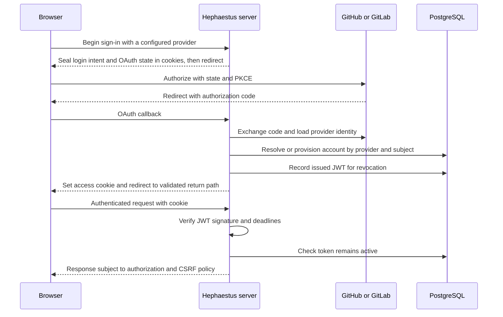

# Auth architecture

Authentication components and request flow. [The auth glossary](auth-glossary.md) defines the domain
and token claims; [ADR 0017](decisions/0017-replace-keycloak-with-spring-native-auth.md) records the
architecture decision.

## Request flow

Identity linking uses the same OAuth exchange but binds its sealed intent to the already
signed-in account. It cannot create an authenticated link from an anonymous request. Slack and
Outline support linking only, not sign-in.

Sign-in and linking also fill [`identity_link.external_actor_id`](./auth-glossary.md), the synced
git-provider user the link denotes. That join, not a login comparison, is what tells the rest of the
system which developer an account is.

## Key properties

- **No HTTP sessions.** Revocation state lives in PostgreSQL. The browser holds one `__Host-HEPHAESTUS_AT`
  cookie carrying an ES256 JWT;
  [session deadlines](./admin/configuration-readiness.mdx#session-deadlines) define
  its lifetime. OAuth-flow state rides AES-GCM cookies, not a
  session — so login works across pods without sticky sessions.
- **Application-issued tokens.** After federating to the upstream IdP, Hephaestus issues its own JWT. Claim
  shape combines standard JWT/OIDC claims with Hephaestus claims, defined in
  [the auth glossary](./auth-glossary.md#jwt-claim-shape) and emitted by `HephaestusJwtIssuer`. The public signing keys are published at `/.well-known/jwks.json`; there is
  no full OIDC discovery document.
- **Database-backed revocation.** Every issued JWT has a `jti` row in `issued_jwt`. Logout /
  refresh / sign-out-everywhere / account-delete set `revoked_at`; `RevocationAwareJwtDecoder`
  re-checks `issued_jwt(jti)` on every request, so revocation takes effect on every pod within
  DB visibility lag. The cache is a *negative* cache (REVOKED verdicts only) that merely sheds
  replay load; no cross-pod cache invalidation is needed.
- **Account lookup is `(provider, subject)`, never email.** This is the structural defence
  against the nOAuth (Descope 2023) account-takeover class. `IdentityLinkRepository` has no
  `findByEmail`.
- **Login providers are instance-scoped.**
  A sign-in option — GitHub, GitLab.com, or a self-hosted GitLab — is a row in the instance
  `login_provider` table (`core.auth.provider`), **one per SCM instance** (`UNIQUE(type, base_url)`),
  env-seeded on first boot and managed at runtime by an instance admin. The client secret is sealed
  by `EncryptedStringConverter` (AES-256-GCM). This is **authentication** only; a workspace's SCM
  data source is a separate per-workspace `Connection` + group token/PAT. ADR 0017 records why the
  two are separate.
- **A user view never switches authentication.** An instance administrator reads a workspace
  member's private pages as themselves, even when the viewed user has no account — see
  [read-only user views](./contributor/instance-admin.md#read-only-user-views).
- **GDPR.** `auth_event` is an append-only, monthly RANGE-partitioned (self-managed in-app by
  `pg_partman`, 12-month retention; see ADR 0018)
  audit log. Account deletion is a 48-hour soft-delete cooldown → hard cascade +
  pseudonymization of the git-provider mirror (Art. 17(3) — preserves activity-graph integrity on
  other users' work).

## Browser session coordination

Renewal and logout use the browser's
[Web Locks API](https://developer.mozilla.org/en-US/docs/Web/API/Web_Locks_API) to serialize requests
and responses that replace the shared session cookie. Generated SDK operations own HTTP requests;
TanStack Query mutation options retain their lifecycle and error handling. Without Web Locks, only
renewal within a single tab is coordinated.

Rotation atomically revokes the presented token before issuing its replacement. A losing rotation
neither issues nor clears a cookie: its delayed response must not overwrite the winner's credential.
A lost response after committed rotation can require another sign-in. This is the cookie-response
ordering hazard illustrated by [Auth.js issue 8897](https://github.com/nextauthjs/next-auth/issues/8897).

Only an authentication refusal triggers sign-in. Network and server failures preserve the page;
revocation-store failures deny access as server errors. Failed mutations are not automatically
replayed. Logout navigates away only after success or confirmation that the session is already
unauthenticated; otherwise the existing notification surface offers a retryable error.

[Spring Security's `csrf.spa()`](https://docs.spring.io/spring-security/reference/servlet/exploits/csrf.html#csrf-integration-javascript-spa)
handles SPA CSRF tokens. Cookie-authenticated mutations require CSRF protection, including requests
with an Authorization header; pure bearer requests are exempt. The final filter uses this policy
explicitly because Spring's resource-server exemption also matches cookie-resolved tokens.
Authenticating an existing JWT preserves the CSRF cookie rather than treating each request as a
new sign-in.

Public login-provider discovery ignores credentials so revoked cookies cannot block sign-in.
Locally invalid cookies are ignored without a clearing response that could erase a newer sign-in;
protected endpoints still reject the resulting unauthenticated request.

## Module boundaries

`core.auth` owns accounts, login-provider configuration, OAuth exchange, token issuance and
revocation. Spring Security owns the OAuth and resource-server protocols. The browser uses the
generated API client rather than a second authentication transport.

Login client registrations are built from the instance-scoped `login_provider` store. Integration
adapters must not reach into `core.auth.provider`: they resolve the associated provider record
through `GitProviderRegistry`, an auth SPI. A login provider grants authentication; it does not
supply a workspace's integration credentials.

Workspace, SCM integration and notification modules consume auth read interfaces and events;
auth does not depend on their implementations. HTTP-wide enforcement belongs to `core.security`,
outside individual provider adapters.
