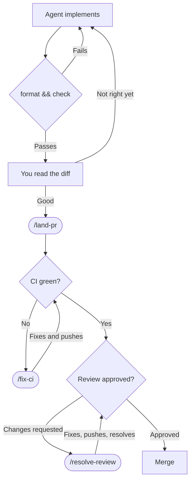

# Coding agents

Three are configured here: **Claude Code**, **opencode** and **Codex**. All three read the same
`AGENTS.md` files, so which one you use is your preference. CodeRabbit reviews pull requests as a
GitHub App and needs nothing in the tree.

Install the tool from its own documentation:

- [Claude Code](https://code.claude.com/docs)
- [opencode](https://opencode.ai/docs)
- [Codex](https://developers.openai.com/codex)

Sign in with your own account.
Nothing in this repository carries a credential.
No further configuration is necessary for these tools to read everything below.

## How work moves

**Agents do not stage, commit, or push** until you run `/land-pr`.
Afterwards, `/fix-ci` and `/resolve-review` push their own fixes.
Thus, neither loops back through `/land-pr`.

Read the diff yourself.
This is the review that matters.
The gates prove that the tree is consistent, not that the change is correct.

`vp run format && vp run check` is the minimum, not the full requirement.
Name the behavior that your change could break.
Use specific evidence, such as:

- The test file that covers it, instead of "run the tests".
- A request against the endpoint that you added.
- A query that confirms the stored row.
- The logs after the change.

## Parallel delivery protocol

Parallel work stays parallel only when contributors avoid manufacturing shared diffs:

1. **Reserve hot-file lanes at assignment time.** Only one in-flight PR can write each lane:
   - `.github/workflows/**` and `.github/actions/**`.
   - `vite.config.ts` with `scripts/ci-contract.test.ts`.
     The task graph and its contract keep these in step.
   - Root `package.json` with `pnpm-lock.yaml`.
   - `CHANGELOG.md` and `MIGRATION.md`, for release automation only.
   - `webapp/src/api/**` with `extension/src/api/**`.
   - `server/application/src/main/resources/db/master.xml`.

   Migration fragments remove `MIGRATION.md` from feature work.
   Only release automation owns it.
   Use `/gh-stack` for dependent changes.
   Otherwise, do not make one PR wait for another.

2. **Commit only regeneration caused by the change.** If OpenAPI, ERD, route-tree, or another generator
   produces unrelated drift, stop and report it. One dedicated PR or the owning automation lands that
   drift.
   Feature branches do not each carry a copy.
3. **Repair broken `main` once.** One queue-jumping hotfix owns the repair.
   Feature branches neither duplicate it nor absorb it.
4. **Let the merge queue integrate.** Branch from a freshly fetched `origin/main`.
   Immediately before you request merge, rebase.
   Then use `gh pr merge --squash --auto`.
   Do not repeatedly rebase behind unrelated PRs or bypass the queue's final integration.
   A genuine dependency is a stack, not an informal waiting chain.

The assignee releases a hot-file lane when the PR merges or the assignee abandons the edit.
If two tasks need the same lane, explicitly split or sequence that part.
Do not leave the predictable conflict for later.

## Slash commands

| Command           | Does                                                                     |
| ----------------- | ------------------------------------------------------------------------ |
| `/land-pr`        | Validate, regenerate, branch, commit, push, and open the PR              |
| `/fix-ci`         | Read every failing check in one pass, fix in dependency order, push once |
| `/resolve-review` | Fetch review threads, decide each, reply and resolve                     |

Each lives in `.claude/skills/<name>/SKILL.md`.
opencode [reads `.claude/skills/` alongside its own](https://opencode.ai/docs/skills/).
`opencode debug skill` prints every skill with its resolved path.
Thus, no skill needs a second copy for opencode.

A *typed* `/name` is the exception.
opencode resolves it only from `.opencode/commands/`.
Each of these three commands has a file there whose entire body is `@.claude/skills/<name>/SKILL.md`.
opencode [inlines a referenced file into the prompt](https://opencode.ai/docs/commands/).
Thus, a pointer is sufficient.

Codex shares no directory with the other two tools.
It [scans `.agents/skills/`](https://developers.openai.com/codex/skills), never `.claude/skills/`.
It has no repository-level slash commands.
[`~/.codex/prompts/` is personal and uncommitted](https://developers.openai.com/codex/custom-prompts).
OpenAI's guidance is to make a shared command a skill.

Thus, the four contribution skills have copies in `.agents/skills/<name>/`.
These are the three above and `/gh-stack`.
`gate:instructions` fails if a copy is missing or differs.
`CODEX_SKILLS` in that script lists them.
If Codex should have another skill, add its name and copy.

The knowledge packs intentionally have no mirrors.
`react-best-practices` alone has fifty files.
A Codex session that needs them works in `webapp/`, whose `AGENTS.md` names them by path.

A mirror also causes one `duplicate skill name` warning per skill in opencode's log.
opencode reads both directories and sees the same name twice.

`disable-model-invocation` makes these three typed-only in Claude Code. opencode and Codex both
ignore the field, so there they are ordinary skills the model can reach on its own.

## Instructions live in `AGENTS.md`, once

| File               | Covers                                                                                  |
| ------------------ | --------------------------------------------------------------------------------------- |
| `AGENTS.md`        | The repository — layout, quality gates, generated artefacts, migrations, changesets     |
| `webapp/AGENTS.md` | The SPA — component conventions, linting traps, drawers, motion, vocabulary             |
| `server/AGENTS.md` | The Spring Boot server — build traps, the four test tiers, API and security conventions |

The tools read them differently.
The file itself does not show these differences:

- **opencode** reads `AGENTS.md` natively.
  It reads the nested files through the `instructions` globs in `opencode.json`.
  These load unconditionally, so an opencode session carries all three.
- **Codex** reads `AGENTS.md` from the repository root down to its launch directory.
  It stops there.
  Start it in `webapp/` to get the SPA guide.
  If you start it at the root, it has only the root file.
- **Claude Code** reads `CLAUDE.md` and
  [never `AGENTS.md`](https://code.claude.com/docs/en/memory#agents-md).
  Thus, each `AGENTS.md` has a `CLAUDE.md` beside it with one import line: `@AGENTS.md`.
  An import resolves against the file that holds it.
  The same line therefore means a different file in each directory.
  Claude loads a nested file the first time it reads a file anywhere in that tree.

  Thus, a server-only session does not load the webapp guide.

`vp run gate:instructions` fails in these cases:

- No `CLAUDE.md` imports an `AGENTS.md`.
- An `@` reference resolves to nothing.
- An `instructions` entry matches no file.
- A typed-only skill has no opencode command.
- A Codex mirror differs from its source.
- Two agent files have the same body.
- Any of these files is a committed symlink.

Each failure explains itself.
The gate compares bodies exactly.
Thus, it detects a copy when someone makes it, not after the copies differ.

### Adding a tree, or a skill

1. Write `<dir>/AGENTS.md`.
2. Add `<dir>/CLAUDE.md` with `@AGENTS.md`.
3. Unless `*/AGENTS.md` already matches, add its own `opencode.json` `instructions` entry.
4. Run the gate.

A skill is a directory under `.claude/skills/`.
It needs a file in `.opencode/commands/` only if you mark it `disable-model-invocation`.

After you open a file in a tree, use `/context` in Claude Code to confirm that its instructions loaded.
It lists them under **Memory files**.
The other two tools have no equivalent view.
`opencode debug config` shows configured patterns, not their matched files.
Thus, use the gate as the check for those tools.

### When an agent ignores an instruction

Confirm the instruction reached it before rewriting the instruction. An `AGENTS.md` in a tree the
agent has not opened yet has not loaded.
