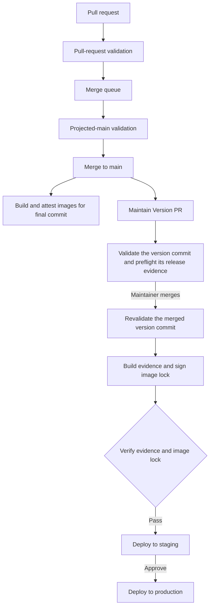

# CI/CD Architecture

Hephaestus uses trunk-based delivery through GitHub's merge queue. Pull requests provide early
feedback, merge groups validate projected `main`, and pushes to `main` produce release images. Releases
with signed image locks deploy automatically to staging; production requires approval.

## Architecture overview



## Release flow

Every push to `main` builds and attests multi-architecture images for that commit and maintains the
Version PR; merging the Version PR cuts a release that promotes those images by digest —
[Release management](./release-management.mdx). Pull requests and merge groups build `linux/amd64`
only; a merge group has its own SHA, so its images are never the ones a release promotes. The
exception is the Version PR's branch, where every run builds every release image on both
architectures, whichever event started it, because the release evidence preflight that guards that
branch evidences each image on both published platforms and can only evidence what the run
published.

## Quality gates

| Job | Checks | Local command |
| --- | --- | --- |
| Quality → App Server | Spotless and PMD, NullAway policy, the PMD canary when PMD inputs changed, artifact-source contracts, setting delivery per runtime role | `vp run gate:server`, `gate:java-nullness`, `gate:contracts`, `gate:env` |
| Quality → Tooling and Docs | toolchain and agent-runtime pins, the runner and lint contracts, `gate:agents`, load-test format and syntax, agent specs, instruction mirrors, docs format and `docs:lint`, Mermaid parse | `vp run gate:agents`, `gate:docs`, `test:agents` |
| Quality → Webapp | `vp check`, presentational components, story prose, story sort, docs colour tokens, unit tests, Vite build with a `routeTree.gen.ts` diff | `vp run check:webapp`, `test:webapp`, `build:webapp` |
| Quality → Webapp: Stories | Storybook interaction tests, `export:assets` diff, Storybook build, Chromatic | `vp run test:webapp:stories` |
| Quality → Windows | Every gate that needs neither Gradle, Docker nor the agent sandbox, on `windows-latest`, uncached | `vp run --no-cache ci:windows` |
| Quality → Clean install | `vp install --frozen-lockfile` on a runner with Node and the launcher and nothing else, then `gate:toolchain` and the hooks path | `vp install` |
| Build → App Server: Package | `./gradlew :application:bootJar :application:testClasses`; uploads the classes and JARs once | — |
| Build → App Server: Generated artifacts | `generate:api` diff against the packaged JAR; `db:check-drift`, which replays `master.xml` and diffs the JPA model; ERD diff | `vp run generate:api`, `db:check-drift`, `db:generate-erd-docs` |
| Build → App Server: Database | Gradle `databaseTest` task against PostgreSQL; the PostgreSQL 18 backup-restore drill | `vp run test:postgres-restore` |
| Build → Webapp: E2E | Playwright against the packaged JAR | `vp run --filter webapp test:e2e` |
| Build → App Server image | `pack build` from the packaged JAR, signed, attested and policy-scanned | — |
| Test → App Server: Unit and architecture, App Server: Integration | compiled from source | `vp run test:server:verification`, `test:server:integration` |
| Security → New dependency risk | dependency review; pull requests only | — |
| Security → Dependencies, secrets, and policy | Trivy filesystem scan, dependency vulnerability gate, TruffleHog, `security.txt` expiry, changelog immutability guard, legacy-reference guards | — |
| Changesets → Verify changesets | policy tests, verified-revert detection, release-note presence, `MIGRATION.md` freeze | `vp run gate:changesets` |
| Compose → Render compose stacks | the self-hosted, preview and reference stacks render | `vp run gate:preview-stack` |
| Docker → Webapp, Agent: Pi, Postgres (pg_partman), Tag unchanged images | Dockerfile images; aliases for unchanged ones | — |
| Supported-host boot smoke | `docker/self-host/setup.sh`, then PostgreSQL, NATS and the application server from this run's own images, waiting for the application to report healthy | — |
| Actionlint, Zizmor | workflow lint with ShellCheck warnings; Zizmor at medium confidence | — |
| PR → Validate PR | Conventional Commit title; every commit’s primary author resolves to the pull request author’s GitHub account (including bot accounts); the PR body follows attribution policy | — |

The browser job retains `webapp-e2e-results`, including `e2e-server.log`, for seven days on
success as well as failure. Inspect server startup and shutdown output even when browser assertions
pass; a passing suite does not prove that background work started correctly. Its coverage summary
names credential-gated live checks and their skipped reasons; the ordinary suite is not evidence
of live-provider behavior.

Test checks show totals and failed suites/cases, not an inventory of successful tests. Source-file
lookup runs only when failure annotations are needed. The complete unit, integration, database and
Storybook JUnit reports remain downloadable for fourteen days, including successful runs. Chromatic
prints warnings/errors alongside the structured visual-coverage summary; its JUnit report is retained
with the Storybook reports. Do not publish its debug log or diagnostics file: they can contain
credential-bearing signed URLs even when the project token is masked.
Reporter action inputs read `job.status` and explicit continued-step outcomes: status-check functions
such as `failure()` are valid in a step's `if` condition, not in its `with` inputs. The CI contract
parses those input expressions without status functions and tests successful and failed outcomes.

Image builds retain the complete `buildpacks-log` artifact for fourteen days. The console shows a
first example and totals for repeated JVM archive-eligibility exclusions (unsupported location,
already-linked class, signed JAR, JFR event class). These describe classes CDS cannot archive, not
failed application operations. All preload and verification failures remain visible, including
optional framework adapters: a previously investigated class can fail for a different reason after
an update. Unfamiliar diagnostics and archive failures also remain visible; the reporting pipe cannot
change the image build's exit status.

The four quality legs call `ci-quality-leg.yml` independently. Job-level conditions omit unchanged
legs before a runner is allocated; selected legs do not cancel each other on failure. Each runs
`vp run ci:<leg>`, then pipes `vp run --last-details` through `scripts/report-task-run.ts`: every
task that did not pass becomes an error annotation naming the command that reproduces it, and the
report, cache hits and miss reasons included, lands in the job summary. A leg runs when the change
detection in `cicd.yml` says its scope changed; the Windows leg listens to the tooling scope, and
both it and the tooling leg prove the hook dispatcher on a rejected and an accepted commit.

### Merge policy

Pull requests targeting `main` merge through GitHub's merge queue after these GitHub
Actions contexts pass: `CI Status Gate`, `Actionlint`, and `Zizmor`. Required
workflows run again for the merge group, which includes the current base and queued changes ahead of
the pull request. `CI Status Gate` also waits for CodeQL analysis and publication. Each required context is bound to the GitHub Actions integration rather than
accepting a same-named external status.

A merge group is a diff, so it selects its jobs from the paths it touches —
[Path filters](#path-filters). It has no preview, so `Build` and `Docker` are filtered there too.
`any-code` is the union of the source filters and reaches `docs/**` through the tooling filter, so a
documentation-only group still starts `Quality`, `Security`, `Build` and `Docker` even where the
jobs inside them skip. To find out why a leg did not run, read the `CI Status Gate` summary, which
lists every leg including the skipped ones, and the `Detect changes` log, which records the filters
the diff matched.

A required context may be filtered because a ruleset accepts a skipped check as satisfied; the check
still reports `skipped`, not `success`. A workflow that never triggers reports nothing at all, and a
required context left pending blocks the queue for good — `merge_group` supports no `paths:` filter
in any case, so the filtering lives in each job's `if`. The queue builds up to
`max_entries_to_build: 2` groups speculatively, a repository-ruleset field rather than a file here,
and each group starts a `CI/CD` run. GitHub's
[runner concurrency limits](https://docs.github.com/en/actions/reference/limits#job-concurrency-limits-for-github-hosted-runners)
apply across workflows, so queue parallelism competes with pull-request validation for capacity.

A failed merge group drops its pull requests from the queue without failing any check on them, so
CI updates a comment on the pull request named by the merge group's head ref with the run link. It
does not requeue automatically: the result does not say whether the failure was transient or
deterministic. Regrouping the queue cancels the runs it dissolves, and a cancelled run is reported
to nobody.

Review is a native ruleset requirement with stale approvals dismissed on every push. Authors listed
in `REVIEW_POLICY_MAINTAINERS` receive an automated approval; every other author needs a human with
write access, including Renovate. Green checks and Dependency Dashboard approval do not satisfy this
review requirement. Renovate includes that reminder in each pull request's body. Repository
administrators own the allow-list; do not add dependency bots to it. Remove the automation when
independent maintainer review is available. After approving the current commit, the workflow attempts
to minimize superseded automatic reviews. A minimization failure is a warning, not a failed approval.

The approval workflow runs on `pull_request_target` with `pull-requests: write`. It loads the evaluator
from `scripts/` on the default branch, reads current pull-request metadata and reviews from GitHub,
and executes no pull-request code. An empty allow-list approves nobody. It has no `branches:` filter:
a stacked layer is approved while it still targets the layer below, because retargeting to `main` after the
lower layer merges must not depend on receiving a subsequent event. The `edited` trigger also
re-evaluates explicit base changes.

A merge group uses a synthetic ref, not the Version PR branch name. If its aggregate tree changes
`package.json`'s version relative to the group's base, it is a release candidate: it builds both
platforms of every release image and must pass release evidence preflight on that exact tree.
Missing base/version data fails detection rather than silently skipping release validation.

Cancelled or approval-blocked runs do not suppress the Version PR’s CI dispatch; actual validation
failures require an explicit rerun.

The Version PR is maintained after CI/CD succeeds for the current tip of `main`; failed or
overtaken main runs do not update it. It carries checks like any other pull request. Its updates are
pushed with `GITHUB_TOKEN`, which starts no workflow run, so `version-pr.yml` dispatches CI/CD on the Version
PR's branch instead — `workflow_dispatch` being one of the two events that token may start. The
dispatched run reports `CI Status Gate` onto the branch head, which is the pull request's head
commit, so the commit whose merge cuts a release is validated before it lands. `Verify changesets`
is the one leg it skips, and deliberately: the Version PR is the pull request that consumes
changesets rather than adding one. [Release management](./release-management.mdx#the-flow).

## Security and supply-chain controls

| Control | Timing | Enforcement | Destination |
| --- | --- | --- | --- |
| Dependency vulnerability gate | Security workflow | owns the dependency verdict; blocks fixable high or critical findings in every dependency the checkout resolves | required Security workflow |
| GitHub dependency review | pull requests | reports the advisories a pull request introduces, with their patched versions; holds no verdict | Security workflow summary |
| CodeQL advanced setup | pull requests, merge groups, `main` pushes, and weekly | repository SAST policy | code scanning |
| TruffleHog and GitHub push protection | pull requests and pushes | block verified secrets | Security workflow and repository protection |
| Trivy filesystem scan | Security workflow | a scanner error blocks; findings of every severity are report-only | code scanning |
| Semgrep TLS policy | pull requests, merge groups, and `main` pushes | fails on a rule violation or a scanner error | code scanning and a run artifact |
| Image vulnerability policy | image build and release | blocks fixable high or critical findings | build summary and release evidence |
| Weekly image rescans | `rescan-main-images.yml`, `rescan-release-images.yml` | the `main` rescan upserts one tracking issue; the release rescan fails and comments on the vulnerability response issue | issues and run artifacts |
| OpenSSF Scorecard | `main` pushes, branch-protection changes, and weekly; never on pull requests | reports | code scanning and a run artifact |
| Scorecard ratchet | the same events, plus on demand | fails when a check scores below `security/scorecard-baseline.json`; on a push, only for the checks that commit decides | job summary and a run artifact |
| Renovate | configured schedule and vulnerability alerts | pull requests require normal review and CI | dependency dashboard |

Image scanning also reads embedded SBOMs shipped by image builders. Trivy's third-party-SBOM
advisory describes that additional inventory's provenance; it does not mean the image was scanned
only through the separately published release SBOM. Keep those embedded inventories and the
scanner's vendor-severity provenance visible rather than changing severity sources or disabling
analyzers to remove a warning. The vulnerability policy result and retained scanner JSON carry the
actual verdict.

One check owns the dependency verdict: the dependency vulnerability gate in `ci-security-scan.yml`,
a second Trivy pass in `table` format over the same checkout. It runs on pull requests and on `main`
pushes and includes development and test dependencies from the lockfiles. An advisory published
against a pin no pull request touches fails the next run rather than waiting for someone to open
the code-scanning dashboard. It applies the severity policy in [vulnerability
remediation](./vulnerability-remediation.mdx) — fixable high or critical — and its exceptions are the
one exception path for a dependency finding, recorded in `security/trivy-dependency-ignore.yaml`.

Dependency review compares the base and head dependency graphs, so it cannot hold that verdict; it
reports what the pull request introduces and fails nothing. Gradle graphs are generated on pull
requests and main pushes through the official Gradle action, with dependency verification still
enabled. Generation has read-only permissions; a separate `workflow_run` publisher submits the
snapshot without checking out or executing the originating code. Dependency review waits for these
asynchronous snapshots. The publisher must exist on the default branch before GitHub runs it.

The first Trivy pass is the code-scanning feed: SARIF output reports every severity whatever
`severity` is set to, so the pass that publishes it carries neither `severity` nor `exit-code`,
and it keeps Trivy's secret scanner,
which covers the whole tree where TruffleHog covers a pull request's own commits.

TruffleHog has two independent pins in `ci-security-scan.yml`: the action commit selects its
wrapper, while the supported `image` and `version` inputs select the scanner container by tag and
digest. The wrapper otherwise defaults to a mutable scanner tag even when its action is pinned.
Renovate tracks the wrapper through its GitHub Actions manager and the scanner through a Docker
custom manager; their versions need not move together. When reviewing a wrapper update, verify its
[`image` and `version` input contract](https://github.com/trufflesecurity/trufflehog/blob/363923b901c911a9164f50b6c423f47c15372b1c/action.yml):
the resulting Docker reference must retain the digest, and scanner failure must still fail the step.
The event's immutable base/head commit range, verified-secret policy, and scan-error failure policy
apply to either update.

Renovate groups routine Gradle updates as server dependencies and webapp development updates
separately. Webapp production dependencies remain separate unless Renovate identifies a package
family that must move together.
Major updates and minor updates to pre-1.0 dependencies remain ungrouped, wait seven days, and require
Dependency Dashboard approval. Native
[branch and PR limits](https://docs.renovatebot.com/configuration-options/#branchconcurrentlimit)
bound routine update concurrency; the hourly limit only restricts PR creation. Vulnerability alerts
remain ungrouped and bypass those gates and limits.

Lockfile maintenance runs on Mondays. `renovate.json` owns the managed ecosystems and extraction
rules; `scripts/renovate-config.test.ts` exercises each custom manager against its source. The Node,
pnpm and Pi SDK pins are grouped, so a version stated in several managed files moves in one pull
request; the toolchain checks reject a version that reads differently in any of them. Renovate
provisions the Node it runs lockfile updates with from `engines`, so `engines.node` restates
`devEngines.runtime` exactly rather than the supported line.

For Gradle, `constraints.java` restates `.java-version`, enforced by `gate:toolchain`: Renovate's
parser cannot infer the toolchain through the file read in the Kotlin build. The Gradle and wrapper
managers own version, lockfile and verification-metadata updates. A self-hosted Renovate administrator
must permit `gradleWrapper` in `allowedUnsafeExecutions` for artifact updates; a repository config
cannot grant that permission. Missing or failed artifact updates are not a reason to weaken Gradle
verification. Follow [Updating Java dependencies](./local-development.mdx#updating-java-dependencies)
to repair and verify them before merging. Renovate-generated checksums still require independent review.

[Vulnerability remediation](./vulnerability-remediation.mdx) owns the severity policy and the shape,
ceiling and approval of an exception, for images and dependencies alike.
[Release management](./release-management.mdx#supply-chain-evidence) owns artifact signing, provenance,
SBOM, and release-verification guarantees.

### Semgrep policy

`security/semgrep/` holds this repository's own rule pack: syntax checks for disabled Node
certificate verification and unconditional Java hostname verifiers, not comprehensive TLS analysis.
CodeQL keeps the deep dataflow analysis, and the image-reference, `security.txt` and Liquibase guards
in `ci-security-scan.yml` stay independent. Inline `nosemgrep` suppression is disabled, so an
exception is a reviewed rule change, and every rule carries a positive and a negative fixture beside
it.

Semgrep reports; it is not a required check. The digest-pinned scanner runs without network access or
credentials over a read-only checkout, and `.github/workflows/semgrep.yml` owns the commands that
reproduce a run locally. A pull request from a fork gets the scan verdict but no code-scanning row,
because GitHub caps a fork token's `security-events` access at read.

### CodeQL configuration

PR and merge-group diffs select analysis languages, not individual files: each selected language
scans its configured source tree. Main and scheduled runs select all languages, as do changes to
the CodeQL workflow or configuration. The language filters live in `.github/workflows/codeql.yml`.

CI calls that reusable workflow, and `CI Status Gate` waits for its successful completion, including
SARIF upload. A merge group therefore cannot pass the gate and lose its temporary ref while CodeQL
is still publishing results. The weekly scan also runs directly from the same workflow.

Java uses manual extraction with the JDK pinned in `.java-version` and a clean, uncached
`:application:testClasses` compilation. This gives CodeQL the real dependencies, generated clients
and annotation-processed source instead of no-build dependency and JDK guesses. The single-use Gradle
process runs inside the extractor; neither cached classes nor a pre-existing daemon can bypass it.
This compilation produces analysis inputs only: the packaged server remains owned by the build-once
job. Actions and JavaScript/TypeScript retain no-build analysis.

`.github/workflows/codeql.yml` runs CodeQL under advanced setup: only advanced setup reads a
committed config file, and `.github/codeql/codeql-config.yml` excludes `security/semgrep/**`,
whose fixtures deliberately carry the patterns the Semgrep rules exist to flag — unused parameters
among them — which CodeQL's own queries otherwise report in code that is never shipped. Advanced
setup replaces GitHub's managed default setup; switching a repository between the two is a one-time
manual step under **Settings → Advanced Security → Code scanning → CodeQL analysis → Switch to
advanced → Disable CodeQL**, not something a workflow file can do.

### Scorecard baseline

`security/scorecard-baseline.json` owns the minimum every enforced Scorecard check must hold, the
four exclusions with their reasons, and what each enforced check is scored over. Checks are compared
one at a time, so an improvement cannot offset a regression, and a check the baseline does not name
is not enforced. Lowering a minimum also edits the map in `scripts/check-scorecard.test.ts`, so the
change is visible in the pull request that makes it.

`scoredOver` is `configuration` when [Scorecard](https://github.com/ossf/scorecard/blob/main/docs/checks.md)
computes the score from the repository as it stands — its files, its workflows, its branch rules —
and `history` when it computes it over a window: SAST and Code-Review over the ~30 most recent merged
pull requests and commits, CI-Tests over the ~30 most recent commits, Signed-Releases over the 30
most recent releases, Maintained over the previous 90 days. Every enforced check carries one and a
one-line reason, and an enforced check without one fails the script, so a check added to the baseline
is classified deliberately rather than by default.

That classification decides who a regression is charged to. On a `push` the ratchet fails only for a
`configuration` check, because the commit just pushed is what set the repository's configuration; a
`history` check is written to the job summary and the run stays green, since no single commit can
move an aggregate over the last thirty and failing `main` for one would redden every merge until the
window rolls past. On `schedule`, `workflow_dispatch` and `branch_protection_rule` every check fails,
because those runs ask again after the window has had time to recover and a score still below the
baseline is a trend, not a merge. Run outside Actions, with no `GITHUB_EVENT_NAME`, the script
enforces everything.

`scripts/check-scorecard.ts` reads the posture OpenSSF publishes for this repository — the latest
published assessment, not necessarily the current commit — and fails on a regression it charges to
the event, a missing enforced check, evidence that predates the baseline or is more than eight days
old, and on an API or parsing failure. `scorecard-ratchet.yml` runs it on `main` pushes,
branch-protection changes, weekly and on demand, and keeps the fetched assessment as an artifact.
It is a workflow of its own because
[OpenSSF restricts the publishing job](https://github.com/ossf/scorecard-action#workflow-restrictions)
to allowlisted actions. Reproduce it with `node scripts/check-scorecard.ts`, or
`node --test scripts/check-scorecard.test.ts` without network access.

## Environments

| Environment | Eligibility | Deploys on | Approval |
| --- | --- | --- | --- |
| Preview (Coolify) | same-repository PR with the `preview` label | every push; never waits for tests | none |
| Staging | every published release | release publication | none |
| Production | the same release after staging | release publication | required reviewer |

### GitHub environment setup

1. **Settings → Environments → New environment**
2. Create `Staging` (no rules)
3. Create `Production` with **Required reviewers**

A deploy brings up `app`, then `core`, then `proxy`: the application server runs the Liquibase
migration the webhook runtime in `core` reads, and the edge starts last, against routers that are
already complete. Both deploy paths use this order — the push workflow and the pull reconciler.
The `proxy` stack publishes :80 and :443. An environment whose host already has an
edge in front of it sets the environment variable `DEPLOY_EDGE_PROXY=false`, which leaves `proxy`
out of both the render and the deploy; anything else, including an unset variable, deploys all
three. Staging sets it, because it shares a host with the Coolify instance that serves preview
deployments and that proxy holds both ports — a second edge there fails the deploy on a port that
is already allocated.

Preview environments do not need to be created in advance. The preview workflow registers
`preview/pr-N` as a transient GitHub environment when Coolify accepts the first deployment.

## Preview deployments

Add the `preview` label to a same-repository pull request. Every push redeploys, and a preview does
not wait for tests. `Docker` rebuilds the images whose inputs changed and its `Tag unchanged images`
job aliases the base commit's verified digests for the rest, so every image exists at the head SHA.
An alias serves a preview and never release evidence: when the base commit's image is still
publishing it falls back to the candidate the merged pull request built, which carries `linux/amd64`
alone. That is why the Version PR's branch builds every image itself instead.

A draft deploys like any other pull request: wanting eyes on unfinished work is the usual reason to
ask for a preview, so the label is the only opt-in.

A sticky comment carries the URL, and GitHub records each accepted update as the transient
environment `preview/pr-N`. The deployment is opened as soon as the pull request is admitted, not
when the stack is finally up, and moves through `queued` while CI publishes this commit's images,
`in_progress` while Coolify builds, and then `success` — so the pull request's **View deployment**
link and the run log are both reachable throughout. A run that a newer push supersedes, or whose
label is removed while it works, ends `inactive` rather than `failure`; neither is a fault.

Remove the `preview` label to tear the stack down and free the slot. Closing or merging the pull
request does the same thing. Converting it back to draft does not — a draft is a thing you can
preview.

The environment itself outlives the deployments recorded in it. Deleting one needs repository
administration, which `GITHUB_TOKEN` cannot be granted — `administration` is not among the
permission scopes a workflow may request — so a `preview/pr-N` entry stays in the repository's
settings after its pull request closes, holding only retired deployments. Removing them is a
maintainer action:

```bash
gh api -X DELETE "repos/hephaestus-build/Hephaestus/environments/preview%2Fpr-<n>"
```

Automating it would mean giving a scheduled workflow an administration-scoped credential, which is a
larger grant than tidy settings are worth.

Deployments are serialized, never parallel, and each one deploys the pull request's *current* head.
A burst of pushes therefore produces one deployment of the newest commit rather than one per commit.
If you push while a deployment is in flight, that run stands down rather than deploying a commit that
is no longer the head; the new push starts the next deployment and nothing needs re-labelling.

A preview runs its own PostgreSQL seeded from staging and reads staging's event stream. What is
switched off in the copy, how sign-in works, and how the sandbox is enforced are in
[`docker/preview/README.md`](https://github.com/hephaestus-build/Hephaestus/blob/main/docker/preview/README.md).

Preview controllers run only for pull requests targeting `main`; this keeps privileged
`pull_request_target` workflows anchored to the protected branch. A stacked layer becomes eligible
after it is retargeted to `main`.

### What a preview keeps from staging

Accounts, workspaces, reviewed work, observations, feedback and the AI catalogs' metadata are all
there to read, model prices, grants and bindings included, and each connection keeps the state it
had on staging. What the clone is stripped of, and what the seed loader verifies before it lets the
preview boot, is
[`docker/preview/README.md` § Security boundary](https://github.com/hephaestus-build/Hephaestus/blob/main/docker/preview/README.md#security-boundary).

None of staging's provider credentials are among what it keeps, so a preview reaches no model and no
provider on staging's account. To give one AI access, add a **preview-only provider key** through
the preview's own AI models administration and enable that connection; instance and workspace
connections both work, and a preview talking to a different endpoint gets a connection of its own.
There is no provider-key environment variable and no fallback to staging's key, and enabling a
connection does not switch practice review execution on.

Seeding happens once per preview, so a preview seeded before this policy was installed still holds
what the policy now clears. **Recreate it, including its private database volume** — a normal
redeploy preserves an already-seeded database — and configure its AI access again afterwards.

### When the comment says nothing deployed

| Comment says | What to do |
| --- | --- |
| does not carry the `preview` label | Add the label |
| is behind `main` on schema, or too far behind to compare | Merge `main` in; the next push previews automatically |
| comes from a fork | Push the branch to this repository |
| was opened by a … , not a repository collaborator | Nothing; previews need push access |
| changes trusted deployment policy | Land that change first — a preview never runs a pull request's own edits to `.github/workflows/**`, `.github/actions/**` or `docker/preview/**` |
| changes too many files for one comparison | Split the pull request, or land it without a preview |

### When the preview failed

| Comment says | What it means |
| --- | --- |
| CI never published images for this commit | An image build failed, or was still running when the deploy gave up. Check the CI run; the next push retries. |
| Coolify reported a failed preview deployment | The stack did not start. Open the deployment log link in the comment. |
| Coolify finished, but the preview did not return HTTP 2xx | Containers started but the app never became healthy. |
| Timed out waiting for Coolify … | The deploy outlasted its budget. The next push retries. |
| The preview host is full (n/m) | Drop the label from one of the named pull requests |

`cleanup-preview.yml` sends the signed close event and marks the GitHub deployment inactive; if
Coolify rejects the event the job fails and `reconcile-previews.yml` retries nightly, starting from
the deployment inventory.

Operator configuration, host capacity and secret scopes live in
[`docker/preview/README.md`](https://github.com/hephaestus-build/Hephaestus/blob/main/docker/preview/README.md);
why the label is the authority, and which alternatives were priced and declined, is
[ADR 0035](https://github.com/hephaestus-build/Hephaestus/blob/main/docs/decisions/0035-pull-request-previews-are-label-gated.md).

## Workflows

| Workflow | Trigger | Purpose |
| --- | --- | --- |
| `cicd.yml` | PR, merge group, push to main, manual | Validates changes before merge and builds final-SHA images after merge; the release evidence gate runs over the images the run built on the Version PR's branch, and wherever the `release-preflight` dispatch input asks for it |
| `review-policy.yml` | PR opened, reopened, synchronized, ready for review, edited | Approves a listed maintainer's pull request so the ruleset's required approval is met; does nothing for anyone else |
| `pull-request.yml` | PR opened, edited, synchronized, reopened, ready for review | Validates the title against the policy `commitlint.config.ts` exports, without installing the workspace, checks that every commit resolves to the pull request's author, and assigns the author when the pull request opens |
| `ci-quality-gates.yml` | Called by cicd.yml | Selects quality legs, clean-install verification and story tests |
| `ci-quality-leg.yml` | Called by ci-quality-gates.yml | Shared formatting, lint, type-check and unit-test execution for each selected task-graph leg |
| `ci-build.yml` | Called by cicd.yml | Runs the OpenAPI, schema, database and browser E2E gates against the server artifact packaged by cicd.yml |
| `ci-tests.yml` | Called by cicd.yml | The server unit, architecture and integration suites, compiled from source |
| `ci-docker-build.yml` | Called by cicd.yml | Dockerfile image builds (webapp, agent, PostgreSQL) and aliases for unchanged images |
| `reusable-docker-build.yml` | Called by cicd.yml and ci-docker-build.yml | Builds, signs, attests, and blocks on the release vulnerability policy for the `linux/amd64` image |
| `ci-security-scan.yml` | Called by cicd.yml | Dependency review on pull requests; Trivy dependency scan, secret detection and repository policy checks |
| `dependency-graph.yml` | PR, push to main | Resolves and uploads the verified Gradle dependency graph with read-only permissions |
| `submit-dependency-graph.yml` | Successful dependency-graph workflow | Submits snapshot data without executing code from the originating run |
| `verify-changesets.yml` | Called by cicd.yml | Tests changeset and version-sync policy and enforces release-note presence |
| `ci-compose-validate.yml` | Called by cicd.yml | Validates rendered reference and self-hosted Compose stacks |
| `openapi-autocommit.yml` | `autocommit-openapi` label | Regenerates the OpenAPI spec and client and commits them to the pull request |
| `security-mutation.yml` | PR touching the suite's inputs, manual | Runs the security mutation suite |
| `scorecard.yml` | Push to main, branch-protection change, weekly | Publishes the OpenSSF Scorecard |
| `semgrep.yml` | Pull request, push to main, merge group | Tests and scans the repository's own TLS rule pack |
| `rescan-main-images.yml` | Weekly, manual | Rescans main's published images against the release vulnerability policy and keeps one tracking issue in step with the findings |
| `rescan-release-images.yml` | Weekly, manual | Rescans the latest published release's images and reports drift on the vulnerability response issue |
| `ci-profile.yml` | Weekly, manual | Reports advisory performance budgets and profiles server test tiers |
| `ci-server-clean-reference.yml` | Weekly, manual | Records cold server phases and compares generated JARs |
| `scorecard-ratchet.yml` | Push to main, branch-protection change, weekly, manual | Fails when a Scorecard check drops below the committed baseline; a push fails only for the checks its own commit decides |
| `deploy-preview.yml` | `preview` label added, or a push, reopen or ready-for-review on a labelled PR | Waits for this commit's attested CI images, deploys them, and registers the native GitHub deployment |
| `cleanup-preview.yml` | Label removed, or PR closed | Removes and verifies resources, then retains a cleanup tombstone |
| `reconcile-previews.yml` | Nightly, manual | Re-sends teardown for any preview environment whose pull request is closed or unlabelled |
| `cd-docs.yml`, `cd-docs-teardown.yml` | `docs/**` on push and pull requests; PR closed | Publishes the docs site and its pull-request previews |
| `version-pr.yml` | Successful CI/CD completion for the current main tip | Maintains the accumulating Version PR (changesets) and dispatches CI/CD on its branch, release evidence preflight included |
| `release.yml` | Successful CI/CD push on `main` | Publishes the release and promotes the moving series and latest image tags |
| `release-upgrade.yml` | Called by `release.yml`, weekly | Boots the previous stable release with seeded data, then the candidate against the same database |
| `promote.yml` | Manual dispatch, or automatically for staging | Signs the channel a host follows; hosts pull and apply it themselves |

### Commits a workflow makes

Actions holds no signing key, so a commit pushed with `git` from a workflow is unsigned and a
required-signature rule rejects it. Every commit an automation makes here is created through
GitHub's `createCommitOnBranch` mutation instead, which GitHub signs — the same path
`changesets/action` lands the Version PR on and Renovate lands a dependency bump on.
`scripts/commit-via-api.ts` is the one caller: `openapi-autocommit.yml` commits the regenerated spec
and client to the pull request's branch through it, and `promote.yml` commits the channel to
`deploy-state`. `scripts/ci-contract.test.ts` fails any workflow that pushes to a real ref.

The mutation carries whole file contents rather than a diff, so the script enumerates every added,
modified and deleted path from the work tree and sends each file entire; a rename is its source
deleted and its destination added. It commits against the head the work tree was compared with, so a
branch that moved in the meantime fails the run instead of overwriting whatever moved it. The
credential is still `GITHUB_TOKEN`, so these commits start no further workflow run.

### Shared setup actions

| Action | Contract |
| --- | --- |
| `setup-toolchain` | Installs the Node.js version pinned in `package.json`, and nothing else when `install` is `none`, so a job that only runs `node scripts/…` reaches no package registry; `frozen` adds the pinned pnpm — caching its executable by runner platform and pinned version and retrying the download twice on a miss — restores the pnpm store cache, and installs the launcher through the SHA-pinned `setup-vp` with `node-manager: false`, which then runs the lockfile's `vite-plus` |
| `setup-caches` | Sets up the JDK from `.java-version`, validates the wrapper and uses the official Gradle action for dependency and build caches; the trusted package job publishes caches; consumers are read-only |
| `restore-server-build` | Downloads and validates the packaged JARs, compiled tests and resources; outputs the executable JAR path without recompiling or installing local artifacts |
| `setup-browsers` | Restores the exact Playwright browser version and installs Chromium system dependencies |
| `setup-release-security-tools` | Installs Cosign, Trivy, and optionally Syft for release-evidence jobs |
| `download-trivy-db` | Fetches the vulnerability database with retries and a mirror fallback; optionally refuses one over `max-age-hours` old and records its metadata |
| `ghcr-login` | Authenticates Docker to GHCR |

Browser jobs install Playwright's system dependencies using the runner's Ubuntu package sources,
with APT configuration scoped to that installation process. Unrelated vendor repositories do not
participate; repository signatures and package hashes remain enforced. The pinned Playwright CLI
then installs Chromium as the runner user so the browser cache retains its normal ownership.

### Caches

A run restores caches from its own branch and from `main`, never from a sibling branch. Task-cache
entries are content-addressed, so a pull request saves them for its own reruns. Gradle caches are
published only by the server package job on trusted default-branch push, schedule and dispatch runs.
Other jobs are read-only consumers: the Gradle action prefers an older same-job cache over a newer
producer cache, so consumers must not publish snapshots that become stale between their main-branch runs.
The pnpm executable cache also saves only from `main`. The JDK is pinned once, in `.java-version`.

Java quality verdicts are not stored in the Vite task cache: Gradle owns their task inputs and outputs.
GraphQL generation opts into Gradle's build cache using the plugin's declared inputs and outputs.
Its optional timestamped `@Generated` class marker is disabled so unchanged schemas produce identical
sources and compilation can also be restored. Test tasks always execute; their results are not cached.
The [local verification contract](./local-verification.mdx#java-checks-and-caching) describes the shared
local/CI command and how to distinguish Vite, Gradle build and Gradle configuration caches.

Gradle's official action explicitly uses its [enhanced cache provider](https://github.com/gradle/actions/blob/v6.3.0/docs/setup-gradle.md#enhanced-caching).
Its proprietary caching helper is [free for public repositories](https://github.com/gradle/actions/blob/v6.3.0/DISTRIBUTION.md).
It retains dependency fallback and deduplicated build outputs; the OSS basic provider's immutable,
exact-match cache cannot refresh build outputs after source-only changes. Configuration-cache
reuse remains within a job: no encryption key is configured, so the
action does not persist configuration-cache entries across jobs.

Repository-local actions require checkout first. Jobs without checkout use the external SHA-pinned
action directly rather than checking out the repository only to reach a wrapper.

## Path filters

`detect-changes` in `cicd.yml` selects legs from the changed paths on the two events that are a
diff: a pull request against its base, and a merge group against `merge_group.base_sha..head_sha`. A
push to `main` and a dispatch validate a whole commit and run every leg, which `detect-changes`
publishes as `unfiltered`. Same-repository pull requests also run `Build` and `Docker` regardless of
paths, because previews need every image at the head SHA; no other event has a preview.

| Selects | Paths |
| --- | --- |
| Quality → Webapp | `webapp/**`, `docs/images/readme/**`, `docs/src/css/custom.css`, the root oxlint and oxfmt configs, the four `scripts/check-*` files it runs, root package files |
| Quality → App Server | `server/**` except `AGENTS.md` and `CLAUDE.md`, `scripts/run-gradlew.ts`, `docker/compose.app.yaml`, `docker/compose.core.yaml`, root package files |
| Quality → Tooling and Docs | `scripts/**`, `docker/agents/**`, `load-tests/**`, `docs/**`, tsconfigs, oxlint and oxfmt configs, `.changeset/**`, `commitlint.config.ts`, instruction files, `renovate.json`, `openapitools.json` |
| Every quality leg | `vite.config.ts`, `.vite-hooks/**`, `.java-version`, `cicd.yml`, `ci-quality-gates.yml`, `ci-quality-leg.yml` and the setup actions: the task graph, the hooks and the JDK decide every leg's verdict, so a change to one runs all of them |
| Build artifact gates | contracts: the App Server paths or `docker/postgres/**`; E2E: webapp source and the server main sources; image: `server/application/src/main/**`, the Gradle build scripts, catalog, locks and wrapper, `server/application/project.toml`, `server/generated-clients/**` |
| Docker images | `webapp-image`: the webapp build inputs and non-test source; `agent-images`: `docker/agents/**`; `postgres-image`: `docker/postgres/**` |
| Supported-host boot smoke | `docker/**`, `application*.yml`, and the sources Spring binds configuration from — `**/*Properties.java` and `Application.java`. `ci-contract.test.ts` fails if a source carrying `@ConfigurationProperties` or `@ConfigurationPropertiesScan` is not selected |
| CI config | one filter per leg naming its own workflow files and actions; any `.github/workflows/**` or `.github/actions/**` change runs Actionlint and Zizmor |

`docker/agents/**` is in both the tooling and the agent-image filters: `test:agents` and
`typecheck:agents` cover the precompute tree, and the same tree builds the agent image.

## Docker layer caching

Dockerfile builds import `<image>:cache-main-<platform>` from `ghcr.io` and write it, with every
intermediate layer, only on pushes to `main`, so a pull request reuses `main`'s layers and writes
nothing. amd64 builds on `ubuntu-24.04`, arm64 on `ubuntu-24.04-arm`; no emulation. The buildpacks
path (`App Server image`) does not use this cache.

## Registry authentication

Image builds authenticate to `ghcr.io` with the workflow's `GITHUB_TOKEN`; base images are pulled from
Docker Hub anonymously, which
[GitHub-hosted runners may do without a rate limit](https://docs.github.com/en/actions/reference/limits).
A job that reads a first-party image back — the scan, the preflight, the boot smoke — logs in as
well, because `packages: read` alone buys nothing.

A pull request from a fork gets a read-only `GITHUB_TOKEN`, so `cicd.yml` passes `publish: false`
to both image workflows. That build compiles the image and stops: no login, no push, no signature,
no attestation, no policy scan and no alias moves. Forks therefore get no preview and no boot smoke;
the release path exercises their code once it is on `main`.

When release preflight is required, it owns image vulnerability scanning for both architectures;
the image-build workflows omit their duplicate amd64 scans. Other published builds retain those
scans. The final gate rejects a required preflight that is skipped, cancelled or unsuccessful.

## Image identity

Every consumer resolves an image through the commit the run built it from, and
`reusable-docker-build.yml` publishes exactly that tag for the event the run started under:
`github.sha` for a push, dispatch or merge group, and the pull request's head SHA for a pull request,
where `github.sha` is a merge commit no image carries. Within a run, the vulnerability scan skips
tags entirely and reads the digest its own build or merge job emitted as an output, so re-running the
scan alone scans the artefact that build produced.

`ci-contract.test.ts` asserts the whole contract: every tag a consumer resolves is one the build
publishes for that consumer's event, and no job resolves an image by the run that happened to build
it. A run-scoped tag names the attempt rather than the artefact, and GitHub's *re-run failed jobs*
gives the retried job a new attempt number.

## Build once

`App Server: Package` in `cicd.yml` packages the server once and uploads its JARs, compiled tests and resources. OpenAPI and
browser checks boot that executable JAR; buildpacks consume it without another build. Schema gates
and database contract tests use the restored classes with `-PpackagedServer=true`, which bypasses
compilation. Unit, architecture and integration suites compile from source in `Test` without
waiting for packaging; their outputs do not ship.

The application image and `Build` artifact gates depend on packaging independently. Host smoke
and release preflight wait for the image producers, not the API, database or browser checks. The
final CI gate still requires all of them; an early image verdict cannot approve a failed artifact gate.

A default-branch push reuses the packaged server when a successful release-candidate merge group
validated the exact same commit. The source must be this repository's `cicd.yml` run, with successful
artifact gates, tests, security checks, dual-platform server builds, release preflight and final gate.
The immutable artifact ID and its SHA-256 digest bind the download to that run. Missing, expired or
unavailable source evidence falls back to packaging; a corrupt download fails rather than being used.
Main still runs its own validation and publishes its images, including main-only tags and source maps.
Release publication still generates fresh vulnerability evidence and signatures.

An image a pull request did not change is not rebuilt either: `Tag unchanged images` verifies the
digest an earlier run published and re-tags it to this run's head SHA. It is aliased from the
nearest commit the default branch contains, found by walking up the chain of bases — a layer of a
stacked pull request is based on another branch's head, which published nothing — and a run that
reaches no such commit builds every image itself. `detect-changes` resolves that commit once, with
`scripts/resolve-alias-base.ts`, and hands it to the image jobs as `alias_base`.

## Parallelism and concurrency

- `Quality` legs and `Test` suites start from source; `Build` gates start when `App Server: Package`
  uploads its artifact.
- `App Server: Integration` has two shards: `providers-and-startup` selects the `integration`
  package and `StartupBudgetIntegrationTest`; `application` excludes both. Both retain the
  `integration` tag filter and run in separate JVMs and Testcontainers databases. The startup test
  owns a database separate from other Spring contexts. Gradle's native test filters partition
  the tier; `vp run test:server:selection` checks coverage through JUnit dry-run reports before
  unit/architecture verification. Discovery reports stay separate from execution results.
  Both shards use `fail-fast: false`; `CI Status Gate` requires their aggregate result. Locally
  the tier runs whole.
- Pull requests and merge groups build `linux/amd64`; pushes to `main`, and every run on the Version
  PR's branch, build both architectures. A pull request and a merge group each also build only the
  images their own diff touched and alias the rest, while the Version PR's branch builds all of
  them. `detect-changes` decides both once, as `single-arch` and `all-images`, and hands them to
  every image build in the run.
- Quality legs run independently; the image matrix in `reusable-docker-build.yml` uses
  `fail-fast: true`.
- Pull-request runs cancel superseded runs; `release.yml` never cancels. The same-repository
  Version PR shares a concurrency lane with its dispatch, so a racing trigger replaces redundant
  validation. Either survivor must pass release preflight; the merge queue separately validates
  the final merge tree. Ordinary PRs, forks, main pushes and merge groups retain separate lanes.
- A run on `main` that leaves a per-commit record — `codeql.yml`, `semgrep.yml`, `scorecard.yml`,
  `scorecard-ratchet.yml` — is never cancelled, because it is the only run that commit will get and
  its absence is what a later score reads as a gap. Those workflows write
  `cancel-in-progress: ${{ github.ref != 'refs/heads/main' }}`, and `scripts/ci-contract.test.ts`
  holds every `main` push to it; a workflow whose newest run simply replaces the last, such as the
  docs deploy, is named there as the exception.

## Monitoring CI

Use GitHub's organization-level [Actions metrics](https://docs.github.com/en/actions/concepts/metrics)
for workflow and job run time, queue time, failure rate, and runner usage. Each `CI Status Gate` job
also includes the current run's dependency-aware timeline and job summary, and JUnit results appear
as `Test Results - …` check runs.

### Pull-request latency

The full-verification target is a six-minute median and a seven-minute p90, measured from workflow
creation to completion of **CI Status Gate**. On the default branch, `CI profile` samples the ten most recent successful,
first-attempt PR runs with full server and browser verification from the latest 100 completed PR
runs created in the last 28 days. Lightweight changes and Version-PR runs cannot satisfy this
cohort. Failed and cancelled counts describe the bounded listing, not a repository-wide failure
rate. Budget misses produce warnings and a job summary, not workflow failures. Fewer than ten
qualifying runs produces an insufficient-data notice, not a pass or a regression. All observations
retain the JSON report. Historical latency includes runner waiting and earlier commits, so it is
not a correctness verdict on the profiled commit.

Performance observations are advisory in this diagnostic workflow; test failures, unreadable
recordings, invalid metrics, and reporting/API errors still fail it. Do not use `continue-on-error`
to hide those failures. Investigate sustained warnings using the retained run timelines and profiles.
A blocking performance gate would need a comparable workload and runner environment, an established
noise model, and an attributable regression—not a historical fleet-wide target miss. This separation
follows [SRE guidance on actionable, low-noise monitoring](https://sre.google/sre-book/monitoring-distributed-systems/)
and uses native [GitHub warnings and job summaries](https://docs.github.com/en/actions/reference/workflows-and-actions/workflow-commands).

Reproduce the observer with an authenticated GitHub CLI:

```bash
GITHUB_REPOSITORY=owner/repository vp run report:ci-latency
```

To inspect one completed run, download its metadata and every page of jobs for the same attempt.
Replace `RUN_ID` and `ATTEMPT` in both requests:

```bash
mkdir -p tmp/ci-timings
gh api repos/{owner}/{repo}/actions/runs/RUN_ID/attempts/ATTEMPT > tmp/ci-timings/run.json
gh api --paginate 'repos/{owner}/{repo}/actions/runs/RUN_ID/attempts/ATTEMPT/jobs?per_page=100' |
  jq -s '{total_count: .[0].total_count, jobs: [.[].jobs[]]}' > tmp/ci-timings/jobs.json
vp run report:ci-timings tmp/ci-timings/run.json tmp/ci-timings/jobs.json
```

The report separates time before job creation, time before the first runner, per-job start delay,
and execution time. Start delay includes dependency waiting, so it is not a pure runner-queue
metric. Summed execution times overlap: they measure runner demand, not verdict latency. Retries
retain the original run creation time and must not enter first-attempt percentiles. Unlike the
gate's in-flight summary, this report uses its completed verdict and rejects incomplete job lists
or mixed attempts. Keep raw API evidence under `tmp/`, not in committed performance snapshots.

### Server profiles

Normal PR test jobs retain JUnit XML reports for 14 days, separately for each suite, shard and
attempt. Use those reports and GitHub's step timings before rerunning tests with instrumentation.
Deep profiling stays in the manual/weekly workflow, not on the PR critical path. Select
`integration`, `verification` (unit and architecture, including coverage), or `all` when dispatching
`CI profile`. Weekly runs profile both tiers sequentially so diagnostics do not occupy two heavy
runners at once. Each tier retains its JFR recording, Gradle task profile, resource usage and JUnit
results for 14 days. Verification profiles are diagnostic artifacts, not integration-history samples.

Profile invocations use a single-use Gradle process (`--no-daemon`) for repeatable JVM startup.
Gradle streams test output only in these profiles so Spring context diagnostics reach the retained log.
History uses the `ci-profile-history-gradle-jfr` artifact and compares wall time, test time and context
measurements. GNU time's CPU/RSS accounting does not reliably include Gradle's detached JVMs, so those
values are not reported as suite metrics or compared against budgets. Inspect the retained JFR recordings
for JVM CPU, allocation and GC diagnostics instead.

The manual `runner-comparison` selection runs the application integration shard twice each on standard
Ubuntu 24.04 x64 and ARM64 runners, one job at a time. Preparation is a separate step so cold dependency
and compilation caches are not mistaken for test execution speed. Each sample retains runner hardware,
JUnit results and Gradle task profiles. Compare actual job ordering, test counts and execution time as
well as end-to-end latency; matrix declaration order is not a scheduling guarantee. These samples do
not enter full-suite JFR history and do not change the runners used for required CI.

The integration profile additionally records Spring context-cache metrics. It warns about
a sustained regression after three consecutive profiles exceed variance limits against five earlier
default-branch profiles or absolute Spring-context limits. Only successful test runs with a readable
JFR recording and valid summaries enter history, including out-of-budget samples.
History is restored from this repository's default-branch JFR history artifacts, retained for
90 days; a rerun replaces its own sample. Uninstrumented runs are not baseline candidates. Without seven earlier
profiles, the sustained-regression check has no verdict. Branch dispatches produce diagnostic
artifacts without changing or comparing against the baseline.

The workflow's `Run integration suite with JFR` step owns the invocation. Additional test-JVM flags
use `-PtestJvmArgs=...`; Gradle composes them with the configured memory limits and JaCoCo agent.
`-PprofileTests=true` writes a separate JFR recording for each test task, so unit and architecture
recordings never overwrite each other. Missing recordings, Gradle reports or resource metrics
fail the profile rather than becoming zero-valued baselines. Integration profiles also require
Spring-context measurements; unit/architecture profiles do not require a Spring application to boot.
For local shard profiling, use the same `HEPHAESTUS_INTEGRATION_SHARD` selector as the CI matrix
and the Java version pinned in `.java-version`. Compare the same suite, runtime and cache state;
the weekly whole-tier baseline is not comparable to one shard.

`SpringTestContextArchitectureTest` enforces the reviewed Spring context keys. The weekly
**Server Phase Reference** workflow profiles generation, compilation and test execution with the
build cache disabled, and compares two clean generated-client JARs.

## Running CI locally

```bash
vp run format && vp run check
```

When relevant to the change, also run `vp run build:webapp`, `vp run test:server:verification`
and `vp run test:server:integration`; `vp run verify` runs the credential-free set.

```bash
# Webapp
vp run check:webapp          # vp check: format and lint
vp run fix:webapp           # check:webapp, applying every safe fix
vp run typecheck:webapp      # A separate leg — check:webapp does not run it
vp run test:webapp           # Unit tests

# Application Server (Java)
vp run format:java:check     # Check formatting
vp run test:server:unit      # Unit tests

# Agent runtime (Node) — the Pi runner and the practice precompute scripts
vp run test:agents           # Runner + precompute specs
vp run check:agents           # Format check, oxlint, both typechecks, release-image inventory, scripts/*.test.ts
vp run fix:agents            # check:agents, applying every safe fix
vp run typecheck:agents      # Agent + precompute TypeScript
```

| Issue | Solution |
| --- | --- |
| Formatting errors | Run `vp run format` |
| Lint errors (agent runtime, precompute, `scripts/`) | Run `vp run fix:agents`, then fix what remains |
| TypeScript errors | Run `vp run typecheck` to see details |
| OpenAPI out of sync | Run `vp run generate:api` |
| Database schema drift | Run `vp run db:draft-changelog` |

## Adding a new service

Extend the pipeline at the ownership boundary that changed; do not copy an existing job wholesale.

1. Add the service's paths to `detect-changes` in `cicd.yml`, including the shared files that can
   affect it. Expose the result as a reusable-workflow input.
2. Add purpose-named jobs to `ci-quality-gates.yml`, `ci-tests.yml` or `ci-build.yml`. Declare
   `needs` only when a job consumes another job's artifact, and give every runnable job a timeout and
   least-privilege permissions.
3. Use `setup-toolchain` with an explicit install mode: `frozen` for any job that calls `vp`,
   because Vite+ loads the task graph from the workspace configs; `none` only for jobs that run
   `node scripts/…` or shell alone. Java jobs use a validated `setup-caches`
   type; browser jobs use `setup-browsers`.
4. Add image builds through `reusable-docker-build.yml`. Keep image metadata, immutable tags,
   attestations, and signing in that workflow rather than reproducing them in the caller.
5. Pass the change-detection output from `cicd.yml` to every reusable workflow that needs it.

`scripts/ci-contract.test.ts` owns the workflow invariants; extend it when the service introduces one.

## Chromatic visual coverage

The Stories job reports visual coverage separately from interaction tests and the
**Preview / Storybook** publication link. Publication is not visual approval: the final job
verdict also requires a passing coverage report or an explicit policy exemption.

| Verdict | Meaning and action |
| --- | --- |
| `tested-build` | The returned build has captured snapshots and a terminal successful JUnit report with no unfinished or failed test cases. It may be a reused approved build, not new captures in this CI run. |
| `inherited` | The returned build reused baseline snapshots without new captures. Valid TurboSnap coverage, but not a newly tested recovery baseline. |
| `quota-skipped` | An account limit blocked coverage. The job fails; an account owner must resolve the limit. |
| `failed` | Visual differences or component/interaction errors need review. Fix errors; accept only intentional, inspected differences. |
| `unavailable` | Chromatic failed or returned insufficient coverage evidence. The job fails; inspect the build, action logs and account limits before retrying. |
| `budget-paused` | A maintainer-approved, time-bounded pause skips paid visual comparison. Interaction tests and generated-asset checks remain required. CI may pass without visual approval. |
| `policy-skipped` | Fork PRs and `dependabot/` or `renovate/` branches do not run credentialed visual tests. Interaction tests still run; this is not visual approval. |

The workflow's `CHROMATIC_PAUSED_UNTIL` is the sole budget-pause deadline (midnight UTC).
Before it expires, CI does not invoke Chromatic, reports `budget-paused` explicitly, and still builds,
tests, and publishes the first-party PR's independent Storybook preview. The pause does not turn
actual failures into passes. At the deadline, visual testing and fail-closed evidence enforcement
resume automatically; removing the deadline resumes them immediately. Restore account capacity
before expiry and follow baseline recovery below. Do not extend a pause silently or interpret a
preview link as visual verification.

`scripts/report-chromatic.ts` requires both the action's public outputs and its fresh JUnit report.
The workflow removes the previous report before invoking Chromatic and uses one explicit report
filename for validation and artifact upload. The report must identify the same returned build,
have status `PASSED` or `ACCEPTED`, and contain only successful terminal test cases with no reported
failures. Missing, malformed, mismatched, incomplete, or nonterminal evidence fails closed.

[CLI exit codes](https://www.chromatic.com/docs/cli/#exit-codes) and positive capture counters alone
are insufficient: publish-only mode can return zero even after an account-limit warning, while
snapshot records are still `IN_PROGRESS`. Check project UI testing/review settings as well as billing
when the log says no UI tests or UI review are enabled. Publication is not a completed visual run.

Counts describe the returned build, which Chromatic can reuse; they do not establish when snapshots
were captured. Accepted builds can retain nonzero change counts. Chromatic's JUnit writer marks both
skipped and preserved records as skipped, so that marker alone does not reject a successful inherited
baseline. Nor do snapshot and test counts share a promised equality: the gate checks terminal
structured evidence instead of subtracting counters. Review this contract when updating the action.

For visual verification of a fork contribution, a maintainer can review it and run a trusted
same-repository branch. Do not expose project secrets to forks or use `pull_request_target`
to bypass the policy.

### Recovering quota and the baseline

1. An account owner checks the project's current quota/billing and the linked build's results.
   Resolve any account limit and confirm UI tests or UI review are enabled before retrying.
2. Coordinate one full run on the current `main` commit after confirming snapshot capacity.
   From the repository root:

   ```bash
   vp run --filter webapp build-storybook
   cd webapp
   vp exec chromatic --storybook-build-dir=storybook-static --only-changed=false --force-rebuild
   ```

   Supply `CHROMATIC_PROJECT_TOKEN` through the environment, never a committed file or command
   argument. `--force-rebuild` prevents same-commit build reuse; `--only-changed=false` requests
   full snapshots instead of TurboSnap inheritance.
3. Verify in Chromatic that the build captured snapshots and completed testing. Inspect every
   difference and component/interaction error. CI never auto-accepts, including on `main`:
   manually accept only intentional, inspected differences, then rerun the check. Never accept
   a publish-only, limited, errored or untested build as the recovery baseline.
4. Reproduce component failures with the affected stories. Fix defects with story or regression
   coverage, or link a scoped defect with reproduction details. For earlier errors that no longer
   reproduce, record the verification evidence rather than assuming a successful upload fixed them.
5. Record the `main` commit, build URL, captured/inherited counts, quota check and error dispositions
   in the issue tracking the recovery. Then rerun affected PRs.

### Snapshot consumption and global changes

[TurboSnap](https://www.chromatic.com/docs/turbosnap/) reuses unchanged baseline snapshots.
`webapp/chromatic.config.json` owns external-file invalidation: global styles, public files, assets
and build configuration intentionally trigger full snapshots. Budget for those runs; do not narrow
`externals` or broaden `untraced` to reduce quota use or latency. Follow
[Chromatic's external-file guidance](https://www.chromatic.com/docs/turbosnap/setup/#configure-external-files)
when changing these boundaries, and preserve dependency stats from the single Storybook build.
