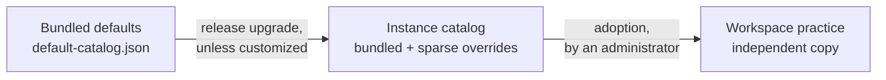

# Practice catalog curation

The practice catalog turns defined engineering practices into review criteria.
Product terminology lives in the [practice feedback language guide](practice-feedback-language.md).
This page covers how to maintain the catalog.

[Writing effective practices](/admin/writing-practices) owns the authoring method, a worked example and the case-based review checklist for both custom and bundled practices.
Apply it to the effective definition, including its shared preamble and any precompute output, rather than reading the criteria in isolation.

## Sources and ownership

The effective catalog combines three scopes, and definitions only ever flow one way:



| Scope               | Owner                    | Stored as                                   | Decides                          |
| ------------------- | ------------------------ | ------------------------------------------- | -------------------------------- |
| Hephaestus defaults | repository maintainers   | `default-catalog.json` + precompute scripts | the bundled definition and order |
| Instance catalog    | instance administrators  | sparse override rows                        | what workspaces may adopt        |
| Workspace practices | workspace administrators | full database copies                        | reviews in one workspace         |

All three scopes use the same definition fields.
What differs is who owns the value:

- **Definition and review policy** — maintained in the repository.
  The instance inherits or customizes it.
  Once adopted, a workspace owns it outright.
- **Inclusion** — an instance decision only. Excluding an entry removes it from what workspaces may
  adopt and changes nothing that is already adopted.
- **Autonomy, review coverage, and delivery status** — workspace decisions only. A curator never sets
  any of them, and a practice Hephaestus cannot review is forced to `OFF`.
- **Group and order** — repository array order, overridable on the instance, then independent per
  workspace.

Neither step silently rewrites a customized instance definition or an existing workspace practice.
The badge tables an administrator reads for both scopes live in the [Practice Catalog admin guide](/admin/practice-catalog).

| Stakeholder                | Primary task                                                                                                                | Deliberately not their task                      |
| -------------------------- | --------------------------------------------------------------------------------------------------------------------------- | ------------------------------------------------ |
| Practice author            | Define the practice, guidance, and responsible mentoring support                                                            | Authorize collection or certify review accuracy  |
| Instance administrator     | Curate the library workspaces may adopt from                                                                                | Rewrite existing workspace practices             |
| Workspace administrator    | Adapt practices, set the workspace default autonomy and override it per group or practice, and scope which work is reviewed | Authorize a new data source for the instance     |
| Instance operator          | Approve source purposes, privacy, retention, and erasure coverage                                                           | Decide that connected evidence proves a practice |
| Developer, peer, or mentor | Use observations and available human context in a review                                                                    | Supply hidden context to Hephaestus implicitly   |

## Authoring experience

Authored definition objects and their nested policy, evidence and precondition objects reject unrecognized fields.
Send authored request fields, not response-only validation metadata.

The practice editor follows the decisions an author can make confidently:

1. **Practice** — give one observable way of working a short, action-oriented name.
   Choose the work it applies to.
   Optionally place it in a group.
2. **Review guidance** — describe what to look for, why it matters, and one concrete example.
3. **How this practice is mentored** — choose AI-supported mentoring, human review, or guidance only.

The generated identifier, review signals, and optional static-analysis script are under **Technical settings**.
A new practice starts with the signals and evidence requirements recommended for its kind of work.
Authors change them only when the practice needs a different review boundary.
One definition may name several signals with the same evidence and subject.

Different expectations or evidence at another moment belong in a separate practice.
Manual review is not an author-selected signal.

The definition-options API supplies eligible signals, default evidence requirements, and permitted sources.
The runtime derives the artifact kind from the signals' shared prefix instead of storing a second declaration that could contradict them.

Write **What to look for** as a review boundary, not as a personality or a score.
Define one observable way of working.
Define the signals that show it.
Define the cases where a reviewer should stay silent.
Do not require intent, private context, runtime behavior, or any other fact outside the selected work and evidence boundary.

## Choose how Hephaestus can help

The practice form starts with one product choice instead of separate model and evidence-sufficiency settings:

- **AI-supported mentoring** lets Hephaestus review connected work after every required source passes.
- **Human review needed** records that connected work is not enough. Hephaestus skips the practice.
  A developer, peer, or mentor can still review it from context the system does not collect.
  It still names its occasion, which supplies its artifact kind.
  Saying what a practice is about is not the same claim as asking Hephaestus to act on it.
  It cannot define a static-analysis script.
  Its autonomy is forced to `OFF`.
- **Guidance only** keeps the criteria and guidance without configuring Hephaestus to review it.

The practice starts with the recommended evidence for its kind of work.
Most authors should keep it.
**Choose sources** reveals each source's display name, privacy class, and contract-required capture quality.

It shows whether the source can be captured whole.
Thus, an author knows whether an `EXHAUSTIVE` stance is available.
It also shows the practice's known limitations.
How strictly a source must be captured is not a per-practice choice.

The source contract states it once.
Every shipped practice already agreed with it.

Selecting a source never authorizes collection.
Instance governance and workspace integrations remain separate gates.

### Example: explain what changed and why

| Field                    | Definition                                                                                                      |
| ------------------------ | --------------------------------------------------------------------------------------------------------------- |
| Name                     | Explain what changed and why                                                                                    |
| Review this kind of work | Pull or merge request                                                                                           |
| What to look for         | Look for a description that explains the behavior change and why. Stay silent for automated dependency updates. |
| Why it matters           | Reviewers can judge a change faster when they understand its purpose.                                           |
| What good looks like     | “This changes retry behavior so temporary network failures no longer end the sync.”                             |
| Hephaestus support       | AI-supported mentoring with the recommended review configuration and evidence                                   |

The author does not choose source-contract identifiers or runtime states in this common path.
If required pull-request details or the diff are missing, Hephaestus skips the practice.
It also skips the practice if capture is less complete than the contract demands.
It does not invent an observation.
For a practice that needs more context, use **Human review needed**.

Name the missing context.
For example, a practice can ask whether a developer understood a trade-off discussed privately with a mentor.

The instance tables store only decisions that differ from the bundled catalog:

- A customized definition and its complete adopted base.
- Inclusion policy.
- Accepted bundled digest.
- Position.

No override row means the bundled definition and order apply.
See [ADR 0028](https://github.com/hephaestus-build/Hephaestus/blob/main/docs/decisions/0028-source-synced-practice-catalog.md) for the architectural decision.

## Workspace adoption lifecycle

- **Slug identifies a workspace practice.** It participates in provenance and observation recurrence.
  Changing a slug requires an explicit remapping strategy. Changing a display name does not.
- **Definitions and order are independent.** Reordering does not create a definition override or an
  audit event. **Use Hephaestus order** removes custom positions.
- **Automatic installation is keyed on the installation record, not on age.** At startup, a workspace
  with no `practice_catalog_installation` row receives the whole effective catalogue once. Recording
  that row is what makes a workspace start empty, and only `WorkspaceService` — the workspace API —
  records it.
- **Adoption is deliberate.** Workspace administrators can show the instance library alongside their workspace configuration.
  They can inspect a complete effective definition.
  They can add one practice or all available practices in a group as independent copies. Group adoption is one transaction. Both flows
  fail when the reviewed definition or resulting workspace configuration has changed.
- **Group removal is explicit.** Administrators choose whether a group's practices move to Unassigned or
  are deleted with the group. The library can restore a removed catalog group by moving its matching,
  unassigned workspace copies back without replacing local edits. Practices deliberately placed in a
  different group are never moved implicitly.
- **Adoption does not authorize automatic sending.** A reviewable practice starts at `HUMAN_APPROVAL`
  (**Review before sending**), while a practice Hephaestus cannot review remains `OFF`. Moving to **Send
  automatically** is a separate administrator decision. Validation evidence does not make that
  authorization implicitly.
- **Provenance is descriptive, not referential.** Matched workspace copies retain the source slug and
  comparison fingerprint without a foreign key. A bundled source may have no database row and may
  disappear in a later release.
- **Unmatched migrated copies remain unlinked.** Backfill links only definitions that still match the
  bundled review rules or group details.
- **Exclusion controls adoption availability.** Excluding a group also removes its practices from the
  adoption catalogue. Existing workspace copies do not change.

Array order in `default-catalog.json` is the bundled order.
Until an administrator reorders a list, bundled entries continue to follow repository order and instance-created entries append.
The first deliberate reorder records the complete affected list.
Moving a practice to another group is a definition change and is audited.

## Release behavior

Each effective entry is resolved from the running bundled definition and any instance override:

| Existing instance state                  | Effective result after upgrade | Admin-page state                     |
| ---------------------------------------- | ------------------------------ | ------------------------------------ |
| Default not customized                   | new bundled definition         | no badge                             |
| Customized. Bundled definition unchanged | saved customization            | **Customized on this instance**      |
| Customized. Bundled definition changed   | saved customization            | **Hephaestus update available**      |
| Instance-created entry                   | saved definition               | **No Hephaestus default**            |
| Uncustomized default removed             | entry disappears               | —                                    |
| Customized default removed               | saved customization            | **Removed from Hephaestus defaults** |

An update never replaces a customization silently.
A customized entry compares its complete bundled base, current definition, and offered bundled definition.
The administrator chooses current or offered for every upstream-changed field, including conflicting edits.
Accepting advances the base to the offered version.

Declining acknowledges only that offered digest.
A later different bundle is offered again.
An entry with no customization continues to follow the bundle.
Reset is a separate action that discards the whole customization.

Inclusion and custom order remain independent.

Git versions bundled defaults.
Content-derived ETags reject concurrent writes based on stale content, and the configuration audit records definition and inclusion changes.
There is no separate catalog revision counter or materialized copy of every bundled definition.

## Workspace drift

Catalog-installed or successfully matched workspace copies retain their source slug and the comparison fingerprint captured at installation.
The workspace UI derives drift by comparing:

1. The definition currently used by the workspace.
2. The definition copied originally. And
3. The current effective instance definition.

A copy that matches the catalog says **Same as the catalog**.
Other states say **Edited here**, **Catalog changed, yours did not**, **Update declined**, or **No longer in the catalog**.
Drift never rewrites the workspace.
A changed effective instance practice produces a proposal for each workspace that adopted it.

Each workspace accepts or declines for itself, and no AI-authored change bypasses this path.
Acceptance creates a new revision and advances the base.
Declining changes neither the definition nor its revision and suppresses that exact offered digest until the offer changes.

A release comparison covers every definition field, including guidance and delivery behavior.
The artifact kind is not compared separately — every signal name carries it, so it is derived from review configuration.
The review-rule fingerprint has a narrower role: it tracks review-judgment inputs, not guidance or delivery presentation.
A group comparison covers name, description, icon, and color. Position is excluded.

## Adopted definition bases

Each new workspace adoption stores the complete instance definition it copied, including guidance, review policy and review configuration, beside the source slug and review-rule fingerprint.
Workspace edits and new revisions do not change that base.
An instance customization likewise stores the complete bundled definition on which it was based.
An uncustomized instance entry has no saved base: it still follows the bundle.

Acknowledging a newer bundle updates the instance base.
Editing the customization does not.

Older copies cannot recover a definition that was never saved.
On upgrade, a workspace copy uses the current bundled definition only when its saved review-rule fingerprint matches.
Otherwise it uses the earliest of its own immutable revisions recorded under that exact saved source fingerprint.
It uses the content as that revision recorded it.
This still works after a fingerprint scheme change.
The match proves a recorded version, not when it was adopted, and the saved fingerprint is never rewritten.

Failing both, or when that revision lacks a complete definition, it uses its current definition.
An older instance customization has no revision history: it uses the current bundle only when its saved catalog digest matches.
Otherwise it uses its current definition.
Each saved base records which route was used (`EXACT_ADOPTION`, `BUNDLED_DIGEST_MATCH`, `BUNDLED_FINGERPRINT_MATCH`, `REVISION_FINGERPRINT_MATCH`, or `CURRENT_DEFINITION`).

With `CURRENT_DEFINITION` or `REVISION_FINGERPRINT_MATCH`, a release review preselects nothing.
A local edit cannot be distinguished from a catalog change.
A revision matched by its assessment fingerprint need not show the original guidance or delivery.
Early revisions might not have recorded them.
No historical match proves identical content: the review-rule fingerprint excludes guidance, and older catalog digests predate the subject field added in [#2160](https://github.com/hephaestus-build/Hephaestus/issues/2160).
Release proposals carry the base source so an administrator can judge an approximate comparison rather than mistake it for the original adopted content.

## Declared feedback delivery

The definition stores whether negative feedback stays in the summary, which issue observations overlap, and which other practice takes priority when both produce feedback.
A workspace-authored practice can use these fields.
They are stored in revisions, shown in release proposals, and read from the revision that judged each observation.
They do not depend on practice slugs in delivery code.

The review-rule fingerprint excludes these delivery fields because they do not change the review judgment.
A change to that fingerprint starts a new recurrence chain.
Accepting a guidance-only or delivery-only change keeps the current chain.
Earlier observations retain their original revision and are never rewritten.

## Turning a practice down

Autonomy is a workspace decision, not a catalog decision.
A practice's `autonomy` and the workspace's review scope both live outside the curated catalogue.
A curator never sets either.
The [practice review glossary](./practice-review-glossary.mdx) defines both in full.
It owns the three autonomy states and what each does.
It also owns refusal reasons for an out-of-scope or autonomy-`OFF` artifact.

What matters for curation is only this: move a noisy but still meaningful practice to `HUMAN_APPROVAL` so measurement continues under supervised release.
Use `OFF` when the practice itself should not run.
Neither operational choice changes the curated definition.

## Selecting a practice

Use the [authoring checklist](/admin/writing-practices#challenge-the-draft-before-adopting-it) to review the occasion, named behavior, evidence, consequences and expected feedback.
For bundled entries, also cite research, a standard or an explicitly identified practitioner norm.

Evidence requirements are declared on each practice against the versioned [artifact-source contract](./artifact-source-contract) and the canonical [practice review glossary](./practice-review-glossary.mdx).
Each entry names a source and a stance — `REQUIRED`, `EXHAUSTIVE`, or `CONTEXTUAL` — and the practice's policy adds conservative skipping and known limitations.
Requirements must not infer availability from a missing file.
An author's declaration is only a declaration.
The product validates no policy independently.
Every shipped policy carries the single status `AUTHOR_DECLARED` to say so.

Requirements also say nothing about whether a developer, peer, or human mentor can review the practice outside the governed integrations.

The review-rule fingerprint uses an explicit scheme prefix.
The prefix changes whenever its *inputs* change, not the rules.
Thus, a stored fingerprint is never compared against one computed from a different set of facts.
Each scheme retains its original meaning, so two schemes never compare equal by accident.
Bump the prefix in the same change that alters the input set.

Architecture-wide qualities cannot be inferred from one change.
A practice may review an observable act, such as recording a decision, without turning it into a claim about the whole system.

Classify evidence accurately:

| Classification                 | Requirement                                                          |
| ------------------------------ | -------------------------------------------------------------------- |
| Peer-reviewed evidence         | an empirical study directly supports the claimed relationship        |
| Standard or canonical guidance | a recognized standard or established engineering guide recommends it |
| Practitioner norm              | a community convention with no controlled-outcome claim              |

Record exact sources in the proposal or pull request that changes the practice.
Do not present a standard as an experiment or a convention as a proven outcome.

## Changing bundled defaults

1. State the user problem and supported reviewed work.
2. Cite and classify the evidence.
3. Draft applicability, signals, exclusions, evidence requirements, and severity.
4. Confirm every source applies to the practice's artifact kind.
   Confirm its governance decision permits the product purpose, audience, processor egress, and retention. A new source follows the
   [artifact-source governance gate](../admin/dsms/artifact-source-governance).
5. Update `server/application/src/main/resources/practices/default-catalog.json` with the bundled definition.
   Its adjacent JSON Schema provides editor completion and CI validation.
   Git history is the bundled version history.

   Declare the one occasion directly as `signals`, with `reviewWhen` and `subject`.
   Declare sources as `evidenceRequirements` explicitly.
   A review needs at least one required or exhaustive source.

   A guidance-only practice uses an empty list.
   Declare a mechanical gate as `precondition`.
   `reviewWhen` maps descriptor-supported state dimensions to nonempty value sets.

   An empty map is unrestricted.
   Omitting a dimension permits all its values.
   There is no occasion array or string-or-object shorthand.

   Reference any precompute script explicitly.
   A script must be named after the practice slug, and an unreferenced one fails validation.
   What a script is and what the library owns is in [Precompute scripts](#precompute-scripts) below.

   Give the practice a `holdsAs` sentence — [Holds as](./practice-feedback-language.md) in the feedback language.
   Use one present-tense line without dashes, within the length that the schema (`default-catalog.schema.json`) sets.
   Name what the developer keeps doing when the practice holds.

   Example: *Every reviewer comment gets a visible answer*.
   The sentence is read from the bundled catalog by slug.
   It is not part of the definition a workspace copies, customizes, or compares.

   Thus, a better sentence reaches every workspace with the next release.
   Every bundled practice takes the default review frame for its kind of work.
   The one exception is `insufficiencyReason`.

   If no collected source can answer the practice's question, it ships as **Human review needed**.
   It carries that reason and no precompute script.
   The shipped reason is a withdrawal, not a default, so no instance customization or recorded workspace copy can override it.

   The effective catalog gives a customized entry that asks for a review the shipped policy and reason (`PracticeDefinition.withdrawnAs`).
   A guidance-only customization is never reviewed and stays as written.
   A workspace copy keeps its authored definition.
   The editor saves it as shown.
   Its read carries the shipped reason separately as `automatedReviewWithdrawal`.
   The autonomy page, catalog list, and editor show this reason.

   A copy descends from the entry only by the source slug it records.
   A practice authored under the same slug is the workspace's own.
   For every such copy, whatever policy it stores, the review gate occasions nothing.

   Readiness refuses it with `DECLARED_EVIDENCE_INSUFFICIENT`.
   Admission withholds any claim from a run prepared before the release.
   An observation already admitted before it stays.

   Its autonomy cannot be raised.
   The server-role catalog repair switches it `OFF` at startup with an audited `PRACTICE_USAGE` change.
   It reports itself out of service when any copy stays on.
   Such an entry carries no `holdsAs`, so the practice page shows no phrase for earlier positives.
   A copy made and edited before provenance was recorded has no source slug and is left alone.

   Nothing distinguishes it from a practice authored under the same slug.
   That is the one change a release makes to a workspace copy without its administrator.
   The definition, revisions, and earlier observations stay as they were.

6. Add or update focused automated-review tests, including required-source skipping and valid-empty evidence.
7. Review the admin presentation and a representative piece of delivered feedback.

### Bundled visuals and guides

A bundled practice can have a practice visual and a practice guide.
Their files live in one folder for each practice, beside the catalog:

| File | Holds |
| --- | --- |
| `practices/guidance/<slug>/visual.svg` | The visual |
| `practices/guidance/<slug>/guide.md` | The guide |
| `practices/guidance/<slug>/figures/<name>.svg` | One figure of the guide |

The catalog entry names the files:

```json
"visual": {
  "file": "practices/guidance/<slug>/visual.svg",
  "alt": "What the picture shows and what it means."
},
"guide": "practices/guidance/<slug>/guide.md"
```

The loader reads each figure that the guide shows with ``.
A file outside the folder of its own slug, a missing file, or markup that the server refuses stops the catalog load.
A changed visual or guide follows the [release behavior](#release-behavior) of every other definition field.

[Practice visuals and guides](./practice-visuals.md) is the style guide.

### Precompute scripts

A precompute script extracts candidates inside the review container.
It receives the parsed diff, artifact metadata, captured context and derived change directory (`work/change/`).
Its output is hints, metrics and directions, not observations.

- **Practice-specific predicates belong in the script.** Shared readers and scanning mechanics live
  in `docker/agents/precompute/lib/`. Keep the predicates consistent with the practice criteria.
- **A candidate is not a judgment.** A matched line or review thread directs inspection. The model
  must check its context against the criteria. The purity test rejects observation vocabulary in
  scripts, but does not establish that their output is complete or correct.
- **Missing and empty differ.** Context readers return `null` when a capture file is absent and `[]`
  when a captured list is empty. Scripts must preserve that distinction.
- **Line scanning has limits.** Declaration placement uses syntax tables, not a full language parser.
  Unsupported languages and unavailable files produce `unknown` placement. Directions must identify
  relevant limits, such as constructs that span several lines.

The runner renders one bounded section per practice, `work/precompute-out/<slug>.md`, and the review shows it under that practice's criteria in the turn that evaluates it.
A section holds the practice's directions, candidate locations and record rows.
When they do not fit its 3,000 characters, it keeps a sample of each and a pointer to the full per-practice JSON.
Sections are bounded one by one, so a script with many rows never crowds another practice's leads out.

A section is an entry point to the evidence, not proof that the model inspected every candidate.

### Review the effective definition

For every changed practice, compare its criteria with the work-type preamble, review configuration, precompute script, shared review instructions and developer guidance.
Check these seams explicitly:

- A preamble cannot declare a source unavailable when the review captures it, or infer absence from
  an unavailable quotation. The actual capture manifest establishes availability. Practice criteria
  establish permitted use.
- A precompute candidate is a lead, not a judgment. A count or path match alone cannot establish a
  developer's intent, a runtime outcome or the adequacy of a rationale.
- An applicability exclusion and an assessed outcome cannot both describe the same case. Read all
  exceptions together with the final decision instructions, not just the opening behavior statement.
- Exceptions for deliberately generated files, version ranges or repository conventions must survive
  the final outcome rules. Severity follows the evidenced consequence, not the number of matches.
- Guidance and examples cannot silently add requirements absent from the criteria. Shared instructions
  define the observation protocol. Individual practices define the occasion and evidence needed for
  their expectation.

Keep the cases and evaluation evidence with the relevant test or benchmark, and explain the change in the pull request.
Every bundled practice is written in the decision-procedure shape of [Writing effective practices](/admin/writing-practices#write-the-criteria-as-a-decision-procedure), and `CatalogCriteriaShapeTest` checks that shape (the sections, their order, the size bound).
That test checks structure, not semantic quality.
Schema and fixture tests prove loading and faithful presentation.

Evidence-based case review and model evaluation are separate checks.
The shared preambles are one artifact-framing paragraph each.
The grounding rules live once, in the shared review instructions.
Changing a preamble affects every entry that uses it, so inspect every affected kind of work and preserve the existing workspace-adoption boundary.

Create workspace-specific practices through the admin UI or API so validation, ordering, revisions, and audit behavior remain intact.
