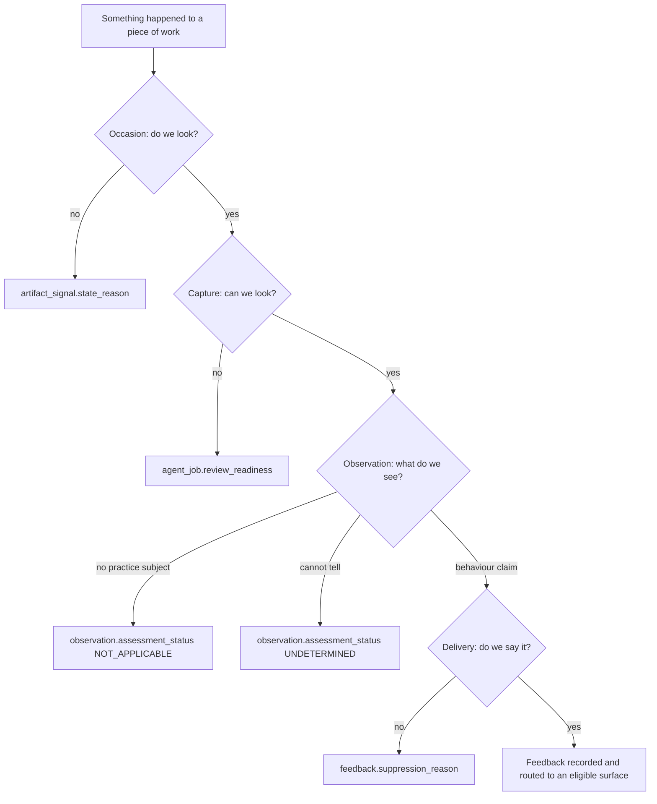
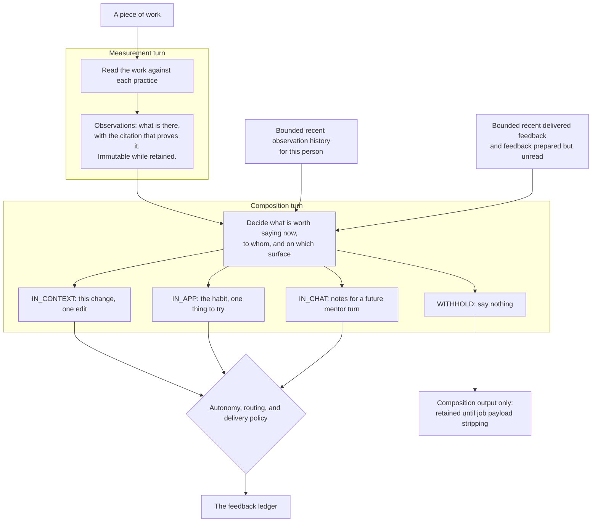

A practice review passes through four stages, in this order: **Occasion**, **Capture**, **Observation**,
**Delivery**. Each stage can stop independently and records a different reason.

Use the stage that stopped the review to decide what to fix. Do not translate one stage's reason into
another stage's vocabulary.

## Choose the page for your change

This page owns the runtime sequence and the seams between its stages. Start elsewhere when your change
belongs to one contract:

| You are changing                                                  | Start with                                                    |
| ----------------------------------------------------------------- | ------------------------------------------------------------- |
| A source, its capture states, retention, or permitted uses        | [Artifact-source contract](./artifact-source-contract.mdx)    |
| A practice's criteria, occasion, or evidence requirements         | [Practice catalogue](./practice-catalogue.md)                 |
| Observation or feedback persistence, identity, or API projections | [Practice review data model](./practice-feedback-schema.md)   |
| Product and model-facing terminology                              | [Practice feedback language](./practice-feedback-language.md) |
| Run provenance and evaluation joins                              | [Evaluation provenance](./evaluation-provenance.md)           |
| An exact enum meaning after you know the stage                    | [Practice review glossary](./practice-review-glossary.mdx)    |

Use this page for changes across stages. Capture failures must not become observations, and delivery
choices must not erase observations.

## Where a review can stop

**Each stage has its own refusal vocabulary.**

| Stage       | Refusal vocabulary                                                           | Lands in                                                                   | Means                            |
| ----------- | ---------------------------------------------------------------------------- | -------------------------------------------------------------------------- | -------------------------------- |
| Occasion    | `SignalStateReason`                                                          | `artifact_signal.state_reason`                                             | We chose not to look, or not yet |
| Capture     | `SourceAbsenceReason` per source, `SourceReadinessReason` per practice check | `agent_job.evidence_snapshot` (the manifest), `agent_job.review_readiness` | We could not look                |
| Observation | `AssessmentStatus.UNDETERMINED`                                                      | `observation.assessment_status`                                                     | We looked and could not tell     |
| Delivery    | `FeedbackSuppressionReason`                                                  | `feedback.suppression_reason`                                              | We know, and chose to stay quiet |

A missing source is not a claim about behavior and must not become a `Presence` value. A delivery refusal
or pending approval does not erase the observation. Add each reason to the stage that owns the decision;
use separate reasons when more than one stage stops.

## Occasion

An occasion is one named signal on one revision of one artifact. It is recorded in
`artifact_signal` before admission, so a review that does not start still has an auditable outcome.

### Issue snapshot supersession

An issue observation is current only while both its practice review rule and its supporting issue
snapshot are current. A change to title, body, state, state reason, native type, milestone, labels or
assignees advances the issue's review snapshot in the mirror transaction and marks earlier issue
observations historical. An identical replay does neither. A return to earlier content is a **new**
transition: the snapshot token changes even though its content digest matches an older one, and the
older observations do not become current again. The snapshot-deduplicated automatic occasion may
already be settled for that content; in that case there is no new current observation until a new
review is requested. A failed, refused, or undecided later review never implies that the earlier
judgment was correct or incorrect.

One mirrored issue can be reviewed in several workspaces. Its transition retires observations in
every workspace that recorded that issue, without exposing one workspace's history to another.
Each monitoring workspace records and settles its own issue-update occasion; a later monitor change
cannot redirect a queued review to a different workspace.

At observation publication, the review must still name the issue's current snapshot token. The
publication transaction locks the issue row; a concurrent mirror update either completes first and
rejects the old review, or completes afterwards and marks its observations historical. A historical
observation keeps its evidence, job, feedback links and original developer. It is not a human
retraction ([#1507](https://github.com/hephaestus-build/Hephaestus/issues/1507)). Existing issue
observations with no reliable snapshot token become historical at migration, rather than being
presented as verified current claims. Operator review history reports `STALE`; current developer
standings and Heph context omit superseded claims.

The webhook sender is the **initiating actor**, not necessarily the issue author or the developer
under review. Issue-update occasions retain the actor in the deferred ledger and carry it into the
review job; sync discoveries have no initiating actor. Coalescing uses the actor of the final
reviewed snapshot. GitHub issues webhooks name `sender`; GitLab issue webhooks name `user`
([GitHub payload](https://docs.github.com/en/webhooks/webhook-events-and-payloads#issues),
[GitLab payload](https://docs.gitlab.com/user/project/integrations/webhook_events/#issue-events)).
GitLab still has no advertised live native-type transition. This policy does not merge evidence
sufficiency, review execution and semantic outcome; those remain separate as described in
[#1428](https://github.com/hephaestus-build/Hephaestus/issues/1428) and
[#1429](https://github.com/hephaestus-build/Hephaestus/issues/1429).

`SignalState` has six values: `RECORDED` for an occurrence nobody has decided on yet, `DEFERRED` for one
queued in the [update coalescer](#durable-update-coalescing), `TRIGGERED` for one that started a review,
terminal `SUPPRESSED`, retryable `PENDING`, and retired `LAPSED`. Terminal rows never reopen — a coalesced
`SUPPRESSED` row is the one exception, moving to `DEFERRED` rather than reopening when a later live
transition repeats its content, because that content has never itself been decided on. Pending rows are
re-offered until their reason clears or their deadline passes. Retryability belongs to the reason, not to
the caller: each `SignalStateReason` declares the state it resolves to. Which reason to reach for, and the
two that are easy to confuse, are in
[Signal state reasons](./practice-review-glossary.mdx#signal-state-reasons); provenance mapping and UI
labels are in [How a review was occasioned](./practice-review-glossary.mdx#how-a-review-was-occasioned).
Operator remediation is in [When a workspace goes quiet](/admin/practice-review#when-a-workspace-goes-quiet).

A live GitHub or GitLab event whose work is tombstoned holds its occasion with
`ARTIFACT_NOT_VISIBLE` (`PENDING`) instead of starting a review, so the pending-signal reaper
re-offers it and an ordinary sync can restore reviewability without another webhook. The check reads
committed mirror state at admission; work deleted during capture or delivery belongs to that stage's
refusal policy.

The occurrence ledger has no pruning job; capacity planning must treat it as append-only. Retry and lapse
thresholds are `hephaestus.signal-ledger.pending-retry-after` and `pending-lapse-after`.

### Issue lifecycle occasions

Issue practices bind to three lifecycle occasions:

| Occasion | Transition | Revision identity |
| --- | --- | --- |
| `scm.issue.opened` | The issue is created | Title and body |
| `scm.issue.updated` | The review-relevant snapshot changes, including reopening | The whole snapshot |
| `scm.issue.closed` | The issue enters a closed state | The close timestamp |

The snapshot is the title, body, native type, labels, assignees, milestone, state, and state reason — the
fields the issue evidence a bundled practice reads is built from. Labels and assignees are sorted while the
digest is built, so provider ordering does not change the revision.

Only `scm.issue.updated` keys on the whole snapshot. The other two deliberately do not, because a past-work
campaign or a recurring sweep re-derives their keys from the artifact as it stands: an opening keys on the prose and a
close on the moment it closed, so triage between two sweeps moves neither and buys no second review.

Unlike a merged pull request, a closed issue is not in a state it cannot leave. Keying the close on its
timestamp keeps a redelivery of one close inert while making the close that follows a reopen a second
occasion, so the retrospective at-close review runs for each round of work rather than only the first.
Neither provider guarantees a close timestamp; a mirror row without one falls back to a single close
occasion, since there is then nothing to tell two closes apart.

Two consequences are worth stating because neither is obvious:

- **A return to a previously-seen snapshot occasions nothing.** Adding a label occasions a review, removing
  it occasions another, and adding it back matches a revision already in the ledger and occasions none.
  Reverse states are symmetric in what they raise, not in what they spend. A reopen is the exception: it
  moves the state field, so it occasions an update review, and the close after it occasions its own close
  review because that close is a different moment.
- **A burst of distinct intermediate snapshots is coalesced, not deduplicated by content alone.** Five
  triage actions on one issue arrive as five deliveries carrying five different snapshots; only the
  snapshot still current when the burst settles is submitted — see
  [Durable update coalescing](#durable-update-coalescing).

| Transition | GitHub webhook action | GitLab webhook action | Review decision |
| --- | --- | --- | --- |
| Title or body changed | `edited` | `update` | Updated |
| Native type set or removed | `typed`, `untyped` | Not exposed by the validated webhook contract | GitHub: updated; GitLab: synchronization only |
| Label added or removed | `labeled`, `unlabeled` | `update` | Updated |
| Assignee added or removed | `assigned`, `unassigned` | `update` | Updated |
| Milestone set or removed | `milestoned`, `demilestoned` | `update` | Updated |
| Reopened | `reopened` | `reopen` | Updated |
| Closed | `closed` | `close` | Closed |
| Locked, pinned, due date, weight, time tracking | `locked`, `pinned` | `update` | Nothing |

Both adapters report what a delivery moved as a field set, and an update that moves none of the snapshot's
fields occasions nothing: GitHub compares the mirrored row against the incoming one, and GitLab reads the
`changes` diff its `update` action carries, which is the only thing distinguishing a retitling from a
due-date, weight or time-tracking edit.

Synchronization updates the issue projection without starting a live review. When GitLab sync finds
changed review evidence on an existing open issue, it advances the snapshot and records the update
occasion as sync-discovered. This retires stale observations without coaching on historical work.
GitLab synchronization includes native type, but its webhook contract does not provide a reliable
type transition; the GitLab adapter therefore does not advertise live type-change reviews.

Every practice bound to `scm.issue.updated` is reevaluated. Practice bindings declare occasions and evidence
sources, not dependencies on individual issue fields, so there is no second, per-field dependency model
to keep in step with the snapshot.

#### Durable update coalescing

`IssueAgentJobEventListener` records live updates in the mirror transaction. `IssueUpdateCoalescer` consumes
those `DEFERRED` rows on a locked, single-replica sweep in the server role. Sync-only rows are ineligible
until a live delivery promotes them. [Queue timing](/admin/practice-review-operations#issue-update-queue) is
based on newly queued snapshots, not every transition or provider timestamps.

Each artifact's queued rows are locked and eligibility is rechecked in the settlement transaction, which
also re-resolves the issue's workspace: a repository re-keyed to a different workspace inside the queue's
window (§ re-keying,
[ADR 0024](https://github.com/hephaestus-build/Hephaestus/blob/main/docs/decisions/0024-integration-sync-lifecycle-and-two-deletion-semantics.md))
settles as `SUPPRESSED / OUT_OF_REVIEW_SCOPE` rather than under the workspace that recorded it. Submission
and settlement commit together; a rollback leaves the occasions available. Locks cover the whole group
because [skipping individual locked rows](https://www.postgresql.org/docs/current/sql-select.html#SQL-FOR-UPDATE-SHARE)
could split a burst between consumers. Attempt timestamps order retries independently of eligibility,
so a repeatedly failing artifact does not monopolize a batch.

Only a revision matching the current mirror reaches admission. Displaced revisions become
`SUPPRESSED / COALESCED`, including updates overtaken by a close. Missing work lapses; tombstoned work
is held as `PENDING / ARTIFACT_NOT_VISIBLE`. Pending retries also compare revisions before admission.
See [Signal state reasons](./practice-review-glossary.mdx#signal-state-reasons) for retry semantics.

Issue-update jobs retain the admitted revision. Capture compares it against the issue's canonical digest and
reports the source unavailable (`SourceAbsenceReason.NOT_FOUND`) on a missing or mismatched revision, rather
than making an observation about the developer. This check does not fence edits after capture or invalidate
earlier observations and feedback.

#### Push coalescing

`scm.pull_request.synchronized` is coalesced the same way. GitHub names a push; GitLab raises it when a
merge-request update carries `oldrev` or moves the stored head, since GitLab omits `oldrev` on some
pushes. `AgentJobEventListener` defers a live push, and `PullRequestPushCoalescer` reviews the head a burst
settles on. A group becomes due after ten quiet minutes or one hour from its first push. The workspace
cooldown can delay settlement beyond that hour; it does not discard the push. Scheduler timing, admission
and queue capacity also affect when a review starts. Superseded heads become `SUPPRESSED / COALESCED`.
A push overtaken by a merge or a close is left to that occasion.

## Capture

Capture stages **every source the contract says applies to the artifact kind under review** — all of them,
every time. Practice bindings decide which practices may run, never which files reach the sandbox; there is
no per-run source selection. What a capture then reports about each source (available, not collected,
unavailable, redacted, errored — with a typed reason) and how a practice's stances turn those reports into
a readiness decision is the whole subject of the
[artifact-source contract](./artifact-source-contract.mdx), which is versioned and validated at startup.

Capture stages source records, not practice judgments. A pull-request capture pins `base_sha` and
`head_sha` in `inputs/context/change.json` beside the checkout. The sandbox derives the patch, statistics
and changed-file list with `git` under `work/change/`. Commit messages and file changes are staged
as captured input so admission can verify their citations. Practice-specific precompute
scripts run on these inputs inside the sandbox. The server also reads the change to evaluate declared
practice subjects and verify citations. The [workspace ABI](./agent/workspace-abi.mdx) owns the file layout.

Readiness is stored in `agent_job.review_readiness`, separately from `evidence_snapshot`, so status reads
need not load the full artifact manifest.

## Observation

An observation is one practice's answer about one piece of work, written once and immutable. Its
[assessment axes](./practice-feedback-language.md#observation-assessment-axes) remain unchanged from
the sandbox tool through server admission, persistence and read projections. Contradictory fields
are rejected, never silently removed or converted to a different judgment.

Admission validates the observation’s axes and evidence warrants. Practice criteria supply the contextual
expectation; each observation identifies the behavior whose presence and desirability it assesses.

Status-specific warrants and citations are enforced both inside the sandbox and by the server.
Capture failure remains a readiness decision and creates no observation. Unassessed statuses do not
create positive or negative feedback and do not move the assessed-result trend denominator.

Admission is single-flight per attempt. Verifying a historical citation reads the attempt's repository
snapshot, so a runner that repeats a submission whose answer did not arrive joins the admission already
running and receives its answer; a repeat carrying a different payload is refused as a conflict, and an
attempt that was already admitted answers with the recorded result.

Identity is assigned at persistence, not in the sandbox: an occurrence key dedupes within a run
(`insertIfAbsent`, `ON CONFLICT DO NOTHING`), and a recurrence key groups the evidence location across runs.
Different behaviors can share a location; this key does not establish that a concern persisted or resolved.

**Observations describe the work; feedback contains advice.** An observation carries a concise `summary`
and an `evidenceRationale` that explains the assessment, for example: “The change adds a tax-exempt branch,
and no changed test calls `total`.” It has no `guidance` field. Composition decides whether and how to give
advice from admitted observations.

### Recorded-result coverage

The runtime's per-practice execution ledger measures **recorded results**, not how thoroughly the
sources were inspected. A practice with at least one recorded observation is counted as evaluated;
a practice without one is counted as unevaluated and may be retried. This does not establish that
all relevant behaviors were reviewed, or that a practice without a result was never inspected.

The current runner cannot complete successfully with zero recorded observations. A supported
`NOT_APPLICABLE` observation can record that no practice subject applies to the captured work; missing required sources remain
readiness failures, and no verdict may be invented to satisfy execution coverage. Report this
protocol limitation separately from source completeness, judgment quality and delivery.

## Measurement and intervention

Measurement and composition are separate phases in one model session. An authenticated callback admits
observations between them; composition can reference only the persisted projection.

An observation states a claim that can be checked against the captured work. Feedback proposes an action
for a recipient and considers the surface, history and conversation. Keeping these phases separate allows
an observation to remain recorded even when advice would be repetitive, poorly timed or unnecessary.

**The model proposes; the server admits.** Origin, effective autonomy, routing, placement checks and
per-channel limits still apply after composition.

### Composition inputs and outputs

After Java admits observations, the runner resumes the same model session with the composition prompt. The
measurement tool is closed, and feedback may bind only to the durable observations returned by admission.
The resumed session retains artifact context without weakening the server boundary.

The composer receives the current admitted observations, bounded recent observation and feedback history,
unread prepared feedback, practice definitions, and the enabled lanes with their limits.
The exact files belong to the [agent workspace ABI](agent/workspace-abi.mdx), not this guide.

Three constraints shape how that context may be used:

- Only pull-request and issue handlers enable composition, and not for backfills. Document and conversation
  reviews record observations but compose no feedback.
- History is bounded. Claims about repeated behavior require the specific evidence from each reviewed
  artifact; absence from the history does not establish that a behavior never occurred.
- Shared practice or location keys do not establish semantic equivalence. A changed outcome or an
  omitted observation does not establish that a concern was resolved or regressed.

Accepted tool calls update the composition output incrementally. The server parses proposed units and applies
all delivery gates; the model never writes the feedback ledger directly.

### Channels are distinct interventions

What each channel is and where it lands is defined in the
[practice feedback language](./practice-feedback-language.md); which level each one is, in the
[practice review glossary](./practice-review-glossary.mdx#the-three-channels-are-three-levels). The
composition turn must not render one advice string three ways:

- `IN_CONTEXT` is public task-level feedback about the current work. It binds to a current admitted
  observation and uses either server-resolved `DIFF` placement or artifact-level placement. History alone
  cannot support a public claim.
- `IN_APP` is private process-level feedback about a pattern across several pieces of the recipient's work.
- `IN_CHAT` is private context for a later mentor turn. It prepares `situation`, `capability`,
  `evidenceSummary`, and `inConversationSignal` as notes, not dialogue. The mentor receives the original
  evidence and live conversation, then may adapt, defer, or discard the note.

An issue has no diff and therefore permits only artifact-level in-context placement. Pull requests permit
both placements. Per-lane limits are supplied in composition configuration, not fixed in this guide.

### What the composer is not allowed to do

Recording-tool validation and server admission enforce these constraints independently. An invalid
feedback unit is dropped and logged without invalidating admitted observations.

- **No verdict fields.** `report_feedback` takes no presence, assessment, severity or confidence.
- **No model-authored path or line number.** `placement.kind: "DIFF"` names an admitted
  `{ observationId, citationIndex }`, and the server resolves the file, side, and line from that
  observation's citation. `placement.kind: "ARTIFACT"` carries no coordinates and stays in the summary.
  Both forms require a current admitted observation of the same practice.
- **No invented supersession target.** `action: "SUPERSEDE"` must name, in `supersedesThreadKey`, a
  `threadKey` that was staged in `prepared.json`.
- **No second unit on the same lane about the same practice.** One unit per `(channel,
practiceSlug)`; the rest are dropped.

Staying quiet is the fourth action, not a gap: `action: "WITHHOLD"` with `NO_MATERIAL_CHANGE`,
`ALREADY_SAID` or `BELOW_BAR`. Those three are the composer's own vocabulary and are deliberately not
`FeedbackSuppressionReason` values — the glossary says
[why the two must never be merged](./practice-review-glossary.mdx#measurement-and-intervention).

Supersession is likewise the glossary's, under
[Thread key and supersession](./practice-review-glossary.mdx#thread-key-and-supersession). The only part
this stage owns is that composition proposes the thread action; the server, not the model, decides whether
the named thread may be superseded at all.

### When composition does not run

A composition failure does not invalidate admitted observations. An empty result is distinct from a turn
that never ran. In-context feedback may fall back to the admitted observation's summary and grounded
location, but invents no next step. The evidence rationale remains an audit explanation, not prose to
publish to the developer. Longitudinal channels have no content fallback.
Per-channel preparation marks distinguish a successful empty result from unfinished preparation.
The sweeper retries preparation from existing review outputs, not model composition; its
[recovery window is bounded](/admin/practice-review-operations#limits-you-should-know-about).

## Delivery and human approval

Composition creates immutable feedback units before release authority is applied. A composer `WITHHOLD`
means there was nothing useful to say and creates no feedback row; the negative observations it covers on
the work are recorded `SUPPRESSED` with `COMPOSER_WITHHELD`, so a withheld practice is a recorded decision
and never a bare headline rendered without a note. A policy refusal is instead persisted as
`SUPPRESSED` with a server-owned reason. These outcomes must not be conflated with a human rejection.

Autonomy is only the authority step, and the glossary owns it in full — the resolution chain and the three
values in [Practice autonomy](./practice-review-glossary.mdx#practice-autonomy), the approval lifecycle
alongside them, and the ordered list of gates every delivery walks in
[the delivery policy check order](./practice-review-glossary.mdx#the-delivery-policy-check-order). Read
those before changing anything here, and do not restate them.

Each channel router applies `PracticeAutonomyPolicy`: the observation's `ObservationOrigin` must permit
the channel, and effective autonomy must permit delivery there. `HUMAN_APPROVAL` requires approval for
pushed comments on the work, but allows on-demand practice pages and chat; `OFF` blocks all channels.
Backfill origin permits only the practice-page channel, regardless of autonomy. That permission is a
ceiling: `InAppFeedbackRouter` holds a pattern supported only by backfilled observations. Other delivery
gates still apply.

## Runtime and extension points

The server records an occasion and enqueues an `agent_job`; a worker claims it, captures evidence, runs the
sandbox, admits observations, resumes composition, applies delivery gates, and calls the provider. Runtime
roles, transaction boundaries, extension ownership, and change guidance are documented in
[Practice review runtime](./practice-review-runtime.mdx).

## Reading a real review back

`PracticeTraceEntryDTO` is the derived answer to "what did every practice make of this piece of work", and
it is what the **Review activity** screen renders for every member. It is derived, never stored:
`PracticeTraceDeriver` walks an ordered precedence list to a single `PracticeTraceOutcome`.

The trace separates measurement from delivery:

- **`outcome` is about the measurement**, and is one of these values: `REVIEWED`, `RUNNING`,
  `PENDING`, `SKIPPED`, `NOT_REACHED`, `NOT_ASSESSABLE`, `TURNED_OFF`, `NOT_OCCASIONED`, `DORMANT`,
  `LAPSED`, `FAILED`.
- **`observationCount`, `deliveredCount` and `withheldReasons` are about the intervention.**

At `HUMAN_APPROVAL`, `REVIEWED` and a positive observation count describe the measurement; the proposal's
`AWAITING_APPROVAL`, `PREPARED`, `DISCARDED`, or eventual `DELIVERED` state describes the intervention. Do
not represent a pending human decision as suppression: it is an actionable workflow state.

The precedence rule is not "configuration beats mechanics" — it is **what a run recorded beats what today's
configuration implies.** A verdict a run wrote against this practice by name (`REVIEWED`, `SKIPPED`,
`NOT_REACHED`, `NOT_ASSESSABLE`) is returned even after the practice is switched off, because it happened. `TURNED_OFF`
comes next, and therefore outranks everything merely re-derived from the occurrence ledger — `FAILED`,
`LAPSED`, `PENDING` — so a practice the workspace switched off reads as switched off rather than as broken.
A new outcome has to be placed on the right side of that line, not ranked against the others by severity.

Operator-facing guidance for reading the same screen is on
[Practice review](/admin/practice-review); the vocabulary both pages use is defined in the
[practice review glossary](practice-review-glossary.mdx). Persistence concepts and evaluation joins are in
[Practice review data model](practice-feedback-schema.md) and
[Evaluation provenance](evaluation-provenance.md).
