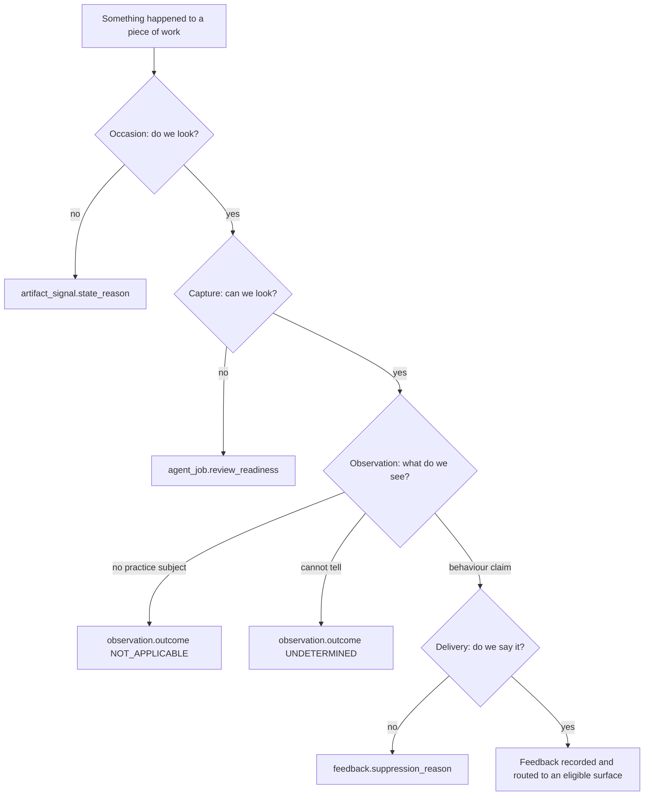
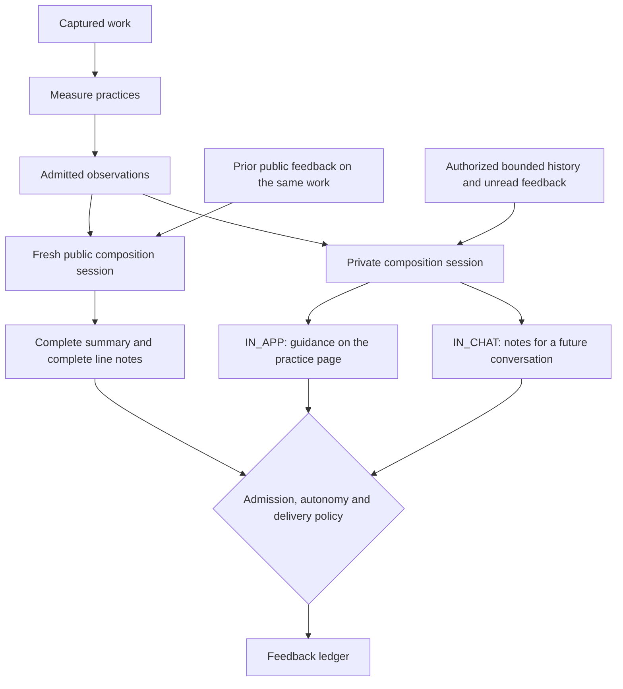

A practice review passes through four stages, in this order: **Occasion**, **Capture**, **Observation**,
**Delivery**.
Each stage can stop independently and records a different reason.

```mermaid
flowchart TB
    accTitle: Practice review stages and their distinct exits
    accDescr: Work passes through occasion, evidence capture, observation, and delivery. Each stage records a different result when processing stops.
    Work[Something happened to a piece of work] --> Occasion{Occasion: do we look?}
    Occasion -->|no| Refused[artifact_signal.state_reason]
    Occasion -->|yes| Capture{Capture: can we look?}
    Capture -->|no| Unready[agent_job.review_readiness]
    Capture -->|yes| Observe{Observation: what do we see?}
    Observe -->|no practice subject| NotApplicable[observation.outcome NOT_APPLICABLE]
    Observe -->|cannot tell| Undetermined[observation.outcome UNDETERMINED]
    Observe -->|behaviour claim| Deliver{Delivery: do we say it?}
    Deliver -->|no| Quiet[feedback.suppression_reason]
    Deliver -->|yes| Said[Feedback recorded and routed to an eligible surface]
```

Use the stage that stopped the review to decide what to fix.
Do not translate one stage's reason into another stage's vocabulary.

## Choose the page for your change

This page owns the runtime sequence and the seams between its stages.
Start elsewhere when your change belongs to one contract:

| You are changing                                                  | Start with                                                    |
| ----------------------------------------------------------------- | ------------------------------------------------------------- |
| A source, its capture states, retention, or permitted uses        | [Artifact-source contract](./artifact-source-contract.mdx)    |
| A practice's criteria, occasion, or evidence requirements         | [Practice catalogue](./practice-catalogue.md)                 |
| Observation or feedback persistence, identity, or API projections | [Practice review data model](./practice-feedback-schema.md)   |
| Product and model-facing terminology                              | [Practice feedback language](./practice-feedback-language.md) |
| Run provenance and evaluation joins                               | [Evaluation provenance](./evaluation-provenance.md)           |
| An exact enum meaning after you know the stage                    | [Practice review glossary](./practice-review-glossary.mdx)    |

Use this page for changes across stages.
Capture failures must not become observations, and delivery choices must not erase observations.

## Where a review can stop

**Each stage has its own refusal vocabulary.**

| Stage       | Refusal vocabulary                                                           | Lands in                                                                   | Means                            |
| ----------- | ---------------------------------------------------------------------------- | -------------------------------------------------------------------------- | -------------------------------- |
| Occasion    | `SignalStateReason`                                                          | `artifact_signal.state_reason`                                             | We chose not to look, or not yet |
| Capture     | `SourceAbsenceReason` per source, `SourceReadinessReason` per practice check | `agent_job.evidence_snapshot` (the manifest), `agent_job.review_readiness` | We could not look                |
| Observation | `Outcome.UNDETERMINED`                                                       | `observation.outcome`                                                      | We looked and could not tell     |
| Delivery    | `FeedbackSuppressionReason`                                                  | `feedback.suppression_reason`                                              | We know, and chose to stay quiet |

A missing source is not a claim about behavior and must not become an `Outcome` value.
A delivery refusal or pending approval does not erase the observation.
Add each reason to the stage that owns the decision. Use separate reasons when more than one stage stops.

## Occasion

An occasion is one named signal on one revision of one artifact.
It is recorded in `artifact_signal` before admission, so a review that does not start still has an auditable outcome.

### Issue snapshot supersession

An issue observation is current only while both its practice review rule and its supporting issue snapshot are current.
A change to title, body, state, state reason, native type, milestone, labels, or assignees advances the issue's review snapshot.
This occurs in the mirror transaction and marks earlier issue observations historical.
An identical replay does neither.
A return to earlier content is a **new** transition.

The snapshot token changes even though its content digest matches an older one.
The older observations do not become current again.

The snapshot-deduplicated automatic occasion may already be settled for that content.
In that case there is no new current observation until a new review is requested.
A failed, refused, or undecided later review never implies that the earlier judgment was correct or incorrect.

One mirrored issue can be reviewed in several workspaces.
Its transition retires observations in every workspace that recorded that issue, without exposing one workspace's history to another.
Each monitoring workspace records and settles its own issue-update occasion.
A later monitor change cannot redirect a queued review to a different workspace.

At observation publication, the review must still name the issue's current snapshot token.
The publication transaction locks the issue row.
A concurrent mirror update either completes first and rejects the old review, or completes afterwards and marks its observations historical.
A historical observation keeps its evidence, job, feedback links and original developer.

It is not a human retraction ([#1507](https://github.com/hephaestus-build/Hephaestus/issues/1507)).
Existing issue observations with no reliable snapshot token become historical at migration, rather than being presented as verified current claims.
Operator review history reports `STALE`.
Current developer standings and Heph context omit superseded claims.

The webhook sender is the **initiating actor**, not necessarily the issue author or the developer under review.
Issue-update occasions retain the actor in the deferred ledger and carry it into the review job.
Sync discoveries have no initiating actor.
Coalescing uses the actor of the final reviewed snapshot.

GitHub issues webhooks name `sender`.
GitLab issue webhooks name `user` ([GitHub payload](https://docs.github.com/en/webhooks/webhook-events-and-payloads#issues), [GitLab payload](https://docs.gitlab.com/user/project/integrations/webhook_events/#issue-events)).
GitLab still has no advertised live native-type transition.
This policy does not merge evidence sufficiency, review execution and semantic outcome.

Those remain separate as described in [#1428](https://github.com/hephaestus-build/Hephaestus/issues/1428) and [#1429](https://github.com/hephaestus-build/Hephaestus/issues/1429).

`SignalState` has six values:

- `RECORDED`: an occurrence nobody has decided on yet.
- `DEFERRED`: an occurrence queued in the [update coalescer](#durable-update-coalescing).
- `TRIGGERED`: an occurrence that started a review.
- `SUPPRESSED`: terminal.
- `PENDING`: retryable.
- `LAPSED`: retired.

Terminal rows never reopen, with one exception.
A coalesced `SUPPRESSED` row moves to `DEFERRED` when a later live transition repeats its content.
This does not reopen a decision: that content has never itself been decided on.
Pending rows are re-offered until their reason clears or their deadline passes.
Retryability belongs to the reason, not to the caller: each `SignalStateReason` declares the state it resolves to.

Which reason to reach for, and the two that are easy to confuse, are in [Signal state reasons](./practice-review-glossary.mdx#signal-state-reasons).
Provenance mapping and UI labels are in [How a review was occasioned](./practice-review-glossary.mdx#how-a-review-was-occasioned).
Operator remediation is in [When a workspace goes quiet](/admin/practice-review#when-a-workspace-goes-quiet).

A live GitHub or GitLab event whose work is tombstoned holds its occasion with `ARTIFACT_NOT_VISIBLE` (`PENDING`).
It does not start a review.
The pending-signal reaper re-offers it.
An ordinary sync can restore reviewability without another webhook.
The check reads committed mirror state at admission.
Work deleted during capture or delivery belongs to that stage's refusal policy.

A GitLab merge occasion is offered only after the merge hook completes its merge-request read and records what it could.
A read that names the merger admits at once.
When the read fails or names no merger, the occasion is still offered with live provenance.
If its matched practices include one about the merger (`subject: MERGER`), it waits as `PENDING / MERGE_ACTOR_UNAVAILABLE`.
This applies in the live listener and in pending retries.
It waits until an ordinary sync records the merger and the reaper re-offers it.

GitHub's merge event names the merger itself and keeps its path.
The job is built from the merge request as stored at admission rather than as the event saw it.

A self-merge then makes the merger practice attributable to the author.
Another merger leaves it withheld as before.
The merger is never inferred.
An occasion whose merger stays unknown lapses at the ledger deadline.

Merge commit and merge time are recorded when the provider names them and are not admission conditions.

The occurrence ledger has no pruning job.
Capacity planning must treat it as append-only.
Retry and lapse thresholds are `hephaestus.signal-ledger.pending-retry-after` and `pending-lapse-after`.

### Issue lifecycle occasions

Issue practices bind to three lifecycle occasions:

| Occasion            | Transition                                                | Revision identity   |
| ------------------- | --------------------------------------------------------- | ------------------- |
| `scm.issue.opened`  | The issue is created                                      | Title and body      |
| `scm.issue.updated` | The review-relevant snapshot changes, including reopening | The whole snapshot  |
| `scm.issue.closed`  | The issue enters a closed state                           | The close timestamp |

The snapshot contains the title, body, native type, labels, assignees, milestone, state, and state reason.
These fields build the issue evidence that a bundled practice reads.
Labels and assignees are sorted while the digest is built, so provider ordering does not change the revision.
A closed issue's snapshot also covers its mirrored discussion: each comment's id, author, body and edit time.
Empty comments and comments identified by Hephaestus's recorded provider delivery identities are left out.

A human comment that quotes a Hephaestus marker remains evidence.
Live comment changes update the closed issue's snapshot in the comment transaction.
Sync batches collect changed issue ids and read each discussion once before commit, then use that revision for snapshot advancement and signal recording.
GitHub and GitLab persist comment pages as batches.

Each snapshot change locks the issue row `FOR NO KEY UPDATE`.
A new comment's foreign-key `FOR KEY SHARE` does not conflict with this lock.
The change reads the issue again before computing the digest.
Thus, concurrent writers record the committed body and comments.

Updates review the current snapshot of both open and closed issues.
A later outcome confirmation or repair in a closed issue's body or discussion can therefore occasion another update review.
The same coalescing and current-snapshot fences apply.
It does not repeat the close occasion or establish what the record said at the close.
Only practices bound to updates are selected.

A closed issue's title or body change also retains the separate repair occasion for assessments of merged pull or merge requests that close it.

A close review is admitted with the issue's snapshot token.
If the token has moved by the time its evidence is captured, capture stops before writing evidence files and the review records no observation.
An issue edit, a change to its closed discussion, or a reopen can move the token.
The update occasion reviews the current record.

Publication checks the same token again under the issue row lock.

Only `scm.issue.updated` keys on the whole snapshot.
The other two deliberately do not.
A past-work campaign or recurring sweep re-derives their keys from the artifact as it stands.
An opening keys on the prose.
A close keys on the moment it closed.

Thus, triage between two sweeps moves neither key and buys no second review.

Unlike a merged pull request, a closed issue is not in a state it cannot leave.
The close's timestamp keeps a redelivery of one close inert.
It makes the close after a reopen a second occasion.
Thus, the retrospective at-close review runs for each round of work, not only the first.
Neither provider guarantees a close timestamp.
A mirror row without one falls back to a single close occasion, since there is then nothing to tell two closes apart.

The close is the occasion, not the evidence.
The issue sources read the mirror when the review runs, after the close.
The review sees body, sub-issue rollup, or comment text edited since then.
A comment's `created_at` does not date its present text.
Nothing captured shows the issue as it stood at the close.
[ADR 0041](https://github.com/hephaestus-build/Hephaestus/blob/main/docs/decisions/0041-compose-1x-kubernetes-2.md#evidence-admission-and-deletion) rules out keeping a copy of it in PostgreSQL or job metadata.

Thus, the bundled practice that asks whether an issue's outcome was confirmed at its close ships needing human review.
A close-time practice can judge the issue as it now is, but never its state at the close.

Two consequences are worth stating because neither is obvious:

- **A return to a previously-seen snapshot occasions nothing.** Adding a label occasions a review.
  Removing it occasions another.
  Adding it back matches a revision already in the ledger and occasions none.
  Reverse states are symmetric in what they raise, not in what they spend. A reopen is the exception.
  It moves the state field, so it occasions an update review.
  The close after it occasions its own close review because that close is a different moment.
- **A burst of distinct intermediate snapshots is coalesced, not deduplicated by content alone.** Five
  triage actions on one issue arrive as five deliveries carrying five different snapshots. Only the
  snapshot still current when the burst settles is submitted — see
  [Durable update coalescing](#durable-update-coalescing).

| Transition                                      | GitHub webhook action        | GitLab webhook action                         | Review decision                               |
| ----------------------------------------------- | ---------------------------- | --------------------------------------------- | --------------------------------------------- |
| Title or body changed                           | `edited`                     | `update`                                      | Updated                                       |
| Native type set or removed                      | `typed`, `untyped`           | Not exposed by the validated webhook contract | GitHub: updated. GitLab: synchronization only |
| Label added or removed                          | `labeled`, `unlabeled`       | `update`                                      | Updated                                       |
| Assignee added or removed                       | `assigned`, `unassigned`     | `update`                                      | Updated                                       |
| Milestone set or removed                        | `milestoned`, `demilestoned` | `update`                                      | Updated                                       |
| Reopened                                        | `reopened`                   | `reopen`                                      | Updated                                       |
| Closed                                          | `closed`                     | `close`                                       | Closed                                        |
| Locked, pinned, due date, weight, time tracking | `locked`, `pinned`           | `update`                                      | Nothing                                       |

Both adapters report what a delivery moved as a field set.
An update that moves none of the snapshot's fields occasions nothing.
GitHub compares the mirrored row against the incoming one.
GitLab reads the `changes` diff its `update` action carries.

Only that diff distinguishes a retitling from a due-date, weight, or time-tracking edit.

Synchronization updates the issue projection without starting a live review.
When GitLab sync finds changed review evidence on an existing issue, it advances the snapshot and records the update occasion as sync-discovered.
This retires stale observations without coaching on historical work.
GitLab synchronization includes native type, but its webhook contract does not provide a reliable type transition.

The GitLab adapter therefore does not advertise live type-change reviews.

Every practice bound to `scm.issue.updated` is reevaluated.
Practice definitions declare occasions and evidence sources, not dependencies on individual issue fields.
Thus, there is no second, per-field dependency model to keep in step with the snapshot.

#### Durable update coalescing

`IssueAgentJobEventListener` records live updates in the mirror transaction. `IssueUpdateCoalescer` consumes those `DEFERRED` rows on a locked, single-replica sweep in the server role.
Sync-only rows are ineligible until a live delivery promotes them. [Queue timing](/admin/practice-review-operations#issue-update-queue) is based on newly queued snapshots, not every transition or provider timestamps.

The settlement transaction locks each artifact's queued rows and rechecks eligibility.
It also re-resolves the issue's workspace.
A repository re-keyed to a different workspace inside the queue's window settles as `SUPPRESSED / OUT_OF_REVIEW_SCOPE`.
It does not settle under the workspace that recorded it.

See § re-keying in [ADR 0024](https://github.com/hephaestus-build/Hephaestus/blob/main/docs/decisions/0024-integration-sync-lifecycle-and-two-deletion-semantics.md).
Submission and settlement commit together.
A rollback leaves the occasions available.
Locks cover the whole group because [skipping individual locked rows](https://www.postgresql.org/docs/current/sql-select.html#SQL-FOR-UPDATE-SHARE) could split a burst between consumers.

Attempt timestamps order retries independently of eligibility, so a repeatedly failing artifact does not monopolize a batch.

Only a revision matching the current mirror reaches admission.
Displaced revisions become `SUPPRESSED / COALESCED`, including updates overtaken by a close.
Missing work lapses.
Tombstoned work is held as `PENDING / ARTIFACT_NOT_VISIBLE`.

Pending retries also compare revisions before admission.
See [Signal state reasons](./practice-review-glossary.mdx#signal-state-reasons) for retry semantics.

Issue-update jobs retain the admitted revision.
Capture compares it against the issue's canonical digest.
For a missing or mismatched revision, it reports the source unavailable (`SourceAbsenceReason.NOT_FOUND`).
It does not make an observation about the developer.
This check does not fence edits after capture or invalidate earlier observations and feedback.
Closure jobs use the same source-unavailable reason when their admitted snapshot token is missing or no longer current.

The recorded source and practice readiness checks explain why capture stopped.
No observation is recorded.
The final publication check still rejects a token that moves after capture.

#### Push and edit coalescing

`scm.pull_request.synchronized` and `scm.pull_request.edited` are coalesced together, as one group per pull request.
GitHub names a push.
GitLab raises it when a merge-request update carries `oldrev` or moves the stored head, since GitLab omits `oldrev` on some pushes.
An edit is a title or description change.
Both providers read it from the stored row before and after the write.
GitLab's `changes` can be empty, and a sync carries none.

Its revision digests the head with the title and body.
Thus, the same text written again after a push is new work.
A redelivery or label change is not.

`AgentJobEventListener` defers a live push or edit before the mirror write commits, in the same transaction.
`PullRequestPushCoalescer` takes the pull request's row lock before it locks the group.
Thus, every occasion the mirror reflects is in the group it drains.
A group becomes due after ten quiet minutes or one hour from its first member.
The workspace cooldown, after the last review under either occasion, can delay settlement beyond that hour.
It does not discard the group.

Scheduler timing, admission and queue capacity also affect when a review starts.
A group with a push is reviewed under `synchronized`, otherwise under `edited`.
Every other member becomes `SUPPRESSED / COALESCED`.
A group overtaken by a merge or a close is left to that occasion.

Another occasion can review the same work first, typically Ready after a push made while the work was a draft.
That review can already answer some of the group's practices.
While it is queued or running, submitted at the current head, title and description, the group waits for it.
The group's review is then submitted as usual.
Its preparation leaves out each practice that the earlier review already answered on the same code.
`AnsweredPractices` decides this from the single capture of the preparation, before the practice catalogue is staged.

A practice is left out only when all of the following hold:

- Every declared evidence requirement is the change or the repository tree, and the practice is about the author.
  Description, metadata, comments, linked work and documents have no retained identity that proves them unchanged.
  A practice that reads any of them is asked.
  A criterion that reads any other staged context file must therefore declare its source.
  `EvidencePolicyRedundancyTest` holds the bundled catalogue to this rule.
- The latest run of the claim, read through `LatestRun.perClaim`, is not superseded or invalidated.
  Its evidence is authorized for automated review.
  It was measured under the revision that this review pins.
- That run completed.
  Its retained manifest records each required source as available, as this capture does.
  Both record the same immutable identity, content, completeness and limitations.
  The change identity is `base:head`, and the tree identity is `commit:tree`.
  Its generated-path policy and source contract also match.
  These states survive the admission cleanup that retires artifact inventories.

Rechecked practices are never left out.
Only `synchronized` and `edited` reviews of the author are trimmed.
A left-out practice stays ready in the readiness report, because its evidence was sufficient.
It is absent from the staged practice index, so the model is not asked about it.
Its earlier claim stays current, as with a recheck that records nothing.
The evidence snapshot records it under `answeredPractices`, with the revision and the completed review that answered it.

The review detail lists each left-out practice with a link to that review.
Thus, ready, asked and answered practices stay distinguishable.

When every ready practice is answered, preparation ends with `ReviewCoalescedException`.
The run then completes with the outcome `COALESCED` without starting a sandbox.
The executor records the captured evidence and readiness.
It writes the outcome and its `answeredPractices` through the fenced terminal write that an evidence refusal uses, then releases the prepared evidence.
`COALESCED` is not `INSUFFICIENT_EVIDENCE` and not a cancellation.
The evidence was sufficient, no model ran, and the run records no observations of its own.

The practice trace attributes each answered practice to the earlier review, as `REVIEWED` with that review's id.
Across every review, this follows the standing observation.
On the named review, it follows the recorded answer.
The named review's own observation and delivery counts stay zero.
This is historical attribution, not a claim that the earlier observation is still eligible today.

Either review also rechecks practices whose current claim about the author on that work is `NOT_MET`, whatever occasion they are bound to.
It uses each claim's latest live or requested run that is neither superseded nor invalidated.
The run is measured against the practice's current revision, with evidence authorized for automated review.
The `NOT_MET` run's staged `reviewedWork` must establish a different head, title, or description from the current mirror.
Only comparisons permitted for automated review by the captured source contract can establish this.

A deferred initial edit cannot recheck a Ready review of the same capture. Missing, malformed or differently bound capture identities establish nothing.
Admission and completion timestamps are not revision evidence.

This extra comparison does not restrict practices explicitly bound to the occasion or manual requests.
A later `MET` result or abstention stands.
The job records these as `rechecked_practices` and reads each with its own evidence requirements.
Draft, coverage, consent, withdrawal and autonomy gates apply as usual, and only open work is rechecked.

A recheck that records nothing for a practice leaves the earlier claim current.

A review that this coalescer admits can wait in the queue while the work moves on.
Each sweep then reads one page of pull requests that have a queued automatic author review under these occasions and a later one.
The next sweep continues after the last pull request of the page.
For each pull request, the sweep locks the pull request, then the newest such review for share, then the queued ones as a claim does.
A row that a claim holds is skipped.
The newest review covers a queued one only when all of the following hold:

- It is queued or running.
  A finished review is never a replacement.
  Only the `COALESCED` path reuses an answer on the same code.
- It was admitted for the current head, title and description.
  A linked-work review also names the current closing-issue material.
- Both name the same pull request, author, merger and origin, and neither is about a reviewer.
- The developer's current AI choice permits both.
  Both use the model route that the workspace binds the developer to now.
- It selects every practice that the queued review selects.
  Both selections use the current catalogue.
  Each uses its own occasion, review state and rechecked practices.
  When it has already captured, only the practices that its readiness report records as ready count.
  A report that cannot be read covers nothing.
- The queued one has no admitted observations.

A covered review completes with the outcome `SUPERSEDED` and `coveringJobId` instead of starting its waiting attempt.
The replacement makes no additional assessment.
A retried review keeps the history of its earlier attempts.
This records an obligation that moves to the covering review, not a result.

The covering review can still wait, run or fail.
The replaced review has no delivery status, and its ledger row stays `TRIGGERED`.
A newer occasion that waits in the ledger replaces nothing until the coalescer or the reaper admits it.
Ready, merge and reviewer reviews are never replaced.

`PullRequestPushCoalescer` is also the pending-signal reaper's resubmitter for pull requests.
A push or edit whose admission was held back is re-offered through the same locked settlement.
For example, admission can be `PENDING` for budget or an unavailable model.
The group includes held-back and queued members.
Queued members' quiet period and maximum wait still decide when it settles.

A group with only held-back members is re-offered at once.
A merge or close committed before the settlement takes the pull request's lock settles the group as above.
Other pull-request occasions go straight to `PullRequestSignalResubmitter`.

Every re-offer is evaluated for the workspace that queued it and the subject it named.
If the repository is now monitored elsewhere, it settles as `SUPPRESSED / OUT_OF_REVIEW_SCOPE`.
It is not reviewed there.
Merge, close and submitted-review occasions, and reviews asked for by hand, keep their own rules.

## Capture

Capture stages **every source the contract says applies to the artifact kind under review** — all of them, every time.
Practice definitions decide which practices may run, never which files reach the sandbox.
There is no per-run source selection.
Capture reports each source as available, not collected, unavailable, redacted, or errored, with a typed reason.
A practice's stances turn those reports into a readiness decision.

The versioned [artifact-source contract](./artifact-source-contract.mdx) owns this subject.
Startup validates the contract.

Capture stages source records, not practice judgments.
A pull-request capture pins `base_sha` and `head_sha` in `inputs/context/change.json` beside the checkout.
The sandbox derives the patch, statistics and changed-file list with `git` under `work/change/`.
Commit messages and file changes are staged as captured input so admission can verify their citations.

A pull-request capture stages the title and description that the job retained at admission, beside the head that the job names.
It never uses the current mirror text in their place.
If the job does not carry one of them as text, capture leaves that field unknown and reports the core source as `PARTIAL`.
A body that the job records as absent stages an empty description file.

The state, draft, merge, approval, check, label and other status fields are the mirror at capture time.
The `basis` object in `metadata.json` names the admission fields, the admission time, and the mirror sync time.
Admission time is when the job was accepted, not when the provider event occurred.
Capture does not reconstruct status at admission, and it does not recover an earlier head or range.

Practice-specific precompute scripts run on these inputs inside the sandbox.
The server also reads the change to evaluate declared practice subjects and verify citations.
The [workspace ABI](./agent/workspace-abi.mdx) owns the file layout.

Readiness is stored in `agent_job.review_readiness`, separately from `evidence_snapshot`, so status reads need not load the full artifact manifest.

## Scheduling and assessment identity

Automatic admission matches the signal and the practice's descriptor-owned `reviewWhen` selections.
Admission records the available categorical state in job metadata as `review_state`.
Preparation uses that snapshot rather than the artifact's later state.
Unknown required facts do not match.

Manual requests bypass scheduling explicitly by trigger mode.
Repair rechecks keep their separate eligibility rules.
Neither bypass removes consent, evidence, attribution or withdrawal checks.

The immutable definition digest includes scheduling and assessment fields.
The review-rule fingerprint excludes only `signals` and `reviewWhen`, because moving a review to a different moment does not change what the same evidence establishes.
Artifact kind, criteria, evidence requirements, subject, precondition, precompute script, assessment policy, name and group remain part of the assessment basis.

## Observation

An observation is one practice's answer about one piece of work, written once and immutable.
Its [outcome](./practice-feedback-language.md#observation-outcomes) remains unchanged from the sandbox tool through server admission, persistence and read projections.
Severity is required exactly for `NOT_MET`.
Contradictory fields are rejected, never silently removed.

A final review records at most one observation per practice.
Duplicate practice results are refused as a whole, before quote verification can remove one side of a contradiction.
The runtime may revise its provisional result before submission.
Persisted observations do not change.

Earlier behavior-level observations remain authorized history, but their fingerprint scheme does not establish conformance under the current whole-practice standard.
They are `UNVERIFIABLE`, not current evidence.
A new review appends a current-standard practice revision without rewriting the revision cited by historical observations.

Current summaries first select each claim's latest valid run, then check its review basis.
An outdated or unknown basis does not restore an older current claim.
Standing snapshots apply the same order before visibility filtering at each time boundary.

Admission validates the outcome and its evidence warrants against the practice's criteria. `MET` and `NOT_MET` are decided results. `NOT_APPLICABLE` requires an evidence-backed applicability reason. `UNDETERMINED` requires an unresolved question and what would settle it.
A submitted absence claim includes a recorded search checked against captured sources.
A `MET` absence claim also requires an exhaustive corpus declared by the practice.

Warrants and citations are enforced both inside the sandbox and by the server.
Capture failure remains a readiness decision and creates no observation.
Abstentions create no feedback and do not move the decided-result trend denominator.
Their counts remain visible separately.

Admission is single-flight per attempt.
Historical citation verification reads the attempt's repository snapshot.
If a runner repeats a submission whose answer did not arrive, it joins the admission already running and receives its answer.
A repeat carrying a different payload is refused as a conflict, and an attempt that was already admitted answers with the recorded result.

Persistence assigns identity, not the sandbox.
An occurrence key dedupes within a run (`insertIfAbsent`, `ON CONFLICT DO NOTHING`).
A recurrence key groups the evidence location across runs.
Different behaviors can share a location.
This key does not establish that a concern persisted or resolved.

**Observations describe the work.
Feedback contains advice.** An observation carries a concise `summary` and an `evidenceRationale` that explains the assessment, for example: “The change adds a tax-exempt branch, and no changed test calls `total`.” It has no `guidance` field.
Composition decides whether and how to give advice from admitted observations.

### Recorded-result coverage

The runtime's per-practice execution ledger measures **recorded results**, not how thoroughly the sources were inspected.
A practice with at least one recorded observation is counted as evaluated. a practice without one is counted as unevaluated and may be retried.
This does not establish that all relevant behaviors were reviewed, or that a practice without a result was never inspected.

The current runner cannot complete successfully with zero recorded observations.
A supported `NOT_APPLICABLE` observation can record that no practice subject applies to the captured work.
Missing required sources remain readiness failures, and no verdict may be invented to satisfy execution coverage.
Report this protocol limitation separately from source completeness, judgment quality and delivery.

## Measurement and intervention

Measurement records one final observation per practice in a review.
Before admission, the runtime can explicitly revise its local draft by naming the returned draft reference and supplying a complete replacement.
The replacement passes the same evidence checks.
A refusal leaves the previous draft unchanged.

A call with repeated practices changes no drafts.
Server admission refuses a package with repeated practices before recording observations.
After admission, recorded observations stay immutable. Correction uses the existing [invalidation flow](./practice-review-glossary.mdx#invalidated-observations).

Measurement and composition are separate phases.
Measurement keeps the catalog group turns as scheduling and work-budget scopes.
Each scope gets one work budget for its practice count, shared across its sessions.
Each practice in a scope gets a fresh session in the same sandbox, one after another.
That session receives the task, the brief and the complete criteria and leads of its practice only.

The native model catalogue identifies Responses models that support explicit prompt caching.
Measurement requests for these models mark the end of the shared task, brief and example within the user message.
The practice criteria follow that boundary without changing their authority or text.

These sessions use one cache key for the workspace and review, while keeping their conversation
histories separate. The provider's implicit caching remains available for later conversation turns.
Other models and protocols keep their native requests unchanged. Cache reuse depends on the provider.
It does not establish a latency or cost improvement.

It can record and revise only its practice.
An item for another practice is refused before any draft changes.

Drafts and coverage stay on disk across sessions, and admission receives every recorded draft once.
A session can end on its own with no result for its practice.
If the scope budget and the safety line permit, the runner then asks the same session one time to record the practice.
The session still holds the evidence that it read.

If the session ends on its own again, the practice is blocked.
A practice blocked this way, by the refusal limit, or by an oversized input stays not reached.
Practices that the budget, the safety line or a stall leave without a result also stay not reached.
The finish scope retries remaining unblocked practices one by one under one shared budget.
Reported native assistant usage events are accumulated once across sessions.
The model proxy remains authoritative for request accounting, including calls such as compaction that may not emit those events.

Public composition starts a fresh session.
Private composition starts its own fresh session after measurement stops.
It holds no measuring transcript.
An authenticated callback admits observations before either composition session.
Composition can reference only the persisted projection.

An observation states a claim that can be checked against the captured work.
Feedback proposes an action for a recipient and considers the surface, history and conversation.
Keeping these phases separate allows an observation to remain recorded even when advice would be repetitive, poorly timed or unnecessary.

```mermaid
flowchart TB
    accTitle: Public and private composition have separate inputs
    accDescr: Admitted observations feed a public review of current work and separate private feedback from authorized history. The server admits each complete body before delivery.
    work["Captured work"] --> measure["Measure practices"]
    measure --> obs["Admitted observations"]
    obs --> public["Fresh public composition session"]
    sameWork["Prior public feedback on the same work"] --> public
    public --> review["Complete summary and complete line notes"]
    obs --> private["Private composition session"]
    history["Authorized bounded history and unread feedback"] --> private
    private --> page["IN_APP: guidance on the practice page"]
    private --> chat["IN_CHAT: notes for a future conversation"]
    review --> gate{"Admission, autonomy and delivery policy"}
    page --> gate
    chat --> gate
    gate --> ledger["Feedback ledger"]
```

**The model proposes.
The server admits.** Origin, effective autonomy, routing and placement checks still apply after composition.

### Composition inputs and outputs

Only pull-request and issue handlers enable composition, and not for backfills.
Document and conversation reviews record observations without composing feedback.
An authenticated callback admits observations before composition starts.
Composition can bind only to the persisted projection returned by that callback.

Before the public session starts, its authenticated attempt reads current authorized public deliveries for the same work and author.
This communication read has its own timestamp and does not replace captured work, assessment history or admitted observations.
A later delivery can establish that a point has already been communicated, but prior-advice and response claims retain the original work capture cutoff.
A failed read records a public composition failure while preserving admitted observations and independent private preparation.
The runner trace retains the read time, original cutoff and shown record eligibility without feedback bodies.

Two public sessions can still read before either publishes.
This refresh does not coordinate simultaneous composition or skip complementary review occasions.

The public session first receives the captured record of the same work.
This record comes from the exact metadata file of the core source and, for a pull request, the linked work items file.
Each is used only when its source is `AVAILABLE` and the capture index records that file under that source.
Only allowlisted fields are shown: title, description, links, numbers, state, draft and merge flags, branches, commit and dates.
Each linked work item shows the same kinds of fields and how it is linked.
A field the record does not state is listed as not in the capture, never defaulted.

A description the record states as empty or `null` is shown as no description.
A missing or malformed description is shown as unknown, never as no description.

When the producer states the record's basis, the record shows it.
The basis names the shown fields retained when the review was admitted, with their admission time.
It also names when the mirror was last synchronized for the other fields.
A malformed basis part is left unstated, and no time is inferred for it.

A record is shown whole, or named as not shown with the reason.
Reasons are source state, an unrecorded file, empty, too large, unreadable, or naming other work.
The record supplies captured intent, identity and state for orientation.
Only admitted observations authorize assessments and concerns.

Primary code from admitted public citations precedes the observations as bounded whole files from the verified revisions.
Change citations add matching pinned diff sections or an explicit omission reason.

The first turn shows the captured work and complete permitted public communication once.
Each practice with an eligible `NOT_MET` observation then carries its whole staged criteria, complete observations and known limitations.
Candidate prior witness references use the delivered feedback's captured practice association, without deciding a match or novelty.

Each reference pairs the current captured code head and practice revision with the matching delivery's recorded head and observation support.
These coordinates identify assessments.
They establish neither developer progress nor unchanged descriptions or discussion.
Missing coordinates remain unknown.

Eligible `MET` observations start as an identity and summary index, without rationale or citations.

Delivered feedback retains its identity, reviewed revision and original observation support.
Public history keeps a stale delivery's stored words as a record of what was delivered, not of a current claim or the provider's current text.
Private history still shows only current words.

Captured discussion retains native identity, authorship, timestamps and the reviewed revision where the provider records it.
Unavailable or incomplete discussion is qualified explicitly.
An equal code revision does not establish unchanged discussion or intent.

Prior Hephaestus feedback uses the same per-entry and total bounds.
Omitted entries are counted by reason and cannot be prior-advice witnesses.

It receives scope bounds for undecided and unreached practices, which support no claims.
An observation that cites or consulted a private or unknown source stays out of this session entirely.
Removing a private citation would not remove the information from the observation's prose.
The public session has two tools: `read_practice` and `report_review`.
It has no file, search or execution tools and loads no private context.
The first turn ends with the writing guidance.

`read_practice` shows a practice’s complete eligible `MET` observations beside its whole staged criteria.
It also shows the known limitations and candidate prior witness references.
A whole standard already shown beside a concern is referenced there rather than repeated.
It names no path and serves no other practice.
A criterion that is missing, unreadable, empty or blank is shown as such and makes nothing available.
Reading a standard creates no obligation to acknowledge anything.

`report_review` submits complete decisions first, then the summary and line notes in the same call.
Each eligible `NOT_MET` observation has one decision: `RAISE` or a withholding reason.
A raised observation supports text.
A withheld one does not.
The runner validates it whole against the original admitted observations and stores it whole, or refuses it with every reason.
There is no separate selection step: the observations each text rests on are the review's choice.

Every eligible `NOT_MET` observation is spoken about or withheld, never both.
A review without text is a valid decision.
When there is no eligible `NOT_MET` observation, its decision list is empty.

Repetition reasons name eligible prior statements in `witnessIds`.
This check establishes a located, dated statement by another author or usable delivered feedback, not semantic equivalence.
The model still judges whether the advice repeats, whether circumstances changed and whether it adds value.
The witnesses are checked and then dropped.
Each withholding decision becomes the existing stored observation support and reason.

A text that rests on a `MET` observation needs its complete reference in view when the model wrote it.
An opening standard for a mixed-result practice does not supply its deferred `MET` grounds.
The complete reference from `read_practice` is in view only from the next model turn.
Thus, a review sent in the same response as the read is refused.

The criteria explain the recorded standard and its accepted responses and establish no additional concern.
The admitted observations stay unchanged, but their outcomes are candidate claims, not certified conclusions.
When the captured evidence does not support a concern under its standard, the session withholds it as `BELOW_BAR`.
`review-composer.md` owns that rule.

A completed compaction takes every standard out of view.
The next tool answer restores the complete original review turn and every standard read so far, whole.
A final proposal is refused until the next model turn can use that restored context.
Another tool call in the same batch cannot finalize it.

Invalid proposals receive correction reasons within the existing turn budget.
An accepted proposal ends the composition, including an intentionally quiet review.
The stored review and independent server admission retain their existing contract.

The private session receives the task, the brief, the admitted observations with their qualifications,
bounded observation history, feedback history and unread prepared feedback.
Its first turn carries the complete staged criteria of each practice with a `NOT_MET` observation before the admitted observations.
It carries no measuring leads.
A criterion too large to show is named with its file.

Current `MET` and `NOT_MET` observations retain their rationale, evidence qualifications and citation coordinates.
Full quoted evidence remains in the admission file.

Delivered and unread prepared feedback retain their staged metadata.
Permitted bodies stay in the unchanged history files at named locations.
The accepted public draft also carries its support and placement metadata with a locator to its persisted body, never the status of prior communication.
The session reads these files when earlier wording matters.

It reads with the evidence tools and records only with `report_feedback`.
A repeated pattern requires evidence from each work item.
Absence from history proves no absence of behavior.
Shared practice or location keys alone establish neither repetition nor resolution.

The exact staged files belong to the [agent workspace ABI](agent/workspace-abi.mdx).

### Channels are distinct interventions

The [practice feedback language](./practice-feedback-language.md) defines where channels land.
The [practice review glossary](./practice-review-glossary.mdx#the-three-channels-are-three-levels) defines their levels.
Each channel is understandable on its own.
A recipient need not read the others.
The same supported action may appear across channels when it serves each channel's purpose.
The shared writing guide and each channel's prompt define those purposes:

- `IN_CONTEXT` is public feedback about the author’s work. `report_review` submits the whole final review:
  complete observation-scoped decisions, an optional complete summary and complete line notes.
  Each body names every admitted decided observation it speaks about in `basedOn`.
  The model writes the prose.
  The server never joins fragments or publishes raw observation summaries.
  Summary and line notes coordinate without repeating the full argument in both places.
  Independent actions use short blocks, bullets or headings when helpful, without a fixed comment template.
- `IN_APP` is private process-level feedback about a pattern in the recipient's work.
- `IN_CHAT` prepares `situation`, `capability`, `evidenceSummary` and `inConversationSignal` as private notes,
  not dialogue. A later conversational turn may adapt, defer or discard them.

Public eligibility uses the author of the mirrored work and the subject of the observation's recorded practice revision.
Author observations qualify, as do merger observations when the author merged the work.
Reviewer observations stay private, including self-review.

The initial public context excludes ineligible observations and ineligible prior public advice.
If no decided observation qualifies, the public writer does not start.
The server checks each composed part and checks the persisted package's exact cited support again before any new provider write.

These exclusions can leave a review with no public composition.
`PUBLIC_SUBJECT_INELIGIBLE` records a saved package refused by the public subject or support check.

Private feedback retains its own recipient, consent, recurrence and visibility checks.
Suppression on the work does not promise that private feedback will be written.

A work-state refusal stops `IN_CONTEXT` delivery.
Closed work, changed work, and merged work that the workspace setting excludes get no note on the work.
`IN_APP` and `IN_CHAT` retain their own evidence and visibility gates.
Preparation alone does not certify that a unit may be shown.

After admission commits, private composition receives a dated `IN_APP` support read from the same owner that selects a card's evidence.
It applies the previous-card cutoff, bounded history, current claims and delivery-purpose visibility.
The broader authorized history remains available for `IN_CHAT`.
An unavailable or malformed support read closes only `IN_APP`.
A recipient-policy refusal closes it without a composition failure.
Card preparation checks the evidence and delivery gates again.

Missing work refuses every channel.
Private feedback also requires its recorded recipient to match the review's subject, which can be a reviewer.

An issue supports only a summary.
A pull or merge request may carry a summary, line notes, or line notes without a summary.
A provider may be unable to place an admitted line note beside the diff.
It may post the same complete body as a separate comment with file and line context.
It never appends that body to the summary.

### Admission preserves complete bodies

Recording-tool validation and server admission enforce the contract independently.
Neither composition tool accepts outcome or severity changes.
Each public body is indivisible: if any supporting observation fails admission, the whole body stays unsent.
Unrelated valid bodies may still proceed.

Every contributor must identify the same recipient, and all public bodies must address that person.
An observation that decided nothing cannot support a positive or negative claim.
A specific positive observation permits a bounded acknowledgement, not a general readiness or approval verdict.

A line note names `{ observationId, citationIndex }` rather than authoring coordinates.
That observation must be among its own `basedOn` contributors.
The server resolves a verified location in the reviewed diff from the persisted citation.
Several independent notes may refer to one practice.
Two notes cannot occupy the same citation.
Each body remains complete through admission and posting, apart from provider security escaping and server metadata.

Private feedback retains one unit per `(channel, practiceSlug)`.
A `SUPERSEDE` action must name an unread thread staged in the prepared targets.
The server decides whether that target may be replaced.

`report_feedback` refuses private `ALREADY_SAID` or `NO_MATERIAL_CHANGE` withholding unless the staged history establishes prior delivery on the unit's channel for each `NOT_MET` practice that the unit covers.
The record must be current and not withdrawn, with a body on the same channel.
It must rest on a `NOT_MET` observation of the same practice.
The glossary owns [thread keys and supersession](./practice-review-glossary.mdx#thread-key-and-supersession).

A public withholding decision names exact `NOT_MET` observations, never a whole practice or a positive observation.
`NO_MATERIAL_CHANGE`, `ALREADY_SAID` and `BELOW_BAR` are composition reasons.
[The glossary](./practice-review-glossary.mdx#measurement-and-intervention) distinguishes them from delivery policy reasons.
A body cannot both speak about and withhold the same observation.

### Missing composition and recovery

A composition failure does not invalidate admitted observations.
The runner records at most one incomplete status per public or private composition phase in `feedback.json`.
It records a finite stop reason after settlement and, where applicable, the existing correction attempt, when a required decision remains.
A final accepted review, including a valid empty review, pays the public obligation.
A private decision is paid by the existing practice-level unit, folding or withholding contract, not by one unit per channel.
Disabled channels and inapplicable composition do not create obligations.

Valid partial feedback remains eligible for normal preparation and delivery.
The review can complete with admitted observations while its delivery status stays `FAILED` for incomplete composition.
Malformed present status also fails delivery processing.
Absent legacy metadata remains unknown.

For known incomplete or unreadable composition, a delivery retry requires an actual failed persisted package.
Delivery recovery never repeats measurement or composition.
Recovery preserves the incomplete status after posting or finding an existing partial package.

Each eligible public `NOT_MET` observation must be named by a body or an explicit withholding decision.
An empty review is intentional silence only when it leaves no such observation undecided.
A required review that is missing or breaks its contract is a delivery failure, never silence.
A later gate refusal of one body holds only that body.

Backfills, disabled public delivery and runs with no eligible decided observations need no public turn.
There is no fallback from failed composition to raw observations.
Private channels have no content fallback either.

Previously sealed immutable dispatch and approval packages remain deliverable and recoverable, including pending
packages that have not attempted a write. They retain the normal delivery and reconciliation checks.
An earlier runner's fragment output cannot produce a fresh public comment.
Per-channel preparation marks distinguish successful empty preparation from unfinished preparation.
The sweeper retries preparation from retained outputs, not model composition.
Its [recovery window is bounded](/admin/practice-review-operations#limits-you-should-know-about).

## Delivery and human approval

Composition creates immutable feedback units before release authority is applied.
A composer `WITHHOLD` means there was nothing useful to say and creates no feedback row.
The observations it covers on the work are recorded `SUPPRESSED` with `COMPOSER_WITHHELD`.
Thus, a withheld practice is a recorded decision, never a bare headline rendered without a note.
A complete body is admitted only when every observation it cites may support delivery.

Feedback is bound only to the observations its text was written from, including every observation a unit cites.
Only those observations decide whether it waits for approval.
A not-applicable result beside it does not.
Each line note carries its own.
A line note that never lands is recorded `FAILED` rather than bound to the delivered comment.
A complete summary may draw on several practices, and its exact contributors decide its approval requirements.

A policy refusal is instead persisted as `SUPPRESSED` with a server-owned reason.
These outcomes must not be conflated with a human rejection.

### Copies on the reviewed work are immutable

A dispatch package seals its text before it is persisted.
An automatic package also seals its own inline marker, derived from its job, and its final line-note text.
Thus, a retry posts and reads back the same words.
An approved package keys each line note by its position in the full approved package.
A retry of one note keeps that note's original position.

Line notes are only appended.
Hephaestus never edits, deletes, minimizes or reposts a copy, whether it is resolved, outdated or answered by a person.
An empty package writes nothing inline, so it never clears what earlier packages placed.

A copy counts as a delivered note only when all of these match:

- The marker and delivery key.
- The exact body that the package renders.
- The native anchor, or static location metadata for an ordinary fallback note.
- The native identity that authored it, read in the same response.

On GitHub, the viewer must have authored the copy.
The copy must also match the original commit and the original lines.

On GitLab, the note author must be the current user.
The note position must be on the reviewed commit, at the path and end line.
This GitLab adapter places a single-line note at the end line.
An ordinary fallback note proves only its exact body and static path and line metadata.

Historical packages are rendered as they were posted.
For example, an older automatic GitHub thread carried only its key.
A copy that carries the key without all of these facts is a conflict.
A conflict is neither delivered nor absent, so nothing is created next to it.
A scan that is incomplete stops the create.
Examples are a page budget, a lost cursor, or a missing connection, page flag or identity.

Each note has a receipt in `delivered_placements`.
`writeMayHaveStarted: false` proves that no copy can exist from this attempt.
The create was unrequested or positively refused before saving a note.
`true` means that a request may have left.
A missing value is unknown.

Before each create, a lease-guarded update stores the whole receipt and marks the attempted notes as unknown.
GitLab fences each create individually and stores the whole receipt.
GitHub stores the whole review batch in one update.
If the lease is lost, no request is sent.

A note whose creation remains unconfirmed is only read back, never requested again.
A note is acknowledged only by a durable native id.
A provider answer without an id stays unknown.
An unknown note keeps the dispatch `UNCERTAIN`.
The dispatch is rechecked on the unconfirmed-write schedule, also past the retry budget.

A failed attempt stores the receipt it holds, never the array it loaded.
On GitLab, the out-of-hunk fallback is allowed only after a specific rejection.
The rejection must be a valid line-code validation answer with no top-level error and an explicit `note: null`.
This proves that no note was saved.
The fallback is then fenced on its own.

A summary is found again only as the exact provider-formatted body.
The authenticated identity must have written it.
A complete scan with no marker-bearing comment is the only evidence of absence.
A pull request or issue review job recovers through its persisted dispatch.
A marker lookup alone never marks the job delivered.

Known limits:

- A historical note recorded without a key, or with a body that no longer matches, is only read back.
- A lost-response copy may stay unknown after credential replacement. Stored native acknowledgements remain known.

Autonomy is only the authority step.
The glossary owns it in full.
[Practice autonomy](./practice-review-glossary.mdx#practice-autonomy) owns the resolution chain, three values, and approval lifecycle.
[The delivery policy check order](./practice-review-glossary.mdx#the-delivery-policy-check-order) owns the ordered gates that every delivery walks.
Read those before changing anything here, and do not restate them.

Each channel router applies `PracticeAutonomyPolicy`: the observation's `ObservationOrigin` must permit the channel, and effective autonomy must permit delivery there. `HUMAN_APPROVAL` requires approval for pushed comments on the work, but allows on-demand practice pages and chat. `OFF` blocks all channels.
Backfill origin permits only the practice-page channel, regardless of autonomy.
That permission is a ceiling: `InAppFeedbackRouter` holds a pattern supported only by backfilled observations.
Other delivery gates still apply.

## Runtime and extension points

The server records an occasion and enqueues an `agent_job`.
A worker claims it, captures evidence, runs the sandbox, admits observations, resumes composition, applies delivery gates, and calls the provider.
Runtime roles, transaction boundaries, extension ownership, and change guidance are documented in [Practice review runtime](./practice-review-runtime.mdx).

## Reading a real review back

`PracticeTraceEntryDTO` derives the answer to "what did every practice make of this piece of work".
**Every practice** renders that answer on a piece of work.
Workspace admins see it under **Practice reviews → Work**.
The developer sees it on a review under **Reviews of your work**.

That view reads it only for a review that observed them.
It is derived, never stored: `PracticeTraceDeriver` walks an ordered precedence list to a single `PracticeTraceOutcome`.

The trace separates measurement from delivery:

- **`outcome` is about the measurement**, and is one of these values: `REVIEWED`, `RUNNING`,
  `PENDING`, `SKIPPED`, `NOT_REACHED`, `NOT_ASSESSABLE`, `TURNED_OFF`, `NOT_OCCASIONED`, `DORMANT`,
  `LAPSED`, `FAILED`.
- **`observationCount`, `deliveredCount` and `withheldReasons` are about the intervention.**

At `HUMAN_APPROVAL`, `REVIEWED` and a positive observation count describe the measurement.
The proposal's `AWAITING_APPROVAL`, `PREPARED`, `DISCARDED`, or eventual `DELIVERED` state describes the intervention.
Do not represent a pending human decision as suppression: it is an actionable workflow state.

The precedence rule is not "configuration beats mechanics" — it is **what a run recorded beats what today's configuration implies.** A run's verdict against this practice by name is returned even after the practice is switched off, because it happened.
These verdicts are `REVIEWED`, `SKIPPED`, `NOT_REACHED`, and `NOT_ASSESSABLE`. `TURNED_OFF` comes next.
It outranks everything merely re-derived from the occurrence ledger: `FAILED`, `LAPSED`, and `PENDING`.

Thus, a practice the workspace switched off reads as switched off, not broken.
A new outcome has to be placed on the right side of that line, not ranked against the others by severity.

Operator-facing guidance for reading the same screen is on [Practice review](/admin/practice-review).
The vocabulary both pages use is defined in the [practice review glossary](practice-review-glossary.mdx).
Persistence concepts and evaluation joins are in [Practice review data model](practice-feedback-schema.md) and [Evaluation provenance](evaluation-provenance.md).
