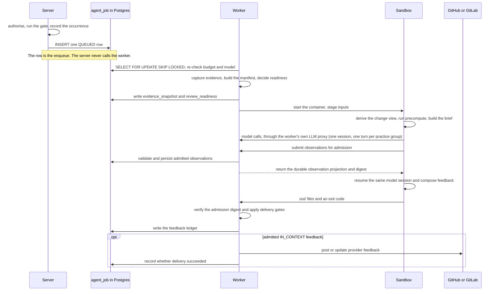

# Practice review runtime

Use this page when changing where practice-review work executes or extending an artifact handler. For the
review lifecycle and its product semantics, start with the
[practice review pipeline](./practice-review-pipeline.mdx).

## Execution sequence

The most counter-intuitive facts about this system are all about *where* code runs, and none of them are
visible from the class names.

- **The `agent_job` table is the queue.** There is no broker between server and worker. Submission is one
  row containing metadata and an idempotency key. NATS carries webhook ingress upstream and is not part of
  the review queue.
- **Evidence capture runs on the claiming worker, not on the server.** The worker snapshots the repository
  from its own mirror: with checkout disabled the manifest records the tree as not collected, and a
  repository with no mirror on that worker is recorded as unavailable.
- **`evidence_snapshot` and `review_readiness` are written before the container starts**, in their own
  transaction, and a failed write fails the run before any model cost accrues. The result is a separate,
  later transaction.
- **One session per review, inside the sandbox.** `pi-runner.ts` opens one model session and drives it
  in turns: the first turn carries the brief — the captured records and the change view, already in
  context with line coordinates — and each turn carries one catalog group of practices with their criteria
  inlined. Observations go through `report_observation` in batches; a refused one is answered per item and
  a practice past eight refusals is reported as not reached. The schema the SDK validates a call against
  is documentation only, for every recording tool (`report_observation`, `report_feedback`,
  `report_summary`) — the SDK's check is all or nothing, and one wrong field must not discard the other
  items in the call — so every rule is applied per item by the tool, with the reason: the vocabulary
  (case and `_`/`-` spelling forgiven), the text bounds the server holds a unit to, an unknown field
  named, a field sent beside the observation instead of under `evidence` read from where it is and the
  correction echoed, a summary a clause too long kept up to its last sentence end within the bound, and
  the cells a practice's Judge section rules out (`- PRESENT/GOOD and ABSENT/GOOD: no ordinary case.`).
  A call that stores nothing is an error the session must correct; one that stores some of what it sent
  is an answer with the skips named per item. A call that ended in an error — a schema the SDK refused,
  a call cut off by the output limit, a failed command — is one line of the transcript and one count in
  the turn's trace (`toolErrors`); a turn that has made 24 recording calls without recording anything
  is ended, and one that repeats the same call with the same arguments is told so at the third and
  ended at the sixth. A turn aborted at its share of the budget is awaited until the session is idle
  before the next turn is sent. What was recorded is repeated at the top of every later turn and
  appended to `work/notes/review.md`, so it survives context compaction. After admission the same
  session composes feedback in one more turn, with the admitted observations (verdict, words and
  citations by coordinates; the quoted lines and verification records stay in
  `work/composition/observations.json`) and the history inlined;
  the session is compacted first when that prompt would not fit beside what it holds, a composer still
  reading at its twelfth call or at most of its budget is told to persist, and a composition that ended
  without one recording call while a practice is NEGATIVE is asked once more. There is no
  reconnaissance session, no fork per practice group and no retry session: a practice no turn recorded
  gets one finishing turn in the same session.
- **The worker posts public feedback.** Parsing, persistence, composition, and provider delivery remain on
  the worker after sandbox execution.
- **Control never returns to the server between claim and completion.** The only server-to-worker push is
  the hub WebSocket, and it carries cancellation and drain, not work.

## Extension points

Artifact handlers assemble context and delivery constraints. Provider adapters own provider identifiers,
diff and comment APIs, and conversation storage; the practices module owns definitions, observations, and
the feedback ledger.

The durable boundaries, which the implementation may reschedule freely behind:

- **Admission** — the review gate decides whether an occurrence may enqueue work.
- **Queue and execution** — `agent_job`, described by
  [ADR 0025](https://github.com/hephaestus-build/Hephaestus/blob/main/docs/decisions/0025-agent-job-queue-on-postgresql.md).
- **Workspace ABI** — the sandbox receives read-only `inputs/`, disposable `work/`, and returns only
  `out/`. [Agent workspace ABI](agent/workspace-abi.mdx) is the source of truth for paths and exit codes.
- **Observations** — the agent reports through `report_observation`; server admission validates it, and
  persistence assigns an occurrence identity and a separate evidence-location grouping key.
- **Feedback** — after admission, the same agent session reports through `report_feedback` in a closed
  intervention phase; the runner refuses a practice-page card unless the practice is NEGATIVE on as many
  distinct pieces of work as the composition request's `minDistinctArtifacts`, counting this work and
  the staged history, so one occurrence stays a note on the work.
  Server admission validates the result without invalidating completed measurement. Admitted feedback,
  server suppressions, replacements, and placements enter the ledger; a model `WITHHOLD` remains only in
  the bounded job output. The seam itself is
  [ADR 0029](https://github.com/hephaestus-build/Hephaestus/blob/main/docs/decisions/0029-measurement-intervention-seam-and-channel-levels.md).

When changing sandbox inputs or outputs: update the owning runtime type or parser first; update the ABI
page only for a durable ABI change; add a behavioural test at the narrowest owning boundary; regenerate
OpenAPI and the web client when the HTTP contract changes. To extend the bundled catalogue, follow
[Practice catalogue curation](practice-catalogue.md).

Avoid copying file trees, enum inventories, defaults, or database columns into this guide. Those details
are owned by executable types, Liquibase, the generated database schema, and OpenAPI.
