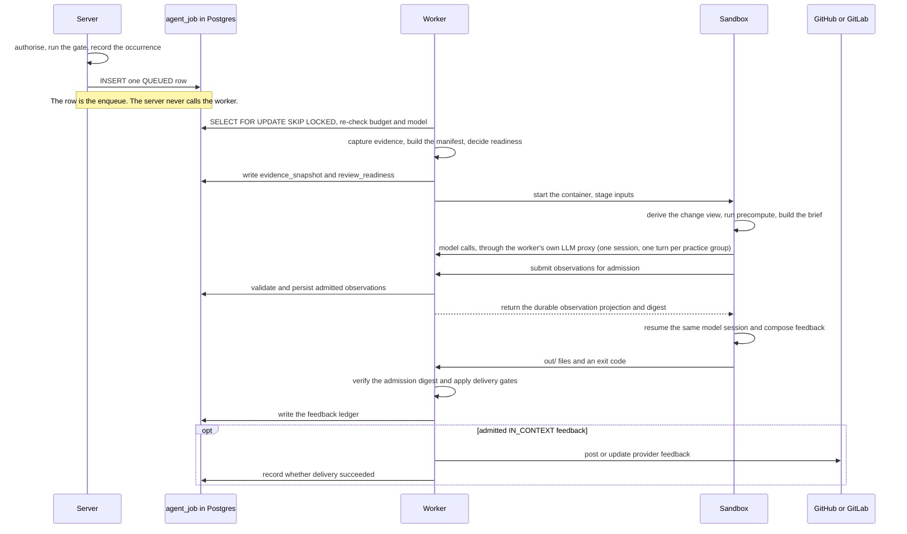

# Practice review runtime

Use this page to change where practice-review work executes or to extend an artifact handler.
For the review lifecycle and its product semantics, start with the [practice review pipeline](./practice-review-pipeline.mdx).

## Execution sequence

```mermaid
sequenceDiagram
    accTitle: Practice review execution across server, worker, sandbox, and provider
    accDescr: The server queues a job, the worker captures evidence, Java admits sandbox observations, the same model session composes feedback, and eligible public feedback reaches the provider.
    participant S as Server
    participant DB as agent_job in Postgres
    participant W as Worker
    participant SB as Sandbox
    participant SCM as GitHub or GitLab
    S->>S: authorise, run the gate, record the occurrence
    S->>DB: INSERT one QUEUED row
    Note over S,DB: The row is the enqueue. The server never calls the worker.
    W->>DB: SELECT FOR UPDATE SKIP LOCKED, re-check budget and model
    W->>W: capture evidence, build the manifest, decide readiness
    W->>DB: write evidence_snapshot and review_readiness
    W->>SB: start the container, stage inputs
    SB->>SB: derive the change view, run precompute, build the brief
    SB->>W: model calls, through the worker's own LLM proxy (one session, one turn per practice group)
    SB->>W: submit observations for admission
    W->>DB: validate and persist admitted observations
    W-->>SB: return the durable observation projection and digest
    SB->>SB: resume the same model session and compose feedback
    SB->>W: out/ files and an exit code
    W->>W: verify the admission digest and apply delivery gates
    W->>DB: write the feedback ledger
    opt admitted IN_CONTEXT feedback
        W->>SCM: post or update provider feedback
        W->>DB: record whether delivery succeeded
    end
```

- **The `agent_job` table is the queue.** There is no broker between server and worker. Submission is one
  row containing metadata and an idempotency key. NATS carries webhook ingress upstream and is not part of
  the review queue.
- **Evidence capture runs on the claiming worker.** `ReviewRepositoryPreparer` authorizes the repository
  and clones or refreshes the worker-local mirror before pinning the review range. A missing mirror alone
  does not make the source unavailable. Disabled checkout records the tree as not collected. Preparation
  failures are recorded in the capture result.
- **`evidence_snapshot` and `review_readiness` are written before the container starts**, in their own transaction.
  A failed write fails the run before any model cost accrues. The result is a separate,
  later transaction.
- **One session per review, inside the sandbox.** `pi-runner.ts` loads a brief from the captured record and derived change view.
  It supplies criteria and each practice's precomputed leads, one practice group per turn. A turn ends once each of its practices has a recorded result. The session carries every turn's reading of the work into the next.
  This keeps practices that share an occasion consistent. The first turn carries the task, the brief and three example observations. When the context fills and is compacted, the next turn carries them again.
  It also carries the results recorded so far.
  Thus, the model quotes the captured text, not a summary. The brief numbers the lines of captured
  files only. The derived change files are shown as written and marked not citable.
  `files.json` gives each file's lines in `diff.patch`.
  Thus, a large diff can be read a file at a time. Recording tools validate each item separately so one invalid item does not discard valid siblings.
  Their schemas carry no list or object type that the SDK could check all or nothing.
  Thus, each item gets its own answer.
  Scalar types stay because they tell the model what a value is.
  The run fills in and reports what it already knows instead of refusing it:

  - A source kind or artifact from the manifest.
  - A line written as `L12`.
  - A line number of `diff.patch` itself that names one line of the cited file.
  - An empty stray field.
  - A WITHHOLD's own NOT_MET observations.
    A refusal names every problem of an item at once.
    It gives the field, the received value, and the accepted values.
    It states facts instead of doubting the outcome. A resend of an already recorded result is an error that names what is still owed.
    An identical resend of a refused item gets the same answer at once.
    A third identical send ends the turn. An unreadable list shows where it breaks and is charged to no practice. A call cut off at the model's output limit reaches its tool incomplete.
    The model is told that the cut caused the error.
    A second cut in the turn ends it. Progress and repetition
    limits stop unproductive turns. Recorded results are saved under `work/notes/`.
    The session is Pi's coding-agent `AgentSession`. Pi 1.0 also ships the experimental harness `pi-durable`.
    It checkpoints every model call and tool call so a crashed run can resume. It is not used.
    A review runs once in a sandbox that is discarded with its storage.
    The server retries a failed run from the captured evidence.
    `pi-durable` has no codemode.

- **Work, not time, bounds a turn.** Each turn gets its own model-call and output-token budget.
  Each practice it carries adds `PRACTICE_REVIEW_PRACTICE_MODEL_CALLS` and `PRACTICE_REVIEW_PRACTICE_OUTPUT_TOKENS`.
  The budget is never less than three practices' worth, whatever earlier turns spent
  ([practice-review operations](/admin/practice-review-operations)). The turn text does not state the budget.
  When told its call budget up front, an open model read less and missed more negatives.
  A turn gets one request to record when two calls remain.
  The request also occurs if the remaining tokens only pay for the observations still owed.
  This uses the session's observed tokens per observation. It ends at the first turn boundary after the call that spends the budget.
  Thus, that call's tools have run, including a recording. An aborted call records nothing. The budget caps a turn that runs away.
  It is several times normal turn spend, not a pace. Composition gets one unit per NOT_MET
  practice, at most a full turn's worth. Time is used for liveness only.
  A turn with no session event for five minutes is aborted as stalled.
  Two stalls in a row end measuring.
  The binding's timeout is a safety ceiling.
  Its split stops measuring early enough for admission and composition to complete. An aborted turn
  must become idle before another turn starts. Practices still missing get a finishing turn with their
  criteria and their own budget. They are not treated as completed reviews. See
  [recorded-result coverage](./practice-review-pipeline.mdx#recorded-result-coverage).
- **Composition follows durable admission.** The same session composes feedback from the admitted projection and bounded history.
  If the turn would not fit, compaction first makes room. The turn
  shows NOT_MET observations with their rationale and cited coordinates and the others by what they
  found. After a compaction it carries the task and the brief again, not the measuring examples. For a pattern count, an earlier review of the same work is the same piece of work.
  The server counts it this way. It cannot add observations during composition. There is no separate reconnaissance,
  per-practice or retry session.
- **The worker posts public feedback.** It validates sandbox output, persists observations and feedback,
  and applies delivery policy before calling the provider. Model composition runs in the sandbox.
- **Control never returns to the server between claim and completion.** The only server-to-worker push is
  the hub WebSocket, and it carries cancellation and drain, not work.

## Extension points

Artifact handlers assemble context and delivery constraints.
Provider adapters own provider identifiers, diff and comment APIs, and conversation storage.
The practices module owns definitions, observations, and the feedback ledger.

The extension boundaries are:

- **Occasion gate** — decides whether an occurrence may enqueue work.
- **Queue and execution** — `agent_job`, described by
  [ADR 0025](https://github.com/hephaestus-build/Hephaestus/blob/main/docs/decisions/0025-agent-job-queue-on-postgresql.md).
- **Workspace ABI** — the sandbox receives read-only `inputs/`, disposable `work/`, and returns only
  `out/`. [Agent workspace ABI](agent/workspace-abi.mdx) is the source of truth for paths and exit codes.
- **Observations** — the agent reports through `report_observation`. Server admission validates it, and
  persistence assigns an occurrence identity and a separate evidence-location grouping key.
- **Feedback** — after admission, a fresh session writes the review on the work through `report_review`.
  The same agent session writes private feedback through `report_feedback` in a closed intervention phase.
  The runner refuses a practice-page card unless the practice is NOT_MET on at least `minDistinctArtifacts` distinct pieces of work.
  This threshold comes from the composition request.
  The count includes this work and the staged history.
  Thus, one occurrence stays a note on the work.
  Server admission validates the result without invalidating completed measurement. Admitted feedback,
  server suppressions, replacements, and placements enter the ledger. A model `WITHHOLD` remains only in
  the bounded job output. The seam itself is
  [ADR 0029](https://github.com/hephaestus-build/Hephaestus/blob/main/docs/decisions/0029-measurement-intervention-seam-and-channel-levels.md).

When changing sandbox inputs or outputs: update the owning runtime type or parser first.
Update the ABI page only for a durable ABI change.
Add a behavioral test at the narrowest owning boundary.
Regenerate OpenAPI and the web client when the HTTP contract changes.

To extend the bundled catalogue, follow [Practice catalogue curation](practice-catalogue.md).

Avoid copying file trees, enum inventories, defaults, or database columns into this guide.
Those details are owned by executable types, Liquibase, the generated database schema, and OpenAPI.
