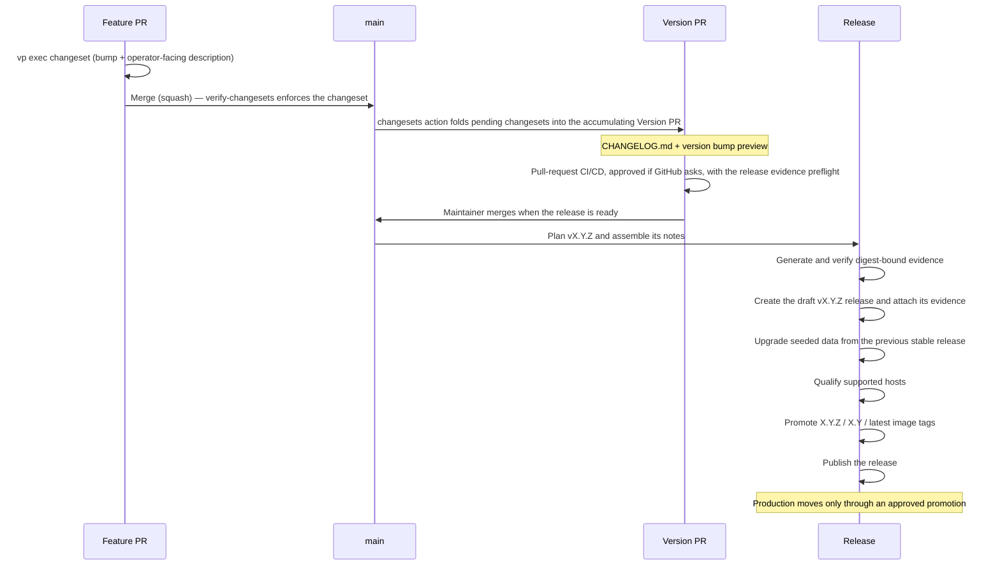

# Release Management

**Release ≠ deploy.** Development is trunk-based: all work merges to `main` (squash merge, no
`develop` branch) and every merge builds deployable images. A **release** is a deliberate act:
cutting a version of Hephaestus for self-hosters, with a tag, curated release notes, and versioned
Docker images. Staging follows `main`. Production moves to a release only through an approved
promotion. We manage releases with [changesets](https://github.com/changesets/changesets).

The [compatibility policy](https://docs.hephaestus.build/admin/compatibility-policy) defines what a released version number promises.

## The flow



1. **Every PR that changes shipped code carries a changeset.** `Verify changesets` fails the PR
   otherwise. [Writing changesets](#writing-changesets) has the rules.
2. **The Version PR accumulates, and is checked.** Successful CI/CD for the current `main` tip permits `version-pr.yml` to maintain the Version PR.
   Its title is `chore(release): version packages`.
   It previews the version bump, `CHANGELOG.md` section, and `MIGRATION.md` section.
   The migration section uses `.migration/` fragments at the `### Next release` anchor.
   Updates use `GITHUB_TOKEN`.
   The pull request's own CI/CD run validates its updated head, with approval when GitHub requests it.
   [The Version PR trigger contract](./ci-cd.mdx#merge-policy) owns approval, reruns and manual recovery.
   Failed main runs do not update the Version PR.
   A successful rerun or later successful tip resumes maintenance.
   Overtaken completions stop before versioning, so release validation does not start beside the same commit's main validation.

   Every CI/CD run on that branch includes the **release evidence preflight** below, regardless of its start event.
   `CI Status Gate` fails unless the same run's preflight succeeds.
   More than one run can report the gate for a Version PR head, and either satisfies the ruleset.
   Thus, a green gate proves preflight success only if no run can pass without it.

   Every run on that branch publishes the whole release image set on both architectures.
   An ordinary pull request builds only changed `linux/amd64` candidates and aliases the rest from `main`.
   The preflight captures evidence for each image on both published platforms.
   It can capture evidence only for images published by its own run.

3. **The merge is checked again.** The merge commit's push runs CI/CD in full.
   A `main` push repeats source-validation legs only with a version bump, which this commit carries.
   `release.yml` starts only after that run succeeds.
4. **Merging the Version PR cuts the release.** The workflow resolves release image digests, then runs the evidence gate.
   Only then does it create the draft at the merge commit and attach evidence.
   After seeded-upgrade and supported-host gates also pass, it promotes CI-built images to `X.Y.Z`, `X.Y`, and `latest`.
   Then it publishes the release.
   Publication deploys nothing. See [Deploys](#deploys).

### When a release fails

Release images are promoted **by digest and never rebuilt**.
A commit rejected by the evidence gate cannot pass on retry.
Only a new commit can pass.
Thus, the gate runs before anything is created.
A rejected release leaves no draft or tag, so cleanup is unnecessary.
A draft itself creates no tag.

Recovery uses a forward fix.
`scripts/plan-release.ts` cuts the version carried by `main` whenever it has **no published release**, from whichever commit carries it.
Thus, landing the fix completes recovery.
The next successful `main` CI run recuts that version from the fixed commit.

Alternatively, merge the next Version PR.
A release follows the latest *published* release, not the version its parent commit carried.
Thus, an unpublished version is skipped.
An ordinary merge carries an already-published version, the sole no-op.

The resume path covers failures *after* draft creation: seeded-upgrade, supported-host, or publication failures.
A workflow rerun at the same commit reuses the draft, regenerates evidence, and replaces assets.
A draft pins its version to its commit.
A later commit refuses to recut over it.
If a draft can never pass, delete it manually.
The version then recuts from the fixed commit.

Version-commit reverts are no longer part of recovery, but their exemption remains.
`verify-changesets` normally freezes `MIGRATION.md` in feature PRs and prevents deletion of pending changesets or migration fragments.
A **verified revert** lifts these restrictions.
`scripts/verify-revert.ts` checks each added commit structurally.
It must record `This reverts commit <sha>.`, name an ancestor of the base, and exactly reverse that commit's patch.
Otherwise, the restrictions remain.

## Supported-host qualification

Every release boots its signed, immutable image lock through the self-hosted topology on native Ubuntu
24.04 `amd64` and `arm64` hosts. The gate enforces the [published support matrix](../admin/install#supported-host-matrix),
waits for stack readiness, and exercises HTTPS ingress. Either cell can block publication.

The release workflow attaches each cell's status record to the immutable GitHub release. This qualification covers a
clean boot. The seeded-upgrade gate separately proves the supported migration path.

A pull request that can change fresh-installation bindings gets the same boot before merge.
`Supported-host boot smoke` in `cicd.yml` runs `docker/self-host/setup.sh`.
It starts PostgreSQL, NATS, and the application server from that run's images, on `amd64` only and without the edge.
Both jobs fill blank installer settings through `scripts/prepare-host-smoke-env.ts`.
Thus, pre-merge and release boots answer the same operator questions.
[CI/CD § Path filters](./ci-cd.mdx#path-filters) lists the selection paths.

## Supply-chain evidence

No release exists until every image in `security/release-images.json` passes the evidence gate.
It remains a draft until later gates pass.
For each image, the gate resolves the index and `linux/amd64` and `linux/arm64` manifests to digests.
It reads each platform manifest from the registry and generates a Syft inventory, SPDX SBOM, and CycloneDX SBOM.

One native Trivy `vuln,license` scan supplies both vulnerability and license report paths.
This avoids duplicate image analysis and binds both evidence consumers to the same subject.
`scripts/verify-release-evidence.ts` checks every document's platform repository, digest, and architecture.
It also checks that every package survives both format conversions.

Then the release workflow attaches the SPDX predicate as a Cosign attestation and verifies image signatures and build provenance.
SBOMs, reports, policy, checksums, and `manifest.json` become release assets.

Evidence capture processes two subjects at a time and waits for both before starting the next pair.
A failed capture blocks the bundle after its in-flight peer finishes. Trivy uses its
[memory scan cache](https://trivy.dev/latest/docs/configuration/cache/) because the filesystem cache
locks out concurrent processes.

The vulnerability database and Java index remain shared and are
prepared before capture. Both workflow callers request `java-db: "true"` from `download-trivy-db`. Direct generator
invocations also need both databases prepared because capture disables their updates. Each subject
still receives the same SBOM formats and combined vulnerability/license scan.

Each subject also has a `.timings.json` diagnostic with its digest, platform and elapsed Syft and
Trivy time, including failed invocations. Timings use a monotonic clock around the existing scans.
They add no scanner work or latency threshold. They are advisory, not security evidence: failure to
save them warns without changing the scan result. The same durations appear in the job log.

Upstream NATS, Traefik, nginx, and Alpine images are versioned and digest-pinned in the production
Compose topology. They receive the same per-platform SBOM, license, vulnerability, and index-membership
evidence as first-party images. Hephaestus requires its own signatures and build provenance only for
images it builds. Image publishing uses GitHub's native attestation action to record provenance and
registry storage metadata. Only publishing jobs and their reusable-workflow callers receive
`artifact-metadata: write`, alongside the signing and attestation permissions.

[Vulnerability remediation](./vulnerability-remediation.mdx) is the normative policy for blocking
findings, scheduled rescans, and exceptions.

### Nothing may fail for the first time at a release

Pre-merge validation covers the same image subjects and shared evidence checks as release publication.
`scripts/generate-release-evidence.ts` is the one generator and
`scripts/verify-release-evidence.ts` the one verifier. `release.yml` and the `Release evidence
preflight` job in `cicd.yml` both run them, and the preflight runs the verifier in its default mode,
which performs every check except signature verification.

| Release evidence check                                                           | Can a release be the first to run it?                                                                                                                                                                                                              |
| -------------------------------------------------------------------------------- | -------------------------------------------------------------------------------------------------------------------------------------------------------------------------------------------------------------------------------------------------- |
| Manifest matches `security/release-images.json`, both platforms, canonical order | No — `check-release-image-inventory.ts` validates the inventory on every pull request, and `generate-release-evidence.test.ts` feeds the real generator's manifest to the real verifier                                                            |
| Syft, SPDX and CycloneDX describe the same subject and the same packages         | No — the preflight generates the triple and validates it                                                                                                                                                                                           |
| Trivy licence report is bound to its subject                                     | No — the preflight generates and validates it                                                                                                                                                                                                      |
| Vulnerability policy, `linux/amd64`                                              | No — also the build gate in `reusable-docker-build.yml` and, for the pinned upstream digests, `Pinned upstream images`                                                                                                                               |
| Vulnerability policy, `linux/arm64`                                              | No — `Pinned upstream images` for the pinned upstream digests, and the preflight for the images we build, which nothing else scans on this platform                                                                                                  |
| Each platform digest is a member of its published index                          | No — the preflight resolves and checks index membership over the images its own run pushed                                                                                                                                                         |
| The validation documents re-derive unchanged                                     | No — the preflight verifies twice, the second time comparing rather than writing                                                                                                                                                                   |
| SBOM attestation matches the durable evidence                                    | **Yes, structurally.** `cosign attest` creates the attestation during the release. There is nothing to verify before it exists                                                                                                                     |
| Image index signature and build provenance carry the release's identity          | **Yes, structurally.** The Fulcio certificate identity is the release workflow's, on `refs/heads/main`, and no earlier run can produce one                                                                                                         |
| The manifest names a release version                                             | **Yes, structurally.** Only `plan-release.ts` decides the tag. The preflight substitutes the version the ref carries                                                                                                                               |
| The bundle describes the images this run built                                   | No — the preflight and `release.yml` resolve subjects through the image build's published commit tag. `ci-contract.test.ts` requires that tag for every supported event of either caller. See [CI/CD § Image identity](./ci-cd.mdx#image-identity) |

The two signature entries are the verifier's only mode-conditional behavior.
`ci-contract.test.ts` asserts this: a check gated on anything except `mode === "verify-signatures"` fails the contract test.
Otherwise, a release could be the first to perform that check.
The third structural entry is unconditional.
The verifier always requires a release version, and preflight supplies the ref's version.

Preflight runs Syft and Trivy over every image on both architectures, plus the image builds it consumes.
On the Version PR branch, it consumes the whole set on both architectures.
An ordinary pull request builds only changed images on `linux/amd64`.
Thus, preflight runs only when its result affects a decision:

- Every CI/CD run on the Version PR branch.
- A manual CI/CD dispatch with `release-preflight` selected.

It reuses images built by that run.
Thus, it judges the artifact a release of that ref would promote, not a substitute.

The Version PR deliberately checks pinned upstream images twice.
The upstream scan in `cicd.yml` uses a minute of Trivy to answer the question a digest bump can affect.
Preflight runs the complete evidence gate and answers the same question while it verifies the bundle.

They cannot disagree: they share one planner, evaluator, policy file, and `selectPlatformDigest` resolution of the same index.
The cost is a duplicate scan, not a second opinion.
Removal of the fast scan would deny the quick answer to the pull request that most needs it.
Removal of upstream evidence from the bundle would make the verifier reject it.

## Browser source maps

`ci-docker-build.yml` passes `SENTRY_AUTH_TOKEN`, `SENTRY_ORG` and `SENTRY_PROJECT` as BuildKit
secrets to the `linux/amd64` webapp build on pushes to `main` only. The Vite build uploads hidden
source maps when all three are set and refuses a partial set. The Dockerfile deletes every `.map`
from the image either way.

### Operator verification

The [release image lock](../admin/release-image-lock) is the canonical verification procedure. It
verifies the lock signer and release identity before Compose consumes any digest. The remaining
release assets provide the per-platform SBOM, vulnerability, license, and index-membership evidence.
From v0.86.2, `SHA256SUMS` covers that evidence set and is signed with the release workflow identity.
The archived evidence reader verifies its Cosign bundle before checking the bytes or evaluating native file identities, advisory snapshots and policy.
Trusted capture validation runs before signing and does not authenticate an archive.

## Current migration-guide instructions

Edit `scripts/templates/migration-guide.md` for current operator instructions, not `MIGRATION.md`.
`vp run release:version` renders the template in the Version PR. Keep its single
`<!-- VERSION_HISTORY -->` marker. Released entries retain their original text, image namespaces
and signing identities. Add new version-specific actions through [migration fragments](#writing-changesets).

Run `vp run gate:changesets` to verify generation and history preservation.

## Writing changesets

A changeset summary becomes the `CHANGELOG.md` entry **verbatim** — write it in the operator/user's voice:

- Lead with what an operator or user can now do, or the symptom a fix removes. No class names, hook
  names, or file paths. If operators must act, add a line: `**Operators:** …`.
- **One changeset per user-visible change** — a PR that ships two unrelated visible changes ships two
  changeset files. Unsure whether it is visible? Add one. A reviewer can delete a superfluous note, but a
  missing one is invisible.
- Once a changeset reaches `main`, revise it in place. If it should not become a release note, convert it to an explained empty changeset.
  Do not delete or rename it.
- **Do not mention automatic migrations** — release notes automatically show a "back up before upgrading" banner for schema migrations.
  This applies when a release touches `server/application/src/main/resources/db/changelog/`.
  Thus, the changeset stays user-facing.
  The notes record the same fact in an invisible `<!-- hephaestus:schema-migrations=… -->` comment.
  An instance's update check reads it to flag the newer release in the admin overview.
  Only a migration that requires operator action belongs in the summary.
  Use `**Operators:** …` plus a `.migration/<changeset-slug>.md` fragment.
- **Bump = the operator's upgrade cost**, not code semantics:
  - `patch` — upgrade needs no action (bug fix, internal change, additive auto-applied migration).
  - `minor` — new capability, still zero-action. Note any new *optional* env var / flag in the summary.
  - `major` — operator must act first (required new env var, removed/renamed config, destructive/manual
    migration, dropped API). State the action and add a `.migration` fragment.

No TTY (agents, CI)? `vp exec changeset` is interactive — write the file by hand instead: create
`.changeset/<slug>.md` with frontmatter `"hephaestus": <bump>` and the summary as the body (see
`.changeset/README.md`). When action is required, add `.migration/<slug>.md` with the complete
`#### 🔴 …` guide entry. CI requires the matching slug and `**Operators:**` marker. Never hand-edit
`CHANGELOG.md` or `MIGRATION.md`. Versioning generates both.

:::caution Pre-1.0
Never pick a `major` bump while the version is `0.x`.
It would cut 1.0.0, which CI rejects. Breaking changes use `minor` instead.

Thus, a pre-1.0 `minor` does **not** guarantee zero-action upgrades.
If operator action is required, state it in the summary.
Add a migration fragment exactly as for a `major`.
:::

We version the whole app as one product. Changesets target only the root `hephaestus` package.
We never version `webapp` and `docs` individually.

## Deploys

Publication does not deploy a release.
Hosts follow a signed channel and apply it themselves.
To change an environment, run **Promote** for that environment and release.
The Production environment's required reviewer gates this deliberate step.
The host applies it on its next reconcile.

[Pull-Based Deployment](../admin/pull-based-deployment) explains the mechanics.
[CI/CD](./ci-cd.mdx#environments) lists the environments.
Verify staging before production promotion.
Hotfixes use the normal process: PR → changeset → merge → merge the Version PR.

### Deployment history

Each promotion that moves an environment records one GitHub deployment of the release or commit that its channel names.
`scripts/record-deployment.ts` records it before the channel is published.
Thus, a promotion that fails still leaves its record.
A freeze moves nothing, so it records no deployment.
If GitHub refuses the record, the promotion continues, and its run shows the error.
The signed channel, not the record, decides what a host runs.

| Field         | Value                                                                             |
| ------------- | --------------------------------------------------------------------------------- |
| `ref`, `sha`  | The promoted release tag and its commit, or the promoted commit                   |
| `environment` | `Staging` or `Production`. Only `Production` is a production environment          |
| `payload`     | `release` or `commit`, `allow_rollback`, `refresh_database_image`, `requested_by` |
| `log_url`     | The promotion run                                                                 |

`requested_by` is the account that started the promotion.
For continuous staging, it is `github-actions[bot]`.

The final state claims only what the workflow observed:

- `success`: the public webapp reports the promoted version. Host metrics report the other services.
- `failure`: the channel is published, but the public webapp did not report the version in time.
- `error`: the workflow did not confirm that it published the channel.

In Staging, a success makes the previous successful deployment `inactive`.
GitHub does not do this in a production environment, so the Production history keeps every success.

A deployment records what was promoted to an environment, and when.
The `deploy-state` history records what each host was told.
Each channel commit names the action and links the run that signed it.

To list the promotions to production:

```bash
gh api --paginate 'repos/hephaestus-build/Hephaestus/deployments?environment=Production' \
  --jq '.[] | [.created_at, .ref, .sha, .payload.requested_by] | @tsv'
```

## Version management

Source manifests keep placeholder versions: `webapp/package.json` and `server/build.gradle.kts` use `0.0.0-development`.
The **release version** lives in root `package.json`.
Only the Version PR bumps it. At deploy time the release
lock sets `IMAGE_TAG`, which `docker/compose.app.yaml` passes as `APP_VERSION`. `application.yml`
exposes it as `spring.application.version`.

Check the current release: `git describe --tags --abbrev=0` or
[GitHub Releases](https://github.com/hephaestus-build/Hephaestus/releases).

## Dependency management

Renovate policy is in [CI/CD](./ci-cd.mdx#security-and-supply-chain-controls). `Verify changesets`
skips bot-authored pull requests. When a dependency bump is user-facing, a maintainer adds the
changeset.
