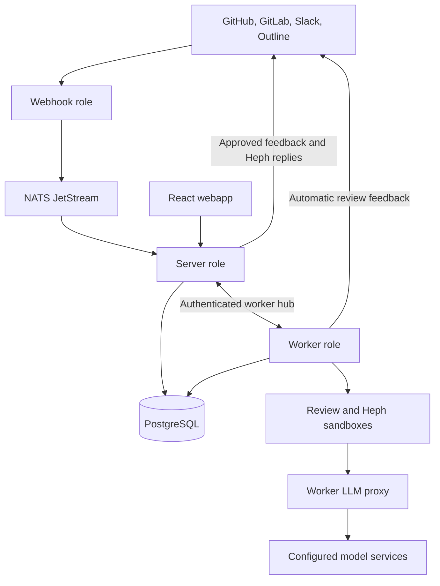
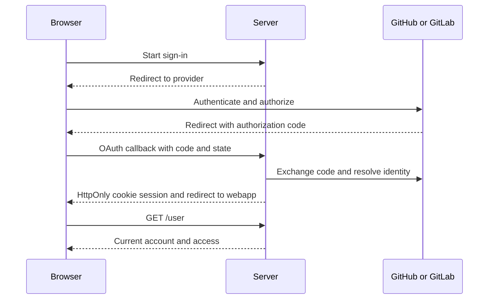

## Runtime topology

One JAR boots in the server, worker, and webhook roles. The supported Compose deployment runs each
in its own container. Only the worker has Docker access. Heph sessions need connected workers even
when server and worker roles share a JVM; there is no direct server-side sandbox fallback.
[Runtime roles](/admin/runtime-roles) owns role configuration, capacity, and drain behavior.
[Observability](/admin/observability#scrape-metrics) owns the private management listener on port 9090.

## Module boundaries

`integration` adapters own provider identity, source sync, and provider-side operations. GitHub,
GitLab, Slack, and Outline each have their own adapter. A deployment syncs one configured GitLab
instance; additional login providers do not create additional GitLab sync instances.

`agent` owns review execution and orchestration. `practices` owns practice revisions, observations,
feedback, approval, and the review gate. Admission uses `integration.scm.ReviewTargetQuery` for SCM
identity rather than SCM entities or repositories. Identity lookup does not authorize workspace
access or feedback delivery.

Integration modules are [open](https://docs.spring.io/spring-modulith/reference/fundamentals.html#modules.open).
Modulith verification therefore does not enforce their persistence encapsulation.
`PracticeReviewModuleBoundaryTest` guards the SCM admission boundary.
[Workspace context](./workspace-context) owns tenant enforcement.

## Sign-in

Spring Security `oauth2Login` federates sign-in. Hephaestus issues its own cookie-session JWTs;
Keycloak is not part of the deployment. Slack and Outline are link-only identity providers.
[ADR 0017](https://github.com/hephaestus-build/Hephaestus/blob/main/docs/decisions/0017-replace-keycloak-with-spring-native-auth.md)
records native auth. [Instance administration](./instance-admin) owns recent-sign-in and user-view implementation.

## Practice reviews

The webhook role verifies and durably buffers provider events. Server consumers sync the work and
record occurrences. Eligible occasions become PostgreSQL-backed jobs; workers claim and execute
them in isolated sandboxes. The worker admits observations through the shared Java admission service
before composition and feedback delivery.
Feedback on the work awaits workspace-admin approval by default. Delivery rechecks policy and
Silent Mode independently from measurement.

The [review pipeline](./practice-review-pipeline) owns occasion, capture, observation, composition,
and delivery. [Review runtime](./practice-review-runtime) owns execution and retry boundaries.
[Workspace ABI](./agent/workspace-abi.mdx) owns the job folder, capture manifest, and output contract.
Missing required capture produces no observation.

## Heph

The server owns HTTP/SSE, Slack delivery, admission, budget checks, thread persistence, and
`fetch_context`. A connected worker owns the live session, its sandbox, attachment, and eviction.
[Unified Pi runtime](./unified-pi-runtime) owns placement and conversation checkpoints.
The UI uses shadcn components over Base UI; it renders streamed text, tool activity, and observation
feedback without a separate assistant-ui runtime.

Heph is available to workspace members only, within their account-wide AI choice. It uses permitted
recent work, review requests, assigned issues, earlier conversations, practices, and connected
context. Prepared conversation feedback counts as delivered only when shown, not merely linked by
a completed turn. [Chat with Heph](/user/ai-mentor) owns the member-facing behavior.

## Member pages

A workspace that reviews practices opens on the member's private Practice profile. Other workspaces
open on Activity. Activity and Workspace activity count and list work without ranking developers.
Members read reviews of their own work from the Practice profile. Workspace admins inspect the wider
history under Practice reviews. Workspace review history does not grant access to a member's private Practice profile or Heph feedback.
